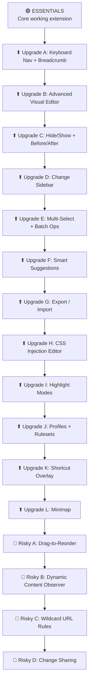

# DOM Surgeon — Tiered Implementation Plan

Each tier is a **stable, testable milestone**. You test it, report bugs, I fix them — then we move to the next upgrade.


```

---

## ✅ COMPLETED SO FAR (Current State)

We have successfully built the **Essentials** core, but we also drastically evolved the architecture beyond the original plan based on live testing. Here is exactly what is currently implemented:

**1. Core Architecture & Shadow DOM Widget**
- Fully working DOM selection, highlighting, and editing (Resize, Delete, Hide).
- Replaced the browser Popup with a sleek, draggable **In-Page Shadow DOM Widget**.
- The widget handles Undo/Redo stacks, page reset, and minimizing/expanding smoothly.
- **Context Menu** support for instant right-click deleting and hiding.

**2. Domain-Wide Rules & Fingerprinting**
- Added a **Scope** toggle ("This Page Only" vs "Entire Website") to the Editor Panel.
- Built a dual-layer storage system (`ds_site_<url>` and `ds_domain_<domain>`).
- Implemented **Element Fingerprinting** (matching `tagName` and `className`) to safely apply global rules across different pages of a website without breaking layouts.

**3. Advanced Global Dashboard**
- Built a standalone `chrome-extension://` Options Dashboard.
- Dashboard features a grouped accordion UI by Website.
- You can **Undo** specific changes directly from the dashboard (which auto-syncs with open tabs).
- You can **Preview** changes from the dashboard (opens a new tab and triggers a highlight).

**4. Advanced UI Features**
- Added a **Live Preview** button in the Editor Panel to test dimensions before saving.
- Replaced confusing UI icons with standard, professional Lucide icons (e.g., Trash Can for wipes).
- Built a Toast Notification system for non-intrusive feedback.

---

## UI Design System

> Used across **all tiers**. Built once in Essentials, reused everywhere.

### Color Palette

| Token | Value | Usage |
|---|---|---|
| `--surface-primary` | `#0F0F12` | Panel backgrounds, popup bg |
| `--surface-secondary` | `#18181D` | Cards, input fields |
| `--surface-tertiary` | `#222228` | Hover states, dividers |
| `--surface-elevated` | `#1C1C22` | Floating panels, dropdowns |
| `--border-subtle` | `rgba(255,255,255,0.06)` | Card borders, separators |
| `--border-focus` | `rgba(99,102,241,0.5)` | Focus rings |
| `--text-primary` | `#EDEDEF` | Headings, primary text |
| `--text-secondary` | `#8B8B96` | Labels, descriptions |
| `--text-tertiary` | `#5A5A65` | Placeholders, disabled |
| `--accent-indigo` | `#6366F1` | Primary actions |
| `--accent-indigo-hover` | `#7577F5` | Button hover |
| `--accent-indigo-muted` | `rgba(99,102,241,0.12)` | Accent backgrounds |
| `--danger` | `#EF4444` | Delete, destructive |
| `--danger-muted` | `rgba(239,68,68,0.12)` | Danger backgrounds |
| `--success` | `#22C55E` | Success, applied |
| `--success-muted` | `rgba(34,197,94,0.12)` | Success backgrounds |
| `--warning` | `#F59E0B` | Resize, caution |
| `--warning-muted` | `rgba(245,158,11,0.12)` | Warning backgrounds |
| `--highlight-hover` | `rgba(99,102,241,0.15)` | Element hover overlay |
| `--highlight-selected` | `rgba(99,102,241,0.25)` | Element selected overlay |

### Typography

```css
--font-sans: 'Inter', -apple-system, BlinkMacSystemFont, sans-serif;
--font-mono: 'JetBrains Mono', 'SF Mono', monospace;

--text-2xs: 0.625rem;   /* 10px */
--text-xs: 0.6875rem;   /* 11px */
--text-sm: 0.75rem;     /* 12px */
--text-base: 0.8125rem; /* 13px */
--text-md: 0.875rem;    /* 14px */
--text-lg: 1rem;        /* 16px */
--text-xl: 1.125rem;    /* 18px */
```

### Spacing, Radii, Shadows

```css
--space-1: 2px;  --space-2: 4px;  --space-3: 6px;  --space-4: 8px;
--space-5: 12px; --space-6: 16px; --space-7: 20px; --space-8: 24px;

--radius-sm: 4px;  --radius-md: 6px;  --radius-lg: 8px;  --radius-xl: 12px;

--shadow-sm: 0 1px 2px rgba(0,0,0,0.3), 0 0 0 1px rgba(255,255,255,0.04);
--shadow-md: 0 4px 12px rgba(0,0,0,0.4), 0 0 0 1px rgba(255,255,255,0.04);
--shadow-lg: 0 8px 30px rgba(0,0,0,0.5), 0 0 0 1px rgba(255,255,255,0.04);

--ease-out: cubic-bezier(0.16, 1, 0.3, 1);
--ease-spring: cubic-bezier(0.34, 1.56, 0.64, 1);
--duration-fast: 120ms;
--duration-normal: 200ms;
```

### Component Rules

- **Buttons**: Primary (solid indigo), Secondary (border only), Ghost (no border), Danger (solid red, confirmation required)
- **Inputs**: `--surface-secondary` bg, subtle border, custom focus ring (no browser outline)
- **Sliders**: Custom track + thumb, filled portion gradient, thumb grows on hover
- **`<kbd>` tags**: `--surface-tertiary` bg, subtle border, monospace

---

## File Structure

```
dom-surgeon/
├── manifest.json
├── background.js
├── content/
│   ├── main.js                 # Entry — orchestrates modules
│   ├── selector.js             # Hover highlight, click select
│   ├── editor-panel.js         # Floating editor (basic in Essentials)
│   ├── toast.js                # Toast notification system
│   ├── breadcrumb.js           # ⬆ Upgrade A
│   ├── box-model.js            # ⬆ Upgrade B
│   ├── change-sidebar.js       # ⬆ Upgrade D
│   ├── multi-select.js         # ⬆ Upgrade E
│   ├── smart-suggestions.js    # ⬆ Upgrade F
│   ├── css-injector.js         # ⬆ Upgrade H
│   ├── shortcut-overlay.js     # ⬆ Upgrade K
│   ├── minimap.js              # ⬆ Upgrade L
│   ├── drag-reorder.js         # 🔴 Risky A
│   └── styles/
│       ├── design-tokens.css
│       ├── shared.css
│       ├── selector.css
│       ├── editor-panel.css
│       ├── toast.css
│       └── ... (one CSS per module)
├── popup/
│   ├── popup.html
│   ├── popup.js
│   └── popup.css
├── lib/
│   ├── storage.js
│   ├── history.js
│   ├── selector-engine.js
│   ├── profiles.js             # ⬆ Upgrade J
│   ├── url-matcher.js          # 🔴 Risky C
│   └── share.js                # 🔴 Risky D
└── icons/
    ├── icon-16.png
    ├── icon-48.png
    └── icon-128.png
```

---

---

# ✅ TIER 1 — ESSENTIALS [COMPLETED]

> **What you get**: A fully working extension. Select elements, delete them, resize them, changes saved, undo/redo works, basic popup with controls. This is your **foundation** — everything else builds on top.

---

## E1. Project Scaffold

### [NEW] manifest.json
- Manifest V3
- Permissions: `activeTab`, `storage`, `scripting`
- Content scripts: `content/main.js` + CSS files on `<all_urls>`
- Popup: `popup/popup.html`
- Background: `background.js`
- Command: `Alt+S` to toggle selector mode

### [NEW] background.js
- Message router: popup ↔ content script
- Handles: `toggle-selector`, `undo`, `redo`, `reset`, `get-status`
- Updates badge text with change count on current tab

### [NEW] design-tokens.css + shared.css
- All CSS variables from the design system
- Button, input, slider base components
- Scrollbar styling, utility classes

### [NEW] Icons (16, 48, 128)
- Clean crosshair/scalpel motif

---

## E2. Element Selector (Basic)

### [NEW] selector.js

**Hover highlight**:
- `mousemove` (debounced via `requestAnimationFrame`)
- Overlay div positioned over hovered element (no `outline` — avoids layout shift)
- Shows: semi-transparent indigo tint + dashed border
- **Info tag** pinned to element's top-left: `div.container — 960×400`
- Skip our own Shadow DOM elements

**Click to select**:
- `click` with `preventDefault` + `stopPropagation`
- Change highlight to solid border + stronger tint
- Open editor panel

**Basic keyboard**:
- `Escape` → deselect, exit selector mode

### [NEW] selector.css
- Hover and selected overlay styles
- Info tag positioning and typography

---

## E3. Basic Editor Panel

### [NEW] editor-panel.js

**Panel shell** (injected inside Shadow DOM for style isolation):
- Draggable by title bar
- Positioned near selected element, repositions at viewport edges
- Close with `×` or `Escape`
- Fade + scale animation (`--ease-spring`, 200ms)

**Contents**:
- **Element info**: tag name, classes, current dimensions
- **Width input**: number field + unit dropdown (`px`, `%`)
- **Height input**: number field + unit dropdown (`px`, `%`)
- **Apply button**: sets inline styles on element
- **Delete button**: danger style, double-click to confirm ("Click again to confirm")
  - Stores `outerHTML` + `parentSelector` + `childIndex` before removing

### [NEW] editor-panel.css
- 280px wide dark panel
- Section layout, input groups, button styles from design system

---

## E4. Persistence

### [NEW] storage.js
```
saveChange(url, change)
getChanges(url)
removeChange(url, changeId)
clearChanges(url)
getAllData()
importData(json)
```
- All writes debounced (300ms)
- Data format versioned (`"version": 1`)

### [NEW] selector-engine.js
- `generateSelector(element)` → unique CSS path
- Priority: `#id` > `[data-testid]` > `.unique-class` > `tag:nth-child(n)`
- Validates uniqueness via `querySelectorAll`

### Replay logic in main.js
- On `DOMContentLoaded`: load changes → replay in order
- `delete` → find by selector → `element.remove()`
- `resize` → find by selector → set inline style
- If selector not found → skip silently, warn in console

---

## E5. Undo / Redo / Reset

### [NEW] history.js
- Per-URL undo + redo stacks (max 50 entries)
- `push(change)`, `undo()`, `redo()`, `reset()`
- Persisted alongside changes

| Type | Undo Action |
|---|---|
| `delete` | Re-insert stored `outerHTML` at original position |
| `resize` | Restore original inline style value |

---

## E6. Toast Notifications

### [NEW] toast.js + toast.css
- Fixed stack bottom-right (max 3 visible)
- Each toast: icon + message + **[Undo]** button + 5s auto-dismiss
- Types: success (green icon), info (indigo), warning (amber), danger (red)
- Slide-in from right, fade-out on dismiss
- Undo button calls `history.undo()` directly

---

## E7. Basic Popup

### [NEW] popup.html + popup.js + popup.css

```
┌─────────────────────────────────┐
│  ◉ DOM Surgeon                  │
├─────────────────────────────────┤
│  Selector Mode        [Toggle]  │
├─────────────────────────────────┤
│  Changes on this page:    3     │
├─────────────────────────────────┤
│  [Undo]  [Redo]  [Reset]       │
├─────────────────────────────────┤
│  Shortcuts                      │
│  Esc  Exit selector mode        │
├─────────────────────────────────┤
│  v1.0.0                        │
└─────────────────────────────────┘
```

- 360px wide, dark theme
- Toggle sends `toggle-selector` message to content script
- Undo/redo/reset send messages
- Change count fetched from storage

---

### ✅ Essentials — Test Checklist

> **Test all of these before moving forward. Report any bugs.**

| # | Test | Expected |
|---|---|---|
| 1 | Load extension in `chrome://extensions` | No errors, icon appears |
| 2 | Click icon | Popup opens with toggle + buttons |
| 3 | Toggle selector mode ON | Hovering elements shows highlight + info tag |
| 4 | Click an element | Solid highlight, editor panel opens nearby |
| 5 | Change width to `500px`, click Apply | Element resizes live |
| 6 | Change height to `200px`, click Apply | Element resizes live |
| 7 | Click Delete (twice to confirm) | Element removed, toast shows with Undo |
| 8 | Click Undo in toast | Deleted element reappears |
| 9 | Reload the page | All previous changes re-applied automatically |
| 10 | Close tab, reopen same URL | Changes still applied |
| 11 | Click Undo in popup | Last change reverted |
| 12 | Click Redo in popup | Change re-applied |
| 13 | Click Reset in popup | All changes cleared, page back to original |
| 14 | Press `Escape` | Deselects element, exits selector mode |
| 15 | Drag editor panel by title bar | Panel moves smoothly |

---

---

# ⬆ TIER 2 — UPGRADATIONS

> Each upgrade is **independent and additive**. Test after each one. No upgrade breaks previous functionality.

---

## ⬆ Upgrade A — Keyboard Navigation + Breadcrumb Bar

### What's added
- `Q` → select parent element
- `W` → select first child element
- `A` → select previous sibling
- `D` → select next sibling
- Clickable breadcrumb bar at top of viewport

### Files modified
- **selector.js** — add `Q`, `W`, `A`, `D` keydown handlers

### Files added
- **breadcrumb.js** — fixed bar rendering inside Shadow DOM
  - Format: `body › div.container › section.hero › h1.title`
  - Each segment clickable (selects that ancestor)
  - Current element in `--accent-indigo`
  - Shows dimensions: `h1.title — 680 × 42`
  - Horizontal scroll with fade edges for deep nesting
  - Slide-down on selection, slide-up on deselect
- **breadcrumb.css**

### Popup update
- Add Q/W/A/D to shortcuts section

### ✅ Test Checklist

| # | Test | Expected |
|---|---|---|
| 1 | Select an element, press `Q` | Parent element selected, panel updates |
| 2 | Press `W` | First child selected |
| 3 | Press `A` | Previous sibling selected |
| 4 | Press `D` | Next sibling selected |
| 5 | Press `Q` repeatedly | Walks up to `body`, stops there |
| 6 | Breadcrumb bar visible at top | Shows full path |
| 7 | Click a breadcrumb segment | Selects that ancestor element |
| 8 | Deep nesting (10+ levels) | Breadcrumb scrolls horizontally |
| 9 | Press `Escape` | Breadcrumb slides away |

---

## ⬆ Upgrade B — Advanced Visual Editor

### What's added
- Interactive box model diagram (margin/padding/border/content)
- Color pickers (background, text, border color)
- Typography controls (font size, weight, family, line height, text align)
- Opacity slider (0–100%)
- Blur slider (0–20px)
- **All changes apply live** as you drag sliders / pick colors

### Files modified
- **editor-panel.js** — expand with collapsible sections (accordion)

### Files added
- **box-model.js** — interactive diagram
  - Visual: nested boxes (margin → border → padding → content)
  - Color-coded edges (margin=amber, padding=green, content=blue)
  - Click any value to edit inline
  - Live sync with element's computed styles
- **box-model.css**

### Editor panel sections (accordion, collapsible)

```
┌─ Element Info ──────────────────┐
│  div.hero-banner — 960 × 400   │
├─ Layout (Box Model) ──────── ▾ ┤
│  ┌─── margin ─────────────┐    │
│  │ ┌── border ──────────┐ │    │
│  │ │ ┌─ padding ──────┐ │ │    │
│  │ │ │   960 × 400    │ │ │    │
│  │ │ └────────────────┘ │ │    │
│  │ └────────────────────┘ │    │
│  └────────────────────────┘    │
│  Width [____960] [px ▾]        │
│  Height [___400] [px ▾]        │
│  ═══ slider ════════════       │
├─ Appearance ─────────────── ▾ ┤
│  Background [■ #fff] [____]    │
│  Text Color [■ #000] [____]    │
│  Border     [1px solid #ccc]   │
│  Opacity    ═══●═══════ 100%   │
│  Blur       ●═══════════  0px  │
├─ Typography ─────────────── ▾ ┤
│  Font    [Inter          ▾]    │
│  Size    [16] [px ▾]          │
│  Weight  ═══════●═══════ 400   │
│  Line-H  [1.5]                 │
│  Align   [◀ ≡ ▶ ☰]           │
├─────────────────────────────────┤
│  [🗑 Delete]                    │
└─────────────────────────────────┘
```

### ✅ Test Checklist

| # | Test | Expected |
|---|---|---|
| 1 | Box model shows correct computed values | Matches DevTools |
| 2 | Click margin value, type new value | Element margin updates live |
| 3 | Drag width slider | Element resizes smoothly in real-time |
| 4 | Pick background color | Element bg changes live |
| 5 | Change font size to 24px | Text grows live |
| 6 | Drag opacity to 50% | Element becomes semi-transparent |
| 7 | Drag blur to 5px | Element becomes blurred |
| 8 | Collapse/expand sections | Accordion toggles smoothly |
| 9 | Undo a color change | Original color restored |
| 10 | Reload page | All visual changes persist |

---

## ⬆ Upgrade C — Hide/Show + Before/After

### What's added
- **Hide toggle** in editor panel — `display: none` instead of delete (reversible)
- Hidden elements show a dashed placeholder outline so you can re-show them
- **Before/After** comparison with `B` key

### Files modified
- **editor-panel.js** — add Hide/Show toggle button in Visibility section
- **storage.js** — support `"hide"` change type
- **history.js** — undo logic for hide (restore original display value)
- **main.js** — replay logic for hide changes + render placeholders

### Before/After (`B` key)
- Press `B` → temporarily revert ALL changes (show original page)
- Floating badge appears: `"Viewing Original — Press B to return"`
- Press `B` again → re-apply all changes
- 200ms crossfade transition

### ✅ Test Checklist

| # | Test | Expected |
|---|---|---|
| 1 | Click Hide on an element | Element disappears, dashed placeholder shown |
| 2 | Click the placeholder | Editor opens, Show button available |
| 3 | Click Show | Element reappears |
| 4 | Hide persists on reload | Element hidden, placeholder shown |
| 5 | Undo a hide | Element reappears |
| 6 | Press `B` | All changes reverted, see original page |
| 7 | Press `B` again | Changes re-applied |
| 8 | Badge visible during "before" mode | "Viewing Original" badge shown |

---

## ⬆ Upgrade D — Change Sidebar

### What's added
- Right-side panel listing all changes on current page
- Hover a change → highlight affected element on page
- Individual undo per change
- Filter by change type

### Files added
- **change-sidebar.js** + **sidebar.css**

### Layout
```
┌─────────────────────────────────┐
│  Changes on this page        3  │
│  [All] [Del] [Resize] [Hide]   │
├─────────────────────────────────┤
│  🔴 Deleted div.ad-banner       │
│     2 min ago              [↩]  │
│─────────────────────────────────│
│  🔵 Resized img.hero → 100%    │
│     5 min ago              [↩]  │
│─────────────────────────────────│
│  🟣 Hidden footer.cookie        │
│     8 min ago              [↩]  │
├─────────────────────────────────┤
│  Empty? → "No changes yet"     │
└─────────────────────────────────┘
```

- Toggle with `C` key or button in editor panel
- 320px wide, slides in from right
- Hover a change → element scrolls into view + highlights
- Click a change → selects that element

### Popup update
- "Changes on this page" row becomes clickable → sends message to open sidebar

### ✅ Test Checklist

| # | Test | Expected |
|---|---|---|
| 1 | Press `C` | Sidebar slides in from right |
| 2 | Make 3 changes | All 3 listed with correct icons |
| 3 | Hover a change in sidebar | Element highlights on page |
| 4 | Click `↩` on a change | That specific change undone |
| 5 | Filter by "Deleted" | Only delete changes shown |
| 6 | Empty state | Shows "No changes yet" message |
| 7 | Press `C` again | Sidebar slides out |

---

## ⬆ Upgrade E — Multi-Select + Batch Operations

### What's added
- `Shift+Click` to select multiple elements
- Each gets a numbered badge
- Editor panel switches to batch mode
- Batch delete, hide, opacity, resize

### Files added
- **multi-select.js**

### Batch mode editor panel
```
┌─────────────────────────────────┐
│  3 elements selected            │
├─────────────────────────────────┤
│  [Delete All]  [Hide All]       │
│  Opacity  ═══════●═══════ 100%  │
│  Width    [____] [px ▾] [Apply] │
│  Height   [____] [px ▾] [Apply] │
└─────────────────────────────────┘
```

### ✅ Test Checklist

| # | Test | Expected |
|---|---|---|
| 1 | `Shift+Click` 3 elements | All 3 highlighted with numbered badges |
| 2 | Click "Delete All" | All 3 removed |
| 3 | Undo | All 3 restored |
| 4 | `Shift+Click` 2, set opacity 50% | Both become semi-transparent |
| 5 | `Escape` | Multi-select cleared |

---

## ⬆ Upgrade F — Smart Suggestions (Quick Clean)

### What's added
- Auto-detect annoying elements on page load
- "Quick Clean" section in popup with checkboxes
- One-click removal of selected annoyances

### Files added
- **smart-suggestions.js**

### Detection patterns
| Pattern | Selectors checked |
|---|---|
| Cookie banners | `[class*="cookie"], [class*="consent"], [id*="cookie"], [id*="gdpr"]` |
| Newsletter popups | `[class*="newsletter"], [class*="subscribe"], [class*="signup"]` |
| Sticky headers > 80px | `position: fixed/sticky` + `height > 80px` + near top |
| Ad containers | `[class*="ad-"], [class*="advert"], [id*="ad-"], iframe[src*="ad"]` |
| Overlay modals | `position: fixed` + `z-index > 999` + covers >50% viewport |

### Popup update
```
┌─ 🧹 Quick Clean ───────────────┐
│  ☐ Cookie banner  (div#cmp)     │
│  ☐ Newsletter popup             │
│  ☐ Sticky header (64px)         │
│  [Clean Selected]               │
└─────────────────────────────────┘
```

### ✅ Test Checklist

| # | Test | Expected |
|---|---|---|
| 1 | Visit a site with cookie banner | Popup shows "Cookie banner" in Quick Clean |
| 2 | Check it + click "Clean Selected" | Banner removed |
| 3 | Change persists on reload | Banner stays removed |
| 4 | Site with no annoyances | Quick Clean shows "Page looks clean! ✨" |

---

## ⬆ Upgrade G — Export / Import

### What's added
- Export all changes as `.json` file
- Import `.json` to restore changes
- Works across browsers (export from Chrome, import in Edge, etc.)

### Files modified
- **popup.js** — add export/import buttons and logic
- **storage.js** — `getAllData()` + `importData(json)`

### Popup update
```
┌─────────────────────────────────┐
│  📤 Export     │     📥 Import  │
└─────────────────────────────────┘
```

- Export: `chrome.storage.local.get()` → JSON blob → download as `dom-surgeon-backup-{date}.json`
- Import: file picker → parse JSON → validate schema → `chrome.storage.local.set()` → reload tab

### ✅ Test Checklist

| # | Test | Expected |
|---|---|---|
| 1 | Make changes on 2 different sites | Changes saved |
| 2 | Click Export | `.json` file downloads |
| 3 | Click Reset to clear all changes | All changes gone |
| 4 | Click Import, select the `.json` | All changes restored on both sites |
| 5 | Open file in text editor | Valid JSON with readable structure |

---

## ⬆ Upgrade H — CSS Injection Editor

### What's added
- Per-site custom CSS editor
- Syntax-highlighted code editor (lightweight, built-in)
- Live preview as you type
- Persisted per URL

### Files added
- **css-injector.js** + **css-injector.css**

### Editor features
- Open with `E` key or "Custom CSS → Edit" in popup
- Floating panel (500×350) inside Shadow DOM
- Syntax highlighting (regex-based: selectors, properties, values, comments)
- Line numbers
- Auto-indent on Enter
- Live preview: CSS injected into page as `<style>` tag, debounced 300ms
- Save + Close buttons

### ✅ Test Checklist

| # | Test | Expected |
|---|---|---|
| 1 | Press `E` | CSS editor opens |
| 2 | Type `body { background: red; }` | Page background turns red live |
| 3 | Click Save, reload page | Red background persists |
| 4 | Open popup → Custom CSS shows "Active" | Indicator visible |
| 5 | Clear CSS, save | Page returns to normal |

---

## ⬆ Upgrade I — Animated Highlight Modes

### What's added
- 3 selectable highlight styles (configurable in popup)

### Modes

| Mode | Visual |
|---|---|
| **Glow** (default) | Pulsing indigo `box-shadow` animation around element |
| **X-Ray** | Entire page dims to 20% opacity; selected element stays at 100% via CSS mask cutout |
| **Depth** | Color overlay based on DOM depth — shallow=cool blue, deep=warm orange |

### Files modified
- **selector.js** — read active mode from storage, apply corresponding highlight
- **selector.css** — add keyframe animations for glow, x-ray overlay, depth gradient

### Popup update
- Add "Highlight Mode" dropdown: Glow / X-Ray / Depth

### ✅ Test Checklist

| # | Test | Expected |
|---|---|---|
| 1 | Default (Glow) mode | Element has pulsing glow on hover |
| 2 | Switch to X-Ray | Page dims, only hovered element bright |
| 3 | Switch to Depth | Colors change based on nesting level |
| 4 | Mode persists across reload | Same mode active after restart |

---

## ⬆ Upgrade J — Profiles + Rulesets

### What's added
- Named profiles (e.g., "Focus Mode", "Presentation")
- Switch between profiles — each has its own set of changes
- Create / duplicate / rename / delete profiles

### Files added
- **profiles.js**

### Profile management
```
createProfile(name)
duplicateProfile(name)
switchProfile(name)    → unapply current, apply target
renameProfile(name, newName)
deleteProfile(name)
```

- "Default" profile always exists, can't be deleted
- Active profile name shown in popup header

### Popup update
```
┌─ Profiles ──────────────── [+] ┐
│  ● Default                      │
│  ○ Focus Mode            [⋯]   │
│  ○ Presentation          [⋯]   │
└─────────────────────────────────┘
```
- `[⋯]` menu: Rename, Duplicate, Delete
- `[+]` creates new empty profile

### ✅ Test Checklist

| # | Test | Expected |
|---|---|---|
| 1 | Create "Focus Mode" profile | Appears in list |
| 2 | Switch to "Focus Mode", make changes | Changes apply |
| 3 | Switch back to "Default" | "Focus Mode" changes gone, Default changes shown |
| 4 | Switch to "Focus Mode" again | Changes restored |
| 5 | Duplicate "Focus Mode" | Clone created with same changes |
| 6 | Delete a profile | Removed, can't delete "Default" |
| 7 | Export includes all profiles | JSON has profile data |

---

## ⬆ Upgrade K — Keyboard Shortcut Overlay

### What's added
- Press `?` to show all keyboard shortcuts in a beautiful overlay

### Files added
- **shortcut-overlay.js** + **shortcut-overlay.css**

### Layout
```
┌─────────────────────────────────────────┐
│           Keyboard Shortcuts            │
├─────────────────────────────────────────┤
│  Navigation                             │
│  Q  Select parent    W  Select child    │
│  A  Prev sibling     D  Next sibling    │
│                                         │
│  Actions                                │
│  ⌫  Delete element   B  Before/After   │
│  E  CSS Editor        C  Change sidebar │
│  ?  This overlay     Esc  Exit / Close  │
│                                         │
│  Selection                              │
│  Click       Select element             │
│  Shift+Click Multi-select               │
├─────────────────────────────────────────┤
│              Press ? to close           │
└─────────────────────────────────────────┘
```

- Full-viewport backdrop with blur
- Centered card, `--surface-elevated` bg
- `<kbd>` styled keys
- Dismiss with `?` or `Escape`

### ✅ Test Checklist

| # | Test | Expected |
|---|---|---|
| 1 | Press `?` in selector mode | Overlay appears with all shortcuts |
| 2 | Press `?` again | Overlay closes |
| 3 | Press `Escape` | Overlay closes |
| 4 | All listed shortcuts are accurate | Each key does what it says |

---

## ⬆ Upgrade L — Minimap

### What's added
- Small floating widget showing a bird's-eye view of the page with modified elements highlighted

### Files added
- **minimap.js** + **minimap.css**

### Features
- 160×120px widget, bottom-left corner
- Renders simplified page layout:
  - Light rectangles for major block elements
  - Modified elements in `--accent-indigo`
  - Deleted elements as red dashed outlines
  - Viewport shown as translucent rectangle
- Click on minimap → scrolls page to that section
- Draggable to reposition
- Click minimize button → collapses to small icon

### ✅ Test Checklist

| # | Test | Expected |
|---|---|---|
| 1 | Enable selector mode | Minimap appears bottom-left |
| 2 | Modify 3 elements | Minimap shows them highlighted |
| 3 | Click area on minimap | Page scrolls to that section |
| 4 | Drag minimap | Widget repositions |
| 5 | Click minimize | Collapses to icon, click to expand |

---

---

# 🔴 TIER 3 — RISKY

> These features involve complex DOM manipulation or external dependencies. Each could introduce regressions. **Test thoroughly after each one.**

---

## 🔴 Risky A — Drag-to-Reorder

### Risk
Moving elements in the DOM can break page layouts, event listeners, and framework state (React, Vue, etc.). Some sites may crash.

### What's added
- Long-press (300ms) selected element or click "Move" handle in editor → enter drag mode
- Ghost preview follows cursor
- Blue insertion lines appear between sibling elements
- Drop to move element in DOM

### Files added
- **drag-reorder.js**

### Change type: `"move"`
```json
{
  "type": "move",
  "selector": "...",
  "originalParent": "...",
  "originalIndex": 2,
  "newParent": "...",
  "newIndex": 4
}
```

### ✅ Test Checklist

| # | Test | Expected |
|---|---|---|
| 1 | Long-press an element | Ghost appears, drag mode active |
| 2 | Drop between siblings | Element moves to new position |
| 3 | Undo | Element returns to original position |
| 4 | Reload | Move persists |
| 5 | Test on React SPA (e.g., GitHub) | No crashes (may not visually persist on SPA navigation) |

---

## 🔴 Risky B — Dynamic Content Observer

### Risk
`MutationObserver` on the entire DOM can cause performance issues on heavy pages. Could trigger infinite loops if our own changes trigger observations.

### What's added
- `MutationObserver` watches for new nodes added to DOM
- When new content matches a saved selector, re-apply the change
- Handles SPA navigation (URL changes without page reload)

### Safeguards
- Ignore mutations inside our own Shadow DOM
- Debounce observer callback (100ms)
- Disconnect observer when selector mode is off
- Max 500 observations per second → auto-disconnect if exceeded

### ✅ Test Checklist

| # | Test | Expected |
|---|---|---|
| 1 | Delete an element on infinite-scroll page | Element stays deleted as you scroll and new content loads |
| 2 | SPA navigation (e.g., GitHub repo → issues) | Changes on issues page reapply |
| 3 | Performance on YouTube | No visible jank |
| 4 | Open DevTools → Performance tab | No excessive mutation callbacks |

---

## 🔴 Risky C — Wildcard URL Rules

### Risk
Overly broad patterns (`*://*/*`) could apply changes to unintended pages. Pattern matching logic could have edge cases.

### What's added
- Define rules that apply to URL patterns: `https://example.com/*`
- UI in popup under "Wildcard Rules" section
- Changes applied to any matching URL during replay

### Files added
- **url-matcher.js**
  - Supports: `*` (any segment), `**` (any path)
  - Examples: `https://*.medium.com/*`, `*://example.com/blog/*`

### Safeguards
- Maximum 20 wildcard rules
- Preview: show list of recently visited URLs that match the pattern
- Warn if pattern matches > 100 sites in history

### ✅ Test Checklist

| # | Test | Expected |
|---|---|---|
| 1 | Create rule: `https://example.com/*` → hide footer | Footer hidden on all pages of that site |
| 2 | Visit `https://example.com/about` | Footer hidden |
| 3 | Visit `https://other-site.com` | Footer not affected |
| 4 | Delete the wildcard rule | Footer reappears on all pages |

---

## 🔴 Risky D — Change Sharing

### Risk
Encoded data in URLs can exceed length limits. QR codes have data capacity limits. Malicious imports could inject harmful CSS/HTML.

### What's added
- Generate shareable link containing profile/changes (base64 encoded)
- Generate QR code for mobile/cross-device scanning
- Import from shared link

### Files added
- **share.js**
  - `generateShareLink(profileName)` → compressed base64 URL
  - `generateQRCode(data)` → inline QR code renderer (~3KB)
  - `importFromLink(url)` → decode + validate + import

### Safeguards
- Sanitize imported HTML (strip `<script>`, `on*` attributes)
- Max share data size: 50KB (warn if exceeded, suggest file export instead)
- Validate JSON schema on import

### Popup update
```
┌─────────────────────────────────┐
│  📤 Export  📥 Import  🔗 Share │
└─────────────────────────────────┘
```

- Share button → modal with copyable link + QR code image

### ✅ Test Checklist

| # | Test | Expected |
|---|---|---|
| 1 | Click Share | Modal shows link + QR code |
| 2 | Copy link, open in new browser with extension | Changes imported |
| 3 | QR code scans correctly | Contains valid share link |
| 4 | Share large profile (> 50KB) | Warning: "Too large, use file export" |
| 5 | Import link with `<script>` tags | Scripts stripped, safe content imported |

---

---

## Summary

| Tier | Items | Cumulative Features |
|---|---|---|
| 🟢 **Essentials** | E1–E7 | Select, edit, delete, persist, undo/redo, popup, toasts |
| ⬆ **Upgrade A** | Keyboard Nav + Breadcrumb | + Q/W/A/D navigation, visual hierarchy |
| ⬆ **Upgrade B** | Visual Editor | + box model, colors, typography, opacity, blur, live sliders |
| ⬆ **Upgrade C** | Hide/Show + Before/After | + non-destructive hide, B key comparison |
| ⬆ **Upgrade D** | Change Sidebar | + change timeline, individual undo, filters |
| ⬆ **Upgrade E** | Multi-Select | + Shift+click, batch operations |
| ⬆ **Upgrade F** | Smart Suggestions | + auto-detect annoyances, Quick Clean |
| ⬆ **Upgrade G** | Export / Import | + JSON backup/restore across browsers |
| ⬆ **Upgrade H** | CSS Injection | + custom CSS editor with live preview |
| ⬆ **Upgrade I** | Highlight Modes | + Glow, X-Ray, Depth highlight styles |
| ⬆ **Upgrade J** | Profiles | + named rulesets, profile switching |
| ⬆ **Upgrade K** | Shortcut Overlay | + ? key help screen |
| ⬆ **Upgrade L** | Minimap | + bird's-eye page overview |
| 🔴 **Risky A** | Drag-to-Reorder | + move elements in DOM |
| 🔴 **Risky B** | Dynamic Observer | + auto-reapply on dynamic content |
| 🔴 **Risky C** | Wildcard Rules | + URL pattern matching |
| 🔴 **Risky D** | Change Sharing | + share links + QR codes |
