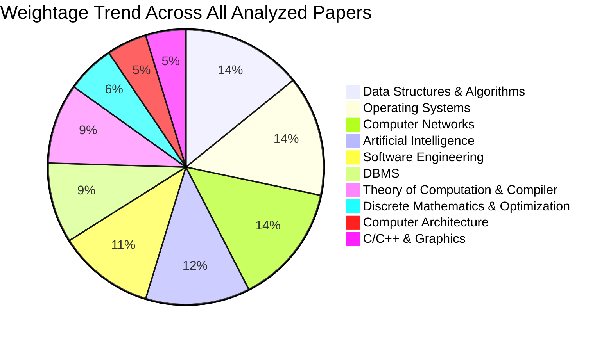

# Subject-Wise Consolidated Analysis of UGC NET Computer Science

This document compiles, consolidates, and merges the topics of the same subject across various UGC NET Computer Science exam papers from December 2023 to June 2025. It acts as a comprehensive study guide, highlighting how specific subjects and their subtopics are distributed and repeated across exams.

> [!NOTE]
> This analysis is derived from the paper-by-paper review in [UGC_NET_Computer_Science_Analysis.md](file:///Users/himanshuverma/Downloads/Cursor/Antigravity/UGC_NET_Computer_Science_Analysis.md).

---

## 1. Data Structures & Algorithms

Data Structures & Algorithms remains one of the most consistently heavy-weight areas across all exams, with recurring questions on advanced tree models, asymptotic bounds, and graph search algorithms.

### **Unified Subtopics & Exam Occurrences**

| Subtopic | Dec 2023 | June 2023 | Dec/June 2024 | June 2024 Re-Exam | June 2025 Mock |
| :--- | :---: | :---: | :---: | :---: | :---: |
| **Trees** (AVL, BST, 2-3-4, Red-Black, B/B+ Trees) | ✔ | ✔ | | | |
| **Hashing** (Probing, Chaining, Extendible) | ✔ | | | | |
| **Complexity Analysis & Master Theorem** | ✔ | ✔ | ✔ | | |
| **Graph Algorithms** (Dijkstra, Bellman-Ford, etc.) | | ✔ | ✔ | | |
| **Sorting** (Heap Sort, Stable/Unstable, In-place) | ✔ | ✔ | ✔ | | |
| **Queues** (Circular Queue conditions) | | ✔ | | | |

### **Detailed Chronological Distribution**
- **December 2023:** 
  - *Trees:* Balanced tree properties including AVL Trees, Binary Search Trees, 2-3-4 Trees, and Red-Black Trees.
  - *Hashing:* Collision resolution mechanisms (Linear/Quadratic probing, Chaining, Double hashing).
  - *Algorithm Analysis:* Time complexities of sorting/searching algorithms, Asymptotic notations ($O$, $\Theta$, $\Omega$).
- **June 2023:** 
  - *Data Structures:* Heap sort (Max-Heapify, Build-Max-Heap processes), B-Trees (Node splitting and level counts), AVL vs Red-Black trees (rotations and height balance), Circular Queues (empty/full conditions).
  - *Algorithm Design:* Dynamic Programming steps (Knapsack), Divide & Conquer, Fast Fourier Transform (Parallel vs Iterative implementations), Graph algorithms (Dijkstra, Bellman-Ford, Floyd-Warshall, Prim's).
  - *Complexity:* Asymptotic bounds ($O$, $\Omega$, $\Theta$), Master Theorem for solving recurrence relations ($T(n) = aT(n/b) + f(n)$), stable sorting algorithms.
- **December/June 2024:** 
  - *Graphs:* In-order traversals, Graph isomorphism, Edge calculations in cycles, complete, and bipartite graphs.
  - *Asymptotic Notations:* Growth rates comparisons of complex functions.
  - *Algorithm Properties:* In-place vs Out-of-place and Stable sorting algorithms.

---

## 2. Operating Systems

Operating Systems is a core pillar of the UGC NET syllabus, featuring heavily in numerical questions (scheduling, page replacement, disk scheduling) and concurrency scenarios.

### **Unified Subtopics & Exam Occurrences**

| Subtopic | Dec 2023 | June 2023 | Dec/June 2024 | June 2024 Re-Exam | June 2025 Mock |
| :--- | :---: | :---: | :---: | :---: | :---: |
| **CPU Scheduling** (FCFS, SJF, RR, Priority) | | ✔ | | ✔ | |
| **Memory Management & Paging** | ✔ | ✔ | ✔ | ✔ | |
| **Page Replacement Algorithms** | | ✔ | | | |
| **Concurrency & Synchronization** (Mutex, Semaphores) | ✔ | ✔ | | ✔ | |
| **Deadlock Avoidance** (Banker's Algorithm) | | ✔ | | | |
| **Disk Scheduling** (SCAN, C-LOOK, SSTF) | ✔ | | ✔ | ✔ | |
| **Linux Concepts** (`/etc/passwd`, `/etc/shadow`) | ✔ | | | | |
| **Process Lifecycle** (Waiting Queues, Interrupts) | | | | | ✔ |

### **Detailed Chronological Distribution**
- **December 2023:**
  - *Memory Management:* Virtual vs Physical addresses, Paging, Page tables structure.
  - *Process Synchronization:* Critical sections, Spin locks, Busy waiting.
  - *Scheduling & Disk Management:* SCAN algorithm, total head movement calculations.
  - *Linux Concepts:* User password storage databases (`/etc/passwd`, `/etc/shadow`), Kernel interrupt priorities.
- **June 2023:**
  - *Process & Threads:* Process Control Block (PCB) structure, Pthreads API, Context switching overheads.
  - *Scheduling:* FCFS, SJF, SRTF, Round Robin, Priority Scheduling (Gantt chart calculations for TAT and WT).
  - *Memory Management:* Virtual Memory, Paging, Page Replacement Algorithms (LRU, Belady's anomaly).
  - *Concurrency:* Mutual Exclusion, Banker's Algorithm (safe states, Need matrix, data structures used).
- **December/June 2024:**
  - *Memory:* Logical to Physical Address Translation steps, Paging vs Segmentation, Memory mapping.
  - *Disk Scheduling:* C-LOOK and SSTF head movement calculations.
- **June 2024 Re-Exam:**
  - *Concurrency:* Spinlocks, counting vs binary Semaphores, Mutual exclusion conditions, Pthreads API standards.
  - *Scheduling & Disks:* Non-preemptive vs preemptive Gantt charts, Average waiting times, Multi-cylinder disk head request scheduling.
  - *Cache & Memory:* Write-through vs Write-back protocols, Cache coherence in multiprocessors, Logical vs Physical address spaces mapping.
- **June 2025 Mock:**
  - *Process Lifecycle:* Events causing a process to enter/leave waiting queues, interruptions vs. blocking calls.

---

## 3. Computer Networks

Computer Networks includes conceptual questions on layers, protocols, wireless standards, and heavy numerical problems on CSMA/CD or subnetting.

### **Unified Subtopics & Exam Occurrences**

| Subtopic | Dec 2023 | June 2023 | Dec/June 2024 | June 2024 Re-Exam | June 2025 Mock |
| :--- | :---: | :---: | :---: | :---: | :---: |
| **OSI / TCP-IP Model** (TCP/UDP Headers) | ✔ | ✔ | ✔ | | |
| **Subnetting & Addressing** (IPv4 Classes, CIDR) | | ✔ | | | |
| **Routing Protocols** (RIP, OSPF, BGP) | ✔ | ✔ | | | ✔ |
| **MAC Layer & Wireless** (CSMA/CD, ALOHA, IEEE 802) | ✔ | ✔ | ✔ | | ✔ |
| **Network Security & Cryptography** (RSA, AES, Hash) | ✔ | ✔ | | | ✔ |
| **Encoding Schemes** (NRZ, Manchester, Baud) | ✔ | | | | |
| **Application Layer Protocols** (DNS, DHCP) | | | ✔ | | |

### **Detailed Chronological Distribution**
- **December 2023:**
  - *OSI & TCP/IP Model:* TCP Header fields (Checksum, Sequence Number, Window size), UDP characteristics.
  - *Routing Protocols:* OSPF, BGP4, RIP, Distance Vector vs Link State, Split horizon with poison reverse.
  - *MAC Layer:* CSMA sensing methods (1-persistent, p-persistent), Bit stuffing protocols.
  - *Cryptography:* Hash functions, Message digests, Public key vs Private key, Digital Signatures.
  - *Encoding:* NRZ, Manchester, Bipolar schemes, Baud rate calculations.
- **June 2023:**
  - *Addressing & Routing:* IPv4 Classes, Subnet masking, Supernetting, Distance Vector Routing (Count to infinity problem), Link State.
  - *Protocols:* TCP (3-way handshake, SYN, ACK), UDP, IP Datagram Headers (TTL, Fragment offset).
  - *MAC Layer & Wireless:* CSMA/CD, ALOHA, IEEE 802 standards (802.15 Bluetooth, 802.16 WiMAX).
  - *Security:* Digital Signatures, Hash Functions, Symmetric vs Asymmetric cryptography (RSA, AES, DES).
- **December/June 2024:**
  - *Data Link Layer:* CSMA/CD minimum frame size calculations based on propagation delay, Network Topologies.
  - *Protocols:* DNS query sequences, DHCP operations, IP header protocols.
  - *Wireless Networks:* Features of MANETs (Mobile Ad-hoc Networks).
- **June 2025 Mock:**
  - *Routing Metrics:* Count-to-infinity problem in Distance Vector Routing.
  - *Wireless Standards:* Distinguishing IEEE 802.16 (WiMAX), 802.15 (Bluetooth), and Mobile Ad-hoc protocols (AODV).
  - *Security:* Deep dive into algorithms (RSA, AES, Hash functions, Digital Signatures).

---

## 4. Artificial Intelligence

AI content is expanding in UGC NET, transitioning from classic search heuristics to machine learning model comparisons, fuzzy sets, and genetic algorithm components.

### **Unified Subtopics & Exam Occurrences**

| Subtopic | Dec 2023 | June 2023 | Dec/June 2024 | June 2024 Re-Exam | June 2025 Mock |
| :--- | :---: | :---: | :---: | :---: | :---: |
| **Search Heuristics** (A*, Alpha-Beta, SMA*) | ✔ | | | | |
| **Fuzzy Logic** (Fuzzy sets, Alpha-cuts, relations) | ✔ | | | ✔ | |
| **Neural Networks** (Perceptron, Weight updates) | ✔ | ✔ | ✔ | ✔ | |
| **Genetic Algorithms** (Initialization, operators) | ✔ | ✔ | ✔ | ✔ | ✔ |
| **Intelligent Agents & KBs** (PEAS, logic representation) | | | | | ✔ |
| **Machine Learning** (Supervised/Unsupervised, PCA) | | ✔ | ✔ | | |

### **Detailed Chronological Distribution**
- **December 2023:**
  - *Search Algorithms:* Alpha-Beta pruning, Greedy Best-First, A* Search, SMA*, State spaces.
  - *Fuzzy Logic:* Fuzzy sets, Crossover points, Core and Support, $\alpha$-cuts.
  - *Neural Networks & GAs:* Feed-forward network weight updates (Sigmoid activation), Genetic Algorithm fitness evaluations.
  - *Multi-Agent Systems:* Single vs Multi-agent architectures.
- **June 2023:**
  - *Machine Learning:* Supervised vs Unsupervised (K-means clustering), Dimensionality reduction (PCA).
  - *Neural Networks:* Perceptrons, Activation functions, Feed-forward networks, Backpropagation, Weight updates.
  - *Genetic Algorithms:* Initialization, Selection, Crossover, Mutation, Evaluation.
- **December/June 2024:**
  - *Machine Learning Models:* Neural Networks vs Decision Trees vs Support Vector Machines.
  - *Neural Networks:* Perceptron learning mechanisms, Backpropagation concepts.
  - *Genetic Algorithms:* Proper sequence (Selection, Initialization, Crossover, Mutation).
- **June 2024 Re-Exam:**
  - *Fuzzy Logic:* Definition of Fuzzy relations, alpha-cuts operations and derivations.
  - *Genetic Algorithms:* Parent selection mechanisms (Tournament, Roulette, Boltzmann), Encoding types.
  - *Neural Networks:* Kohonen SOM (Self-Organizing Maps) weight updation formulas, activation boundaries.
- **June 2025 Mock:**
  - *Intelligent Agents:* Environments, Actuators, Controllers, and Percepts conversions.
  - *Knowledge Bases:* Representational mapping from selecting atoms to axiomatizing the domain.
  - *Machine Learning Algorithms:* Classifying Random Resetting, Scramble, and Inversion in GAs.

---

## 5. Software Engineering

Software Engineering questions frequently target development lifecycle models, testing types, and software metrics like COCOMO and Coupling/Cohesion rankings.

### **Unified Subtopics & Exam Occurrences**

| Subtopic | Dec 2023 | June 2023 | Dec/June 2024 | June 2024 Re-Exam | June 2025 Mock |
| :--- | :---: | :---: | :---: | :---: | :---: |
| **SDLC Models** (Agile, Spiral, FDD) | ✔ | ✔ | ✔ | | |
| **Testing** (Validation, Unit, Regression, Beta) | ✔ | ✔ | ✔ | ✔ | ✔ |
| **Metrics** (COCOMO, CPM/PERT) | | ✔ | | | |
| **Design Principles** (Coupling/Cohesion) | | ✔ | | ✔ | |
| **Quality Factors** (McCall's Quality Factors) | | | | | ✔ |
| **Cloud & Virtualization** (Hypervisors) | | | | | ✔ |

### **Detailed Chronological Distribution**
- **December 2023:**
  - *Software Dev Models:* Spiral model risk analysis.
  - *Testing:* Test suites (Defect, boundary, test cases).
- **June 2023:**
  - *SDLC & Methodologies:* Agile (Scrum, XP), Spiral model, Prototyping model phases, Software product lines.
  - *Metrics & Management:* COCOMO Model (Effort and Size calculations), Project Management (PERT, CPM, Optimistic/Pessimistic time), Software Configuration Management (Version control).
  - *Testing:* Validation vs Verification, Types of testing (Unit, Integration, System, Acceptance, Regression, Component, Beta).
  - *Design Principles:* Jackson's Principle, Coupling and Cohesion types.
- **December/June 2024:**
  - *SDLC:* Sequential flow of the Feature Driven Development (FDD) process, Agile methods vs traditional, Jackson's Principle.
  - *Testing:* Software Testability characteristics (Observability, Controllability).
  - *Architecture:* Layered architecture in operating systems.
- **June 2024 Re-Exam:**
  - *Testing Types:* Distinguishing Equivalence Partitioning, Boundary Value Analysis, Cyclomatic Complexity calculation, and Decision Table testing.
  - *Metrics:* Deep dive into coupling (Stamp vs Control vs External) and ranking them. Requirement elicitation approaches.
- **June 2025 Mock:**
  - *Cloud/Virtualization:* Steps to install and allocate resources for isolated workloads (Hypervisors).
  - *Quality Metrics:* McCall's Quality Factors (Maintainability, Usability, Integrity, Functionality).
  - *Advanced Testing:* Black box vs White box boundaries, distinguishing testing components dynamically.

---

## 6. Database Management Systems (DBMS)

DBMS exhibits highly stable question designs, heavily testing Normalization levels, SQL/Relational Algebra translations, and Transaction control protocols.

### **Unified Subtopics & Exam Occurrences**

| Subtopic | Dec 2023 | June 2023 | Dec/June 2024 | June 2024 Re-Exam | June 2025 Mock |
| :--- | :---: | :---: | :---: | :---: | :---: |
| **Normalization** (1NF to 5NF, Lossless Joins) | ✔ | ✔ | | ✔ | |
| **SQL & Relational Algebra** (DDL, Joins, Division) | ✔ | ✔ | ✔ | ✔ | |
| **Transactions & Concurrency** (ACID, Serializability) | ✔ | ✔ | ✔ | ✔ | |
| **Storage & Indexing** (B/B+ Trees, Extendible Hashing) | ✔ | | | | |
| **Keys** (Candidate, Alternate Keys) | | | ✔ | ✔ | |

### **Detailed Chronological Distribution**
- **December 2023:**
  - *SQL & Relational Algebra:* DDL commands (`CREATE TABLE`), Cartesian products, Outer Joins.
  - *Normalization:* 1NF, BCNF, 4NF (Multivalued dependencies), 5NF (Join dependencies).
  - *Transactions & Concurrency:* Schedules, Blind writes, Conflict Serializability.
  - *Storage & Indexing:* B-Trees, B+ Trees, Extendible Hashing, Dense indexing.
- **June 2023:**
  - *Normalization:* 1NF, 2NF, 3NF, BCNF, 4NF, 5NF. Dependency preservation and Lossless joins.
  - *Transactions:* ACID properties, Serializability (Conflict and View), Locking (2PL), Timestamp ordering.
  - *SQL & Architecture:* DDL/DML, Foreign keys, `COUNT(DISTINCT)` queries.
- **December/June 2024:**
  - *Relational Databases:* Database design steps, Definition of degrees (Attributes).
  - *Keys:* Alternative keys, Candidate key discovery from Functional Dependencies.
  - *Transaction Management:* Phantom read anomalies and Concurrency control.
- **June 2024 Re-Exam:**
  - *Relational Algebra:* Mapping schema, Set operations (Union, Intersect, Divide operation implementations).
  - *Normalization:* Distinguishing between prime and non-prime attributes, advanced keys.
  - *Transactions:* Analyzing ACID properties independently, detecting Conflict vs View Serializable schedules.

---

## 7. Theory of Computation & Compiler Design

TOC and Compiler Design are often closely combined in paper assessments, testing language properties, grammars, and parser design hierarchies.

### **Unified Subtopics & Exam Occurrences**

| Subtopic | Dec 2023 | June 2023 | Dec/June 2024 | June 2024 Re-Exam | June 2025 Mock |
| :--- | :---: | :---: | :---: | :---: | :---: |
| **Automata & Languages** (DFA, NFA, Chomsky) | ✔ | ✔ | ✔ | | |
| **Pumping Lemma & Regularity** | ✔ | ✔ | ✔ | | |
| **Decidability** (Halting, PCP, NP-Completeness) | | ✔ | ✔ | | |
| **Parsers** (LL, SLR, LALR, CLR) | | ✔ | | ✔ | |
| **Intermediate Code** (TAC, Triples, Quadruples) | ✔ | ✔ | | ✔ | |
| **Compiler Optimization** (Flow Graphs, Dominators) | | | | ✔ | |

### **Detailed Chronological Distribution**
- **December 2023:**
  - *Automata:* DFA final state minimization, Moore & Mealy machines.
  - *Regular Languages:* Kleene closure, Identity operations on languages.
  - *Compiler Phases:* Intermediate code generation (Triples, Quadruples), Syntax analysis, Lexical analysis.
- **June 2023:**
  - *Automata & Languages:* Chomsky Hierarchy, Regular Grammars, DFA/NFA conversions, Pumping Lemma.
  - *Decidability:* Halting Problem, PCP (Post Correspondence Problem), NP-Completeness (TSP, SAT).
  - *Compiler Phases:* Lexical, Syntax, Semantic, Intermediate code generation. Parsers (LL, SLR, LALR).
- **December/June 2024:**
  - *NP-Completeness:* Properties of NP-Hard and NP-Complete sets, Reducibility.
  - *Grammar Classification:* Identifying CFGs and strictly Regular Grammars.
  - *Pumping Lemma:* Checking invalidity conditions for Regular Languages.
- **June 2024 Re-Exam:**
  - *Parsing:* Types of Parsers (LR(0), SLR, LALR, LR(1)), Parser hierarchy and power, resolving Shift-Reduce conflicts (Associativity/Precedence rules).
  - *Grammars:* Closures, GOTO sets, Parsing items definition.
  - *Intermediate Code:* Flow graphs, Dominators, Basic blocks, Three Address Code (TAC).

---

## 8. Discrete Mathematics & Optimization

This subject lays the mathematical foundation, focusing on Boolean/Propositional logic, graph structures, group properties, and Linear Programming (LPP).

### **Unified Subtopics & Exam Occurrences**

| Subtopic | Dec 2023 | June 2023 | Dec/June 2024 | June 2024 Re-Exam | June 2025 Mock |
| :--- | :---: | :---: | :---: | :---: | :---: |
| **Logic & Quantifiers** (FOL, Tautologies) | ✔ | ✔ | | | |
| **Group & Set Theory** (Homomorphisms, Relations) | ✔ | ✔ | | | |
| **Linear Programming (LPP)** (Duality, Formulation) | ✔ | | | | |
| **Probability & Combinatorics** (Permutations) | ✔ | ✔ | | | |
| **Graph Theory** (Dirac's Theorem, Planar Graphs) | | ✔ | | | |
| **Queuing Theory** (Little's Law) | | | | | ✔ |

### **Detailed Chronological Distribution**
- **December 2023:**
  - *Probability:* Divisibility probability in a range.
  - *Logic:* Propositional logic tautologies, First-order logic and Quantifiers.
  - *Group Theory:* Sets, Homomorphisms, Subgroups.
  - *Linear Programming:* Formulating LPP constraints, Objective functions, Duality, Graphical solutions.
- **June 2023:**
  - *Logic:* Propositional equivalences, Tautology evaluation, First-Order Logic (Quantifiers, "for all", "there exists").
  - *Group Theory:* Automorphisms of $(Z, +)$, Properties of Relations (Reflexive, Symmetric, Transitive).
  - *Graph Theory:* Dirac's Theorem (Hamiltonian graphs), Planar graphs.
  - *Probability:* Permutations, Combinations, Drawing items without replacement.
- **December/June 2024:**
  - *Mathematics:* Linear Equations (Basic solutions to system equations), Number Systems (Finding the base of a number given an equation).
- **June 2025 Mock:**
  - *Queuing Theory & Optimization:* Little's Law (Calculating average waiting time based on arrival rates and queue sizes).

---

## 9. Computer Architecture & Systems

Hardware design and interface elements, focusing heavily on instruction types, mapping algorithms in Cache memory, pipelining speeds, and RAID error correction.

### **Unified Subtopics & Exam Occurrences**

| Subtopic | Dec 2023 | June 2023 | Dec/June 2024 | June 2024 Re-Exam | June 2025 Mock |
| :--- | :---: | :---: | :---: | :---: | :---: |
| **Digital Logic Circuits** (Decoders, Registers) | ✔ | | | | |
| **Data Representation** (Gray, BCD, Excess-3) | ✔ | | | | |
| **Memory Hierarchy & Cache Mapping** | | ✔ | ✔ | ✔ | ✔ |
| **Pipelines & Processor Speed** (Amdahl's Law) | | ✔ | ✔ | | ✔ |
| **I/O & DMA Interrupts** | ✔ | ✔ | | | |
| **RAID Levels** (RAID 0-6 Properties) | | | ✔ | | |

### **Detailed Chronological Distribution**
- **December 2023:**
  - *Circuits:* Encoders, Decoders, Flip-Flops, Registers (Data storage).
  - *Data Representation:* Gray Code, BCD, Excess-3, Signed binary numbers (Arithmetic Shifts).
  - *Architecture:* System buses (Synchronous/Asynchronous), Interrupt handling hierarchies, Micro-operations vs Subroutines.
- **June 2023:**
  - *Architecture:* Storage access times, Vector processors, Pipeline speedup (Amdahl's Law), Addressing Modes, Interrupts and DMA.
- **December/June 2024:**
  - *Arithmetic Pipelines:* Fixed point multiplication using Carry Save Adders (CSAs) and Carry Propagate Adders (CPAs).
  - *Cache Memory:* Evaluating Cache Performance (Hit Ratio), Memory layout mappings.
  - *Instruction Sets:* Data manipulation instructions vs Branching.
  - *RAID Systems:* Matching RAID levels (0-6) to their error-correction/striping mechanisms.
- **June 2024 Re-Exam:**
  - *Cache & Memory:* Write-through vs Write-back protocols, Cache coherence in multiprocessors, Logical vs Physical address spaces mapping.
- **June 2025 Mock:**
  - *Memory Mapping:* Comparing Data exchange, matching, and transformation when moving from Main Memory to Cache.
  - *Vector Processing:* Calculating total cycle operations based on the number of pipeline lanes.

---

## 10. Programming in C and C++

Code tracing and core syntax semantics form about 10% of the exams, relying on C++ OOP features or complex pointer math.

### **Unified Subtopics & Exam Occurrences**

| Subtopic | Dec 2023 | June 2023 | Dec/June 2024 | June 2024 Re-Exam | June 2025 Mock |
| :--- | :---: | :---: | :---: | :---: | :---: |
| **Basic C Syntax & Loop Tracing** | ✔ | ✔ | | ✔ | ✔ |
| **OOP Properties** (Polymorphism, Virtual functions) | ✔ | | | ✔ | |
| **Pointer Arithmetic & Declarations** | | ✔ | ✔ | ✔ | ✔ |
| **Macros & Operators** (Logical short-circuit) | ✔ | | ✔ | | |

### **Detailed Chronological Distribution**
- **December 2023:**
  - *C Programming:* Postfix expression evaluation, While loops and post-decrements, Macros (`#define`).
  - *C++ OOP:* Virtual functions, Polymorphism, Constructors (Invocation, Inheritance rules, Virtual constructors), Friend functions and classes.
- **June 2023:**
  - *Code Tracing:* Tracking the execution of nested loops or pointer arithmetic in C to determine the output.
- **December/June 2024:**
  - *Pointer Arithmetic:* Complex variable declarations, evaluating array element pointers `a[i][j]`.
  - *Operators:* Short-circuit evaluation of logical operators (`||`, `&&`), bitwise operators.
- **June 2024 Re-Exam:**
  - *Pointers:* Dereferencing mechanisms, pointer-to-pointer mappings, pointer arithmetic constraints (what operations are legal vs illegal).
  - *OOP:* Late vs Early binding, Overloading vs Overriding, Virtual inheritance properties.
  - *Code Tracing:* Determining output of recursive functions, variable swaps, tracking `malloc()` blocks.
- **June 2025 Mock:**
  - *Tracing Algorithms:* Heavy use of nested loops and pointer manipulations to identify edge cases in C variables.

---

## 11. Computer Graphics

Computer Graphics is a smaller, niche subject, typically yielding 2-3 questions per exam focused on line rendering, projections, clipping boundaries, and Bezier curves.

### **Unified Subtopics & Exam Occurrences**

| Subtopic | Dec 2023 | June 2023 | Dec/June 2024 | June 2024 Re-Exam | June 2025 Mock |
| :--- | :---: | :---: | :---: | :---: | :---: |
| **Line Rendering** (DDA, Bresenham) | | ✔ | | | |
| **Clipping Algorithms** (Sutherland-Cohen) | ✔ | ✔ | | ✔ | |
| **Transformations & Viewports** (Scaling, 3D) | ✔ | | | | |
| **Curves** (Bezier, B-Splines) | | ✔ | | | |
| **Projections** (Cabinet, Cavalier, Orthographic) | | | | ✔ | |
| **Visible Surface Removal** (Z-Buffer) | ✔ | | | | |

### **Detailed Chronological Distribution**
- **December 2023:**
  - *Graphics:* 2D Scaling transformations, 3D viewpoint obscuring, Line clipping (Cohen-Sutherland), Hidden surface removal (Z-Buffer).
- **June 2023:**
  - *Graphics:* Bezier curves, B-Splines, Clipping algorithms (Sutherland-Cohen), Line drawing (DDA, Bresenham).
- **June 2024 Re-Exam:**
  - *Algorithms:* Clipping algorithms (Sutherland-Cohen limits), Oblique vs Cavalier vs Cabinet vs Orthographic projections mapping.

---

## Summary of Subject-Wise Trends

> [!TIP]
> **Study Priorities Based on Consolidated Topics:**
> 1. **Core Problem-Solving Subjects:** *Operating Systems*, *Computer Networks*, and *DBMS* consistently feature algorithmic and mathematical subtopics (Scheduling, Subnetting, Normalization) across all papers. Prioritize these for guaranteed high scores.
> 2. **Increasing Trend Subjects:** *Artificial Intelligence* and *Software Engineering* are moving from simple definitions to systems design, cloud hypervisors, and machine learning architectures.
> 3. **High-Value Niche:** *Computer Graphics* and *C/C++ Pointer Tracing* are highly predictable. Reviewing Cohen-Sutherland clipping, projection types, and stack pointer arithmetic provides easy marks.
