# Comprehensive Subject-Wise Study Guide for UGC NET Computer Science

This guide serves as a central repository for all detailed definitions and PYQ-style numericals across the UGC NET CS syllabus.

---

## Master Table of Contents
- [0. Night-Before Exam Formula Cheat Sheet](#0-night-before-exam-formula-cheat-sheet)
- [0.5. Algorithmic Complexity Master Table](#05-algorithmic-complexity-master-table)
- [1. Data Structures & Algorithms](#1-data-structures--algorithms)
- [2. Operating Systems](#2-operating-systems)
- [3. Computer Networks](#3-computer-networks)
- [4. Artificial Intelligence](#4-artificial-intelligence)
- [5. Software Engineering](#5-software-engineering)
- [6. Database Management Systems (DBMS)](#6-database-management-systems-dbms)
- [7. Theory of Computation & Compiler Design](#7-theory-of-computation--compiler-design)
- [8. Discrete Mathematics & Optimization](#8-discrete-mathematics--optimization)
- [9. Computer Architecture & Systems](#9-computer-architecture--systems)
- [10. Programming in C and C++](#10-programming-in-c-and-c)
- [11. Computer Graphics](#11-computer-graphics)

---

## 0. Night-Before Exam Formula Cheat Sheet
> **💡 TIP:**
> This section aggregates every core mathematical formula, statistical boundary, and algorithmic complexity constraint found across all 11 subjects for rapid exam-day review.

- *AVL Balance Factor*: $BF = H_{left} - H_{right}$. A strict mathematical constraint ensuring the tree's height remains absolutely balanced. A node is deemed stable if and only if $BF \in \{-1, 0, 1\}$. Any deviation triggers an immediate structural rotation.
- *B-Tree Capacity*: For a B-Tree of order $m$, an internal node must contain exactly between $\lceil m/2 \rceil - 1$ and $m - 1$ keys.
- *Quadratic Probing Sequence*: $H(k, i) = (h(k) + c_1 i + c_2 i^2) \pmod m$. Mathematically defines the exact index trajectory during a collision, where $i$ is the attempt number. It systematically bypasses primary clustering by mathematically ensuring the step size increases quadratically.
- *The Master Theorem*: $T(n) = aT\left(\frac{n}{b}\right) + f(n)$. Mathematically dictates the exact upper and lower bound runtime of any divide-and-conquer recursion, evaluating the strict tension between the recursive branching cost $a$ and the merge cost $f(n)$.
- *Edge Relaxation*: $If\ d[u] + w(u,v) \lt d[v] \implies d[v] = d[u] + w(u,v)$. The absolute mathematical core of all shortest-path algorithms. It continually tests if a newly discovered route via node $u$ is strictly cheaper than the currently known path to $v$.
- *Circular Queue Element Count*: $Count = (rear - front + N) \pmod N$. A strict mathematical operation that calculates the exact physical number of data elements present in the queue, seamlessly wrapping around the array boundary.
- *0/1 Knapsack DP State*: $K[i, w] = \max(K[i-1, w],\ K[i-1, w-w_i] + v_i)$. Mathematically evaluates the absolute optimal value state. It forces a strict choice: either entirely exclude the $i^{th}$ item, or physically include it (adding its value $v_i$ and subtracting its weight $w_i$), capturing the maximum possible optimization.
- *Turnaround Time*: $TAT = \text{Completion Time} - \text{Arrival Time}$. The absolute total physical time a process spends within the system from inception to termination.
- *Waiting Time*: $WT = TAT - \text{Burst Time}$. The strict mathematical sum of all physical time periods a process spends trapped in the Ready Queue.
- *Exponential Smoothing (SJF)*: $\tau_{n+1} = \alpha t_n + (1-\alpha)\tau_n$. The exact mathematical algorithm the OS utilizes to predict the physical length of the next CPU burst based on historical execution data.
- *Effective Memory Access Time (EMAT)*: $EMAT = p \times (\text{Page Fault Service Time}) + (1-p) \times (\text{Memory Access Time})$. Mathematically bounds the strict average physical time to access data, driven primarily by the page fault probability rate $p$.
- *TLB Access Time*: $EMAT_{TLB} = h \times (c + m) + (1-h) \times (c + 2m)$. Where $h$ is the hit ratio, $c$ is TLB cache lookup time, and $m$ is main memory access time.
- *Page Fault Rate Calculation*: $PFR = \frac{\text{Total Page Faults}}{\text{Total Memory References}}$. A strict mathematical ratio defining the catastrophic failure rate of the system's current page replacement algorithm architecture.
- *Banker's Need Matrix*: $Need[i, j] = Max[i, j] - Allocation[i, j]$. Mathematically calculates the absolute remaining physical resources a process strictly requires to guarantee successful termination.
- *Banker's Safety Condition*: A process $P_i$ can strictly execute if and only if $Need_i \le Available$.
- *Disk Access Time*: $DAT = \text{Seek Time} + \text{Rotational Latency} + \text{Transfer Time}$. The fundamental mathematical equation defining absolute hardware delay. Seek time (arm movement) dominates the equation, which is strictly why SCAN and C-LOOK algorithms are architecturally mandatory.
- *Maximum Transmission Unit (MTU)*: $Payload_{max} = MTU - \text{Header Size}$. Dictates the strict maximum payload bytes a Layer 2 frame can encapsulate.
- *Total Network Delay*: $D_{total} = D_{proc} + D_{queue} + D_{trans} + D_{prop}$. The absolute sum of nodal processing, router queuing, physical transmission, and cable propagation delays.
- *Subnet Capacity*: $\text{Total IPs} = 2^H$. Where $H$ is the number of strict host bits.
- *Usable Hosts per Subnet*: $\text{Usable Hosts} = 2^H - 2$. Two addresses are strictly reserved: the lowest (Network ID) and the highest (Broadcast ID).
- *TCP Throughput bound*: $Throughput \le \frac{W \times MSS}{RTT}$. Where $W$ is the congestion window size.
- *TCP Sequence Number Calculation*: $Seq_{next} = Seq_{current} + \text{Payload Bytes}$. A strict mathematical offset used to perfectly reassemble fragmented segments.
- *Transmission Delay*: $T_t = \frac{L}{B}$. The mathematical time required to push all bits of a frame onto the physical wire.
- *Propagation Delay*: $T_p = \frac{d}{v}$. The strict physics of the electrical signal traversing distance $d$ at propagation speed $v$.
- *RSA Encryption*: $C = M^e \pmod n$. Mathematical transformation of Plaintext $M$ into Ciphertext $C$.
- *RSA Decryption*: $M = C^d \pmod n$. Mathematical recovery of Plaintext $M$ using the strict private exponent $d$.
- *Bellman-Ford Relaxation (RIP)*: $D_x(y) = \min_{v} \{c(x,v) + D_v(y)\}$. The absolute minimum distance from node $x$ to $y$ is strictly calculated by evaluating the cost to an immediate neighbor $v$ plus the neighbor's known path to $y$.
- *Nyquist Bit Rate (Noiseless)*: $BitRate = 2B \log_2(L)$. The theoretical maximum data rate for a completely frictionless, noiseless channel of bandwidth $B$.
- *Shannon Capacity (Noisy)*: $C = B \log_2(1 + S/N)$. The absolute mathematical limit of data transmission over a physical channel affected by Signal-to-Noise thermal interference.

- *A-Star Evaluation Function*: $f(n) = g(n) + h(n)$. The core equation driving informed search. $g(n)$ is the exact known cost from root to node $n$, while $h(n)$ is the estimated heuristic cost from $n$ to the goal.
- *Minimax Bounds*: At a MAX node, value = $\max(\text{children})$. At a MIN node, value = $\min(\text{children})$.
- *Alpha-Beta Pruning Cutoff*: Cutoff occurs at a MAX node if $\alpha \ge \beta$, preventing redundant subtree evaluation.
- *Modus Ponens*: $(P \implies Q) \land P \implies Q$. The foundational mathematical rule of deductive inference.
- *Resolution Principle*: $(P \lor Q) \land (\neg Q \lor R) \implies (P \lor R)$. Used by automated theorem provers to cancel complementary literals.
- *Sigmoid Activation*: $\sigma(z) = \frac{1}{1 + e^{-z}}$. Mathematical function mapping any real value $z$ perfectly into the range $(0, 1)$, widely used in binary classification.
- *Bellman Equation (Q-Learning)*: $Q^{new}(s,a) = Q(s,a) + \alpha [R(s,a) + \gamma \max Q(s', a') - Q(s,a)]$. The recursive mathematical update rule balancing immediate reward $R$ with discounted future utility.
- *Fuzzy Cartesian Product*: $\mu_{A \times B}(x, y) = \min(\mu_A(x), \mu_B(y))$. Mathematical construction of a multi-dimensional fuzzy space.
- *Relational Division ($\div$)*: $R \div S = \{t \mid \forall s \in S, \exists r \in R \text{ such that } r[S] = s \text{ and } r[R-S] = t\}$. Mathematically isolates tuples in $R$ that are flawlessly paired with every single tuple in $S$.
- *Attribute Closure ($X^+$)*: $X^+ = X \cup \{Y \mid X \to Y \text{ is inferable from } F\}$. The absolute mathematical boundary of all attributes functionally determined by $X$ under the strict rules of Armstrong's Axioms.
- *Armstrong's Transitivity*: $If\ X \to Y \text{ and } Y \to Z, \text{ then } X \to Z$. The mathematical backbone used to rigorously derive implied functional dependencies.
- *Lossless Join Decomposition*: $R_1 \bowtie R_2 = R$. A strict mathematical guarantee. Furthermore, either $(R_1 \cap R_2) \to R_1$ or $(R_1 \cap R_2) \to R_2$ must absolutely hold true for the decomposition to be perfectly lossless.
- *Timestamp Ordering Protocol*: If $TS(T_i) \lt TS(T_j)$ (meaning $T_i$ is older), then $T_i$ must mathematically execute before $T_j$. A strict rule preventing Read/Write conflicts without utilizing standard blocking locks.
- *B+ Tree Order Calculation ($m$)*: $m \times P + (m-1) \times (K + D) \le B_{size}$. Where $P$ is block pointer size, $K$ is key size, $D$ is data pointer size, and $B_{size}$ is the strict physical disk block size. Mathematically guarantees the node fits perfectly into one physical disk I/O sector.
- *Chomsky Normal Form (CNF)*: Every production rule must mathematically adhere strictly to either $A \to BC$ or $A \to a$. Crucial for bounding parse tree height.
- *CYK Algorithm Complexity*: $O(n^3 \cdot |G|)$. The mathematical time complexity required to definitively parse a string of length $n$ against a grammar $G$ in strict CNF.
- *Rice's Theorem*: Let $P$ be any non-trivial property of partial mathematically computable functions. The problem of determining whether a Turing Machine computes a function with property $P$ is absolutely undecidable.
- *FIRST(X)*: The strict mathematical set of terminal symbols that begin the strings derived from grammar symbol $X$. Essential for constructing predictive parsing tables.
- *FOLLOW(A)*: The set of terminals that can mathematically appear immediately to the right of non-terminal $A$ in some sentential form. Required for resolving LL(1) empty productions.
- *Strength Reduction*: Replacing computationally expensive operators with cheaper ones, e.g., $X \times 2 \to X \ll 1$ (Bitwise Left Shift).
- *Context-Free Pumping Lemma*: Partition $s = uvxyz$ where $|vxy| \le p$ and $|vy| \gt 0$. The string $uv^ixy^iz \in L$ for all $i \ge 0$. Mathematically tests dual-pumping capabilities.
- *Liveness Analysis*: $In[n] = Use[n] \cup (Out[n] - Def[n])$. A strict data-flow equation mathematically calculating which variable registers are currently holding active values vs dead data.
- *Logical Implication*: $P \to Q \equiv \neg P \lor Q$. A strict mathematical equivalence used to eliminate implication arrows in formal proofs.
- *Quantifier Negation*: $\neg(\forall x P(x)) \equiv \exists x \neg P(x)$. Pushing negation mathematically flips universal quantifiers to existential, and vice versa.
- *Boolean Algebra Distributivity*: $a \lor (b \land c) = (a \lor b) \land (a \lor c)$. Essential property for digital circuit simplification.
- *Handshaking Lemma*: $\sum \text{deg}(v) = 2|E|$. The absolute sum of all vertex degrees must perfectly equal twice the total number of edges.
- *Planar Graph Edge Bound*: $E \le 3V - 6$. For any simple connected planar graph with $V \ge 3$, violating this bound mathematically proves the graph is non-planar (must intersect).
- *Inclusion-Exclusion Principle*: $|A \cup B| = |A| + |B| - |A \cap B|$. Strict arithmetic used to calculate union sizes without physically double-counting intersections.
- *Binomial Distribution*: $P(X=k) = \binom{n}{k} p^k (1-p)^{n-k}$. Calculates exact probability of $k$ successes in $n$ independent boolean trials.
- *LPP Standard Duality*: Maximize $Z = c^T x$ subject to $Ax \le b$ mathematically maps directly to its strict Dual: Minimize $W = b^T y$ subject to $A^T y \ge c$. If one optimal bound is found, the other is instantly solved.
- *Traffic Intensity ($\rho$)*: $\rho = \frac{\lambda}{\mu}$. The core mathematical ratio of arrival rate $\lambda$ to service rate $\mu$. The system strictly collapses into infinite backlog if $\rho \ge 1$.
- *Shannon's Expansion Theorem*: $F(x_1, \dots, x_n) = x_1 \cdot F(1, \dots, x_n) + \neg x_1 \cdot F(0, \dots, x_n)$. The mathematical foundation for implementing massive boolean functions using multiplexers.
- *Maximum Clock Frequency (Synchronous)*: $f_{max} = \frac{1}{t_{pd} + t_{setup}}$. The absolute mathematical speed limit of a synchronous circuit bounded by flip-flop propagation delay and setup time requirements.
- *Effective Memory Access Time (EMAT)*: $EMAT = H_c \times T_c + (1 - H_c) \times (T_c + T_m)$. The core statistical average of memory access duration utilizing Cache Hit Ratio ($H_c$), Cache Time ($T_c$), and Main Memory Time ($T_m$).
- *CPU Execution Time*: $T = IC \times CPI \times \tau$. The absolute time required to execute a program, calculated via Instruction Count ($IC$), Cycles Per Instruction ($CPI$), and strict Clock Cycle Time ($\tau$).
- *Pipeline Speedup ($S$)*: $S = \frac{n \times k}{k + n - 1}$. The theoretical mathematical acceleration of a $k$-stage pipeline executing $n$ instructions, which asymptotically approaches $k$ as $n \to \infty$.
- *Amdahl's Law*: $S_{max} = \frac{1}{(1-P) + \frac{P}{N}}$. The rigid mathematical ceiling on speedup using $N$ parallel processors, severely bottlenecked by the strict sequential fraction $(1-P)$.
- *Total Disk Access Time*: $T_{access} = T_{seek} + T_{rotational} + T_{transfer}$. The physical mathematical delay summing the read-head arm movement, the platter rotation to the sector, and the sheer magnetic data transfer.
- *RAID 5 Capacity*: $C_{usable} = (N - 1) \times S_{min}$. The strict usable disk space spanning $N$ drives, sacrificing exactly one drive's capacity mathematically for distributed XOR parity.
- *Array-to-Pointer Decay*: `arr[i] = *(arr + i)`. The strict mathematical equivalence executed by the compiler to physically resolve array indexing using raw pointer arithmetic.
- *Recursive Time Complexity Master Theorem*: $T(n) = aT(n/b) + f(n)$. The core recurrence relation mathematically evaluating the exact time complexity of tree-based recursive divide-and-conquer algorithms.
- *Object Size Calculation*: $\text{sizeof(Object)} = \sum \text{sizeof(attributes)} + \text{Padding}$. Physically calculates RAM footprint, strictly ignoring standard methods but including the hidden `vptr` if virtual functions are present.
- *Dynamic V-Table Binding*: $\text{Method Address} = \text{VTable Base Address} + (\text{Method Index} \times \text{Pointer Size})$. The exact physical memory jump executed by the CPU at runtime to achieve late binding polymorphism.
- *Template Expansion Complexity*: $S_{binary} \approx S_{base} \times N_{types}$. A rough mathematical estimate of compiler code bloat, where the binary size scales strictly with the total number of unique data types invoked through the generic template.
- *Frame Buffer Size*: $\text{Size (Bits)} = \text{Resolution}_x \times \text{Resolution}_y \times \text{Color Depth (Bits per Pixel)}$. The absolute hardware VRAM footprint physically required to render a single static frame.
- *Bresenham's Initial Decision Parameter*: $P_0 = 2\Delta y - \Delta x$. The core mathematical seed used to recursively evaluate integer proximity to the true geometric line without relying on costly floating-point divisions.
- *2D Rotation Matrix*: $\begin{bmatrix} \cos \theta & -\sin \theta \\ \sin \theta & \cos \theta \end{bmatrix}$. The strict trigonometric linear algebra transformation rotating points mathematically counter-clockwise strictly around the absolute origin.
- *Parametric Line Intersection*: $x = x_1 + t(x_2 - x_1)$ and $y = y_1 + t(y_2 - y_1)$ for $0 \le t \le 1$. The strict mathematical equations used by clipping algorithms to calculate the exact physical pixel where an off-screen line visibly breaches the window boundary.
- *Perspective Projection Transformation*: $x_p = \frac{x \cdot d}{z}$ and $y_p = \frac{y \cdot d}{z}$. The profound physical transformation physically dividing Euclidean coordinates by depth ($z$) to mathematically simulate the violent optical convergence of the human eye.

---

## 0.5. Algorithmic Complexity Master Table
> **💡 TIP:**
> This table aggregates the rigorous asymptotic time and space bounds for core algorithmic structures.

| Algorithm | Best Time | Average Time | Worst Time | Space Complexity |
| :--- | :--- | :--- | :--- | :--- |
| **Bubble Sort** | $\Omega(N)$ | $\Theta(N^2)$ | $O(N^2)$ | $O(1)$ |
| **Insertion Sort** | $\Omega(N)$ | $\Theta(N^2)$ | $O(N^2)$ | $O(1)$ |
| **Merge Sort** | $\Omega(N \log N)$ | $\Theta(N \log N)$ | $O(N \log N)$ | $O(N)$ |
| **Quick Sort** | $\Omega(N \log N)$ | $\Theta(N \log N)$ | $O(N^2)$ | $O(\log N)$ |
| **Binary Search** | $\Omega(1)$ | $\Theta(\log N)$ | $O(\log N)$ | $O(1)$ |
| **BST Search** | $\Omega(1)$ | $\Theta(\log N)$ | $O(N)$ | $O(N)$ |
| **AVL Tree Search** | $\Omega(1)$ | $\Theta(\log N)$ | $O(\log N)$ | $O(N)$ |
| **Dijkstra's (Min-Heap)**| $\Omega(V \log V)$ | $\Theta((V+E)\log V)$| $O((V+E)\log V)$| $O(V)$ |
| **Bellman-Ford** | $\Omega(V \times E)$ | $\Theta(V \times E)$ | $O(V \times E)$ | $O(V)$ |

---

## 1. Data Structures & Algorithms

### 1.1 Trees (AVL, BST, 2-3-4, Red-Black, B/B+ Trees)
**Deep-Dive Definitions & Properties:**
> **📝 NOTE:**
> **Cross-Disciplinary Link**: B and B+ Trees (covered here) form the absolute mathematical foundation for **DBMS Indexing** (covered in [Subject 6.2](#62-normalization--indexing-b-trees)).
- **Core Definition**:
  - Hierarchical node-based memory models
  - Optimize search times from linear $O(n)$ → logarithmic $O(\log n)$
  - A BST enforces a strict left-right bounding condition on every node
  - In-order traversal of a BST intrinsically yields a perfectly sorted sequence
- **Key Properties & Mechanisms**:
  - *AVL Trees*:
    - Self-balancing BST preventing degradation into $O(n)$ linked lists
    - Enforce strict height balance factor: $\{-1, 0, 1\}$ at every node
    - Trigger LL / RR / LR / RL rotations immediately upon violation
    - More rigidly balanced → faster search operations
  - *Red-Black Trees*:
    - Self-balancing BST with relaxed balancing rules
    - Enforce color-coding rules (Red nodes cannot have Red children)
    - Longest path $\le$ 2× shortest path
    - Less balanced than AVL → fewer rotations → faster insertions/deletions
  - *B-Trees*:
    - Multi-way disk-optimized tree for Hard Drives and relational databases
    - A node of order $m$ holds up to $m-1$ keys and $m$ child pointers
    - Minimum children in any internal node: $\lceil m/2 \rceil$
  - *B+ Trees (Industry Standard)*:
    - All data pointers are evicted from internal nodes → pushed strictly to leaf level
    - Internal nodes act purely as routing indices
    - Leaf nodes are linked sequentially via lateral pointers
    - Enables lightning-fast $O(1)$ sequential range scans without tree traversal
  - **Core Mathematical Formulas**:
    - *AVL Balance Factor*: $BF = H_{left} - H_{right}$. A strict mathematical constraint ensuring the tree's height remains absolutely balanced. A node is deemed stable if and only if $BF \in \{-1, 0, 1\}$. Any deviation triggers an immediate structural rotation.
    - *B-Tree Capacity*: For a B-Tree of order $m$, an internal node must contain exactly between $\lceil m/2 \rceil - 1$ and $m - 1$ keys.

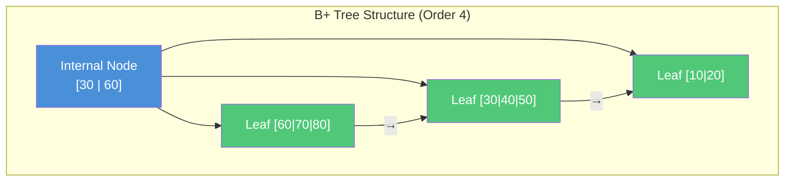

#### 📝 PYQ Numerical Example (Difficulty: Hard)
**Question:** A B-tree of order 4 is mathematically constructed from scratch by exactly 10 successive independent key insertions. What is the absolute maximum possible height of the resulting B-tree? (Assume the root strictly resides at height 0).
**Explanation:**
Order $m = 4$ mathematically dictates the absolute maximum children per node is 4, and maximum keys is 3. The mathematical formula for minimum children in any internal node is strictly $\lceil m/2 \rceil = 2$.
To maximize the physical height of the tree, we must construct the architecture as sparsely as mathematically possible, forcing the tree to grow vertically by placing the absolute minimum number of keys in each node.

1. Minimum keys in the root node = 1.
2. Minimum keys in any standard internal node = $\lceil m/2 \rceil - 1 = 1$.
Level 0 (Root): Contains exactly 1 node holding 1 key, branching to 2 children.
Level 1: Contains exactly 2 nodes holding 1 key each, branching to 4 children.
Level 2: Contains exactly 4 nodes holding 1 key each, branching to 8 children.
Total keys placed in levels 0, 1, and 2 = $1 + 2 + 4 = 7$ keys.
We are mathematically forced to insert 10 total keys. Since 7 are placed, 3 keys remain floating. These 3 remaining keys immediately force the tree architecture to grow an entirely new physical level to accommodate them, extending the structure down to Level 3.
**Answer:** The maximum theoretical height is exactly 3.

### 1.2 Hashing (Probing, Chaining, Extendible)
**Deep-Dive Definitions & Properties:**
- **Core Definition**:
  - Bypasses traversal by converting a key directly into a physical array index via Hash Function $h(k)$
  - Target domain is strictly smaller than infinite key space → collisions are inevitable
  - Collisions must be resolved by strict architectural protocols
- **Key Properties & Mechanisms**:
  - *Open Addressing (Closed Hashing)* — resolve collisions by probing for empty slots:
    - **Linear Probing**: Steps forward by 1
      - Suffers from **Primary Clustering** (massive contiguous occupied blocks degrade performance)
    - **Quadratic Probing**: Steps by squares ($1, 4, 9, ...$)
      - Eliminates primary clustering
      - Suffers from **Secondary Clustering** (same-hash keys follow identical trajectory)
    - **Double Hashing**: Uses a second independent hash function for step sizes
      - Completely eliminates all forms of clustering
  - *Extendible Hashing (Dynamic Hashing)*:
    - Designed for database systems that cannot halt execution to resize arrays
    - Uses an expanding **Directory** of pointers controlled by **Global Depth** ($d$)
    - Physical data stored in **Buckets** controlled by **Local Depth** ($d'$)
    - On bucket overflow:
      - If $d' \lt d$ → bucket independently splits
      - If $d' = d$ → entire Directory doubles in size (Global Depth increments), then bucket splits
  - **Core Mathematical Formulas**:
    - *Quadratic Probing Sequence*: $H(k, i) = (h(k) + c_1 i + c_2 i^2) \pmod m$. Mathematically defines the exact index trajectory during a collision, where $i$ is the attempt number. It systematically bypasses primary clustering by mathematically ensuring the step size increases quadratically.


> **📊 DIFFERENCE TABLE:** Array vs Linked List vs Hash Table
> | Feature | Array | Linked List | Hash Table |
> | :--- | :--- | :--- | :--- |
> | **Memory Allocation** | Contiguous (Static/Dynamic) | Non-contiguous (Dynamic) | Non-contiguous (Dynamic array of buckets) |
> | **Access Time** | $O(1)$ via index | $O(N)$ sequential traversal | $O(1)$ average, $O(N)$ worst |
> | **Insertion/Deletion** | $O(N)$ due to shifting | $O(1)$ if pointer known | $O(1)$ average, $O(N)$ worst |
> | **Memory Overhead** | None | High (requires Next/Prev pointers) | Moderate (empty buckets, pointers) |

#### 📝 PYQ Numerical Example (Difficulty: Medium)
**Question:** A hash table contains exactly 10 physical buckets (indices 0 to 9) and utilizes strict Linear Probing. The keys `43, 36, 92, 87, 11, 4, 71, 13, 14` are sequentially inserted. The hash function is strictly $h(x) = x \pmod{10}$. What is the exact final memory index location of the key `14`?
**Explanation:**
The insertions are strictly mathematical modulo operations:
- `43`: $43 \pmod{10} = 3$ (Index 3).
- `36`: $36 \pmod{10} = 6$ (Index 6).
- `92`: $92 \pmod{10} = 2$ (Index 2).
- `87`: $87 \pmod{10} = 7$ (Index 7).
- `11`: $11 \pmod{10} = 1$ (Index 1).
- `4`: $4 \pmod{10} = 4$ (Index 4).
- `71`: $71 \pmod{10} = 1$. Fatal Collision! Linear probe steps strictly by 1: Index 2 (Occupied), Index 3 (Occupied), Index 4 (Occupied), Index 5 (Empty). Value 71 is physically locked into Index 5.
- `13`: $13 \pmod{10} = 3$. Collision! Probe: Index 4 (Occ), 5 (Occ), 6 (Occ), 7 (Occ), 8 (Empty). Value 13 locked into Index 8.
- `14`: $14 \pmod{10} = 4$. Collision! Probe: Index 5, 6, 7, 8, 9 (Empty). Value 14 locked into Index 9.
**Answer:** The key `14` is permanently located at exact Index 9.

### 1.3 Complexity Analysis & Master Theorem
**Deep-Dive Definitions & Properties:**
- **Core Definition**:
  - Complexity is measured as a mathematical growth-rate function, not physical seconds
  - Describes how operations scale as input $N \to \infty$
- **Key Properties & Mechanisms**:
  - *Asymptotic Bounds*:
    - **Big-O ($O$)**: Mathematical ceiling — worst-case time complexity
    - **Big-Omega ($\Omega$)**: Mathematical floor — best-case complexity
    - **Theta ($\Theta$)**: Upper and lower bounds perfectly match — tight bound across all cases
  - *The Master Theorem*:
    - Solves Divide-and-Conquer recurrences of the form: $T(n) = aT(n/b) + f(n)$
    - Compute Critical Polynomial Value: $n^{\log_b a}$
    - Compare $f(n)$ against $n^{\log_b a}$:
      - **Case 1**: $f(n)$ polynomially lighter → recursive leaves dominate → $T(n) = \Theta(n^{\log_b a})$
      - **Case 2**: $f(n)$ and critical value match → cost uniformly distributed → $T(n) = \Theta(n^{\log_b a} \log n)$
      - **Case 3**: $f(n)$ polynomially heavier → root dominates → $T(n) = \Theta(f(n))$
  - **Core Mathematical Formulas**:
    - *The Master Theorem*: $T(n) = aT\left(\frac{n}{b}\right) + f(n)$. Mathematically dictates the exact upper and lower bound runtime of any divide-and-conquer recursion, evaluating the strict tension between the recursive branching cost $a$ and the merge cost $f(n)$.

#### 📝 PYQ Numerical Example (Difficulty: Easy)
**Question:** Utilizing the Master Theorem, strictly solve the exact recurrence relation: $T(n) = 8T(n/2) + n^2$.
**Explanation:**
1. **Identify Architectural Variables**: The relation dictates $a = 8$ (eight recursive subproblems spawned), $b = 2$ (the dataset size is strictly halved), and $f(n) = n^2$ (the physical cost to merge the results).
2. **Compute the Critical Value**: Calculate $n^{\log_b a} \implies n^{\log_2 8}$. Because $2^3 = 8$, the critical value evaluates exactly to $n^3$.
3. **Mathematical Comparison**: We rigorously compare the merge cost $f(n) = n^2$ against the critical value $n^3$. The function $n^2$ grows polynomially slower than $n^3$ by exactly one full exponent ($n^{3-1}$).
Therefore, Case 1 of the Master Theorem strictly applies, mathematically proving that the recursive leaves absolutely dominate the total algorithmic execution time.
**Answer:** The tight asymptotic time complexity is exactly $T(n) = \Theta(n^3)$.

### 1.4 Graph Algorithms
**Deep-Dive Definitions & Properties:**
- **Core Definition**:
  - Graph structures mathematically model pairwise relationships between objects
  - Shortest Path and MST algorithms are optimization engines for minimum-cost traversal
- **Key Properties & Mechanisms**:
  - *Dijkstra's Algorithm*:
    - Uses a strict Greedy paradigm with a Priority Queue (Min-Heap)
    - Once a node is marked "visited," its minimum distance is permanently guaranteed
    - **Fatal Limitation**: Catastrophically fails on graphs with negative-weight edges
    - Reason: A hidden negative path can retroactively lower the cost of a "permanent" node
  - *Bellman-Ford Algorithm*:
    - Abandons the Greedy approach; uses Dynamic Programming
    - Systematically relaxes every single edge exactly $V-1$ times
    - Guarantees the absolute mathematical minimum even with negative edges
    - Can detect fatal negative-weight cycles (if relaxation still reduces cost after $V-1$ passes)
  - *Minimum Spanning Trees (MST)*:
    - **Kruskal's**: Sort all edges globally by weight → greedily accept if no cycle forms (use Disjoint Set / Union-Find)
    - **Prim's**: Grow a single contiguous tree boundary → consume the cheapest connecting edge at each step
  - **Core Mathematical Formulas**:
    - *Edge Relaxation*: $If\ d[u] + w(u,v) \lt d[v] \implies d[v] = d[u] + w(u,v)$. The absolute mathematical core of all shortest-path algorithms. It continually tests if a newly discovered route via node $u$ is strictly cheaper than the currently known path to $v$.

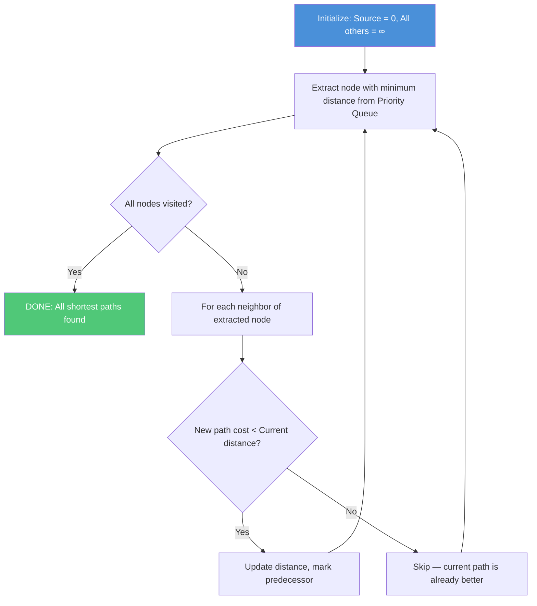

#### 📝 PYQ Numerical Example (Difficulty: Medium)
**Question:** A graph has vertices $A, B, C, D$ and weighted edges $A \to B=1, A \to C=4, B \to C=2, B \to D=6, C \to D=3$. Apply Dijkstra's rigorous algorithm strictly from source $A$. What is the absolute shortest path cost to $D$?
**Explanation:**
Initialization phase strictly sets source distance $A=0$, and all other nodes $B, C, D$ to absolute mathematical infinity ($\infty$). Visited Set = $\emptyset$.
1. Extract minimum unvisited node $A(0)$. 
   - Relax adjacent edges: Distance to $B$ becomes $0+1=1$. Distance to $C$ becomes $0+4=4$.
   - $A$ is permanently locked. Distances are strictly: $B=1, C=4, D=\infty$.
2. Extract minimum unvisited node $B(1)$.
   - Relax adjacent edges: Path to $C$ via $B$ is strictly $1+2 = 3$. Because $3 \lt 4$, the old distance is physically destroyed and $C$ updates to $3$. Path to $D$ via $B$ is $1+6 = 7$.
   - $B$ is permanently locked. Distances are strictly: $C=3, D=7$.
3. Extract minimum unvisited node $C(3)$.
   - Relax adjacent edges: Path to $D$ via $C$ is strictly $3+3 = 6$. Because $6 \lt 7$, $D$ updates to exactly $6$.
   - $C$ is permanently locked.
   **Answer:** The absolute shortest mathematical path cost to $D$ is exactly 6 (following the strict sequence $A \to B \to C \to D$).

### 1.5 Sorting & Queues
**Deep-Dive Definitions & Properties:**
- **Core Definition**:
  - Sorting engines manipulate raw array memory to establish perfect sequential data alignment
  - Queues are rigorous memory buffers enforcing chronological data execution
- **Key Properties & Mechanisms**:
  - *Sorting Stability & In-Place*:
    - **Stable Sort**: Duplicate elements retain their original relative positions after sorting
      - Vital for multi-key database sorts
      - Examples: Merge Sort, Insertion Sort, Bubble Sort
    - **In-Place Sort**: Uses $O(1)$ auxiliary memory (no secondary array)
      - Examples: Heap Sort, Quick Sort
    - **Merge Sort**: Stable ✅ but NOT in-place ❌ (requires $O(n)$ extra RAM)
    - **Heap Sort**: In-place ✅ but NOT stable ❌
      - Models a contiguous 1D array as a Complete Binary Tree
      - Sorts using exactly $O(1)$ auxiliary RAM
  - *Circular Queue Architecture*:
    - Standard linear queue suffers from "False Full" states (dequeued slots become unusable dead memory)
    - Circular Queue fuses array ends using Modulo Arithmetic: $Index = (Index + 1) \pmod N$
    - **Critical Rule**: One physical array slot must be permanently sacrificed (left blank) to distinguish between empty and full states
  - **Core Mathematical Formulas**:
    - *Circular Queue Element Count*: $Count = (rear - front + N) \pmod N$. A strict mathematical operation that calculates the exact physical number of data elements present in the queue, seamlessly wrapping around the array boundary.

#### 📝 PYQ Numerical Example (Difficulty: Easy)
**Question:** A circular queue has a physical array size of exactly 5 (indices 0 to 4). The internal queue variables are actively set to `front = 3` and `rear = 1` (where rear strictly points to the next available physical insertion slot). Exactly how many elements are physically present in the queue?
**Explanation:**
The queue elements mathematically exist sequentially starting directly from the `front` index, continuing up to the `rear - 1` index, seamlessly wrapping around the physical array boundary.
- The array indices mathematically exist as: 0, 1, 2, 3, 4.
- The `front` is locked at 3. This index is occupied.
- The next logical element wraps around the edge to 4. Occupied.
- The next logical element wraps past the boundary to 0. Occupied.
- The `rear` points to 1. By strict definition, this means index 1 is the next available empty slot, terminating the count.
The physically occupied indices are exactly: 3, 4, and 0.
Mathematically, the strict formula evaluates as: Elements count = $(rear - front + N) \pmod N = (1 - 3 + 5) \pmod 5 = 3 \pmod 5 = 3$.
**Answer:** There are exactly 3 data elements physically residing in the queue.

### 1.6 Advanced Algorithms (DP, Topological Sort, Amortized)
**Deep-Dive Definitions & Properties:**
- **Core Definition**:
  - Tackle massive computational complexity via specialized mathematical optimizations
  - Key techniques: state-space memoization, topological dependency tracking, cost averaging
- **Key Properties & Mechanisms**:
  - *Dynamic Programming (0/1 Knapsack)*:
    - Destroys exponential $O(2^n)$ recursive branching by caching state results in a 2D matrix
    - Formula: $K[i, w] = \max(K[i-1, w],\ K[i-1, w-w_i] + v_i)$
    - Evaluates whether including the $i^{th}$ item yields higher value than excluding it, bounded by capacity $w$
    - Builds solutions bottom-up from smallest subproblems
  - *Topological Sorting*:
    - Linear ordering of vertices strictly for Directed Acyclic Graphs (DAGs)
    - Guarantees: for every directed edge $U \to V$, task $U$ executes before $V$
    - If a cycle exists → sort catastrophically fails (circular dependency)
    - Implementation: Kahn's Algorithm (BFS with in-degree tracking) or DFS-based reverse finish order
  - *Amortized Analysis*:
    - Evaluates algorithms where rare operations trigger massive $O(n)$ restructuring
    - Example: Dynamic array resize — doubles capacity when full
    - Because resize occurs so rarely, the average guaranteed cost per operation remains $O(1)$
    - Methods: Aggregate Method, Accounting Method, Potential Method
  - **Core Mathematical Formulas**:
    - *0/1 Knapsack DP State*: $K[i, w] = \max(K[i-1, w],\ K[i-1, w-w_i] + v_i)$. Mathematically evaluates the absolute optimal value state. It forces a strict choice: either entirely exclude the $i^{th}$ item, or physically include it (adding its value $v_i$ and subtracting its weight $w_i$), capturing the maximum possible optimization.

#### 📝 PYQ Conceptual Example (Difficulty: Hard)
**Question:** Why does the classical 0/1 Knapsack problem physically necessitate a massive Dynamic Programming state matrix, whereas the Fractional Knapsack problem can be optimally solved using a blindingly fast, simple Greedy algorithm?
**Explanation:**
In the Fractional Knapsack model, the physics of the items allow them to be arbitrarily sliced into fractions. A standard Greedy algorithm mathematically sorts all items by their pure value-to-weight ratio ($v/w$) and aggressively consumes the highest-ratio items until the bag is full. Because items can be split, the knapsack capacity is mathematically guaranteed to be $100\%$ perfectly filled, ensuring absolute maximum value with zero wasted space.
In the strict 0/1 Knapsack model, an item must be taken whole or entirely rejected. Sorting by the highest ratio catastrophically fails because taking a highly valuable but massive item might leave a physically awkward, unusable void in the knapsack's capacity. Conversely, taking two slightly lower-ratio items might perfectly interlock and fill that exact void, yielding a mathematically higher total value. Dynamic Programming is absolutely required to exhaustively simulate these complex combinatorial gaps and guarantee the optimal physical configuration.
**Answer:** The 0/1 restriction mathematically forces combinatorial gaps in the capacity that simple Greedy logic cannot foresee, explicitly requiring DP's exhaustive state-matrix evaluation to guarantee the optimal physical layout.

---

### Rapid Fire Self-Assessment (Subject 1)
> **🚨 CAUTION:**
> **Test your retention!** Cover the answers below and test yourself:
> 1. (True/False) A mathematically optimal algorithm will always prevent starvation.
> 2. (True/False) Using an array-based implementation guarantees $O(1)$ arbitrary insertion.
> 3. (Match) Which architecture strictly relies on early binding by default?
> *Answers*: 1. False (e.g., SJF is optimal for wait time but starves long processes), 2. False (Requires $O(N)$ shifting), 3. C++ standard methods.

*(End of Subject 1 Checkpoint)*

## 2. Operating Systems

### 2.1 CPU Scheduling & Process Lifecycle
**Deep-Dive Definitions & Properties:**
- **Core Definition**:
  - The CPU Scheduler maximizes CPU utilization by dictating which process from the Ready Queue gains access to processor cores
  - The Process Lifecycle manages program state from New → Terminated
  - Orchestrates complex transitions when a process is blocked for hardware interrupts
- **Key Properties & Mechanisms**:
  - *SJF (Shortest Job First)*:
    - Mathematically proven to generate the absolute optimal (lowest) average waiting time
    - Eliminates the **"Convoy Effect"** found in FCFS by servicing shortest bursts first
    - **Problem**: OS cannot know the exact next CPU burst length in advance
    - **Solution**: Estimates using Exponential Averaging: $\tau_{n+1} = \alpha t_n + (1-\alpha)\tau_n$
    - **Fatal Flaw**: Catastrophically starves long-running processes if unchecked
  - *Process State Transitions*:
    - **New** → **Ready**: Process admitted to system
    - **Ready** → **Running**: Scheduler dispatches process to CPU
    - **Running** → **Waiting (Blocked)**: Process needs I/O (e.g., disk read) → Context Switch occurs
    - **Waiting** → **Ready**: Hardware interrupt fires (I/O complete) → process returns to Ready Queue
    - **Running** → **Terminated**: Process completes execution
  - *Process vs. Thread Architecture*:

| Feature | Process (Heavyweight) | Thread (Lightweight) |
| :--- | :--- | :--- |
| **Memory Space** | Strictly isolated; separate address space | Shared memory space within the parent process |
| **Context Switch Time** | Very high (requires TLB flush, saving CPU state) | Very low (only saves Thread Control Block, PC, registers) |
| **Communication** | IPC (Inter-Process Communication) required | Instant access to shared global variables and heap |
| **Failure Isolation** | Failure of one process rarely affects others | Failure of one thread can instantly crash the entire process |

  - **Core Mathematical Formulas**:
    - *Turnaround Time*: $TAT = \text{Completion Time} - \text{Arrival Time}$. The absolute total physical time a process spends within the system from inception to termination.
    - *Waiting Time*: $WT = TAT - \text{Burst Time}$. The strict mathematical sum of all physical time periods a process spends trapped in the Ready Queue.
    - *Exponential Smoothing (SJF)*: $\tau_{n+1} = \alpha t_n + (1-\alpha)\tau_n$. The exact mathematical algorithm the OS utilizes to predict the physical length of the next CPU burst based on historical execution data.

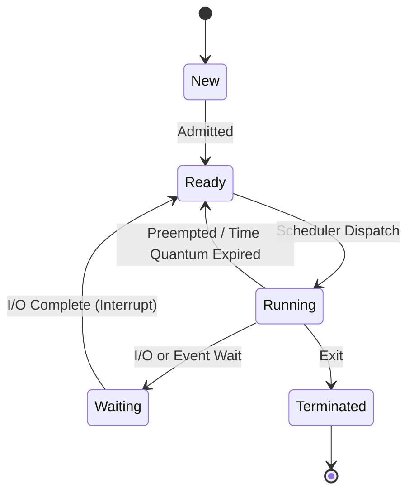

#### 📝 PYQ Numerical Example (Difficulty: Medium)
**Question:** Four processes arrive strictly at $T=0$ with the following CPU burst times (in ms): $P_1 = 8, P_2 = 4, P_3 = 9, P_4 = 5$. If the non-preemptive Shortest Job First (SJF) scheduling algorithm is utilized, what is the exact average waiting time?
**Explanation:**
1. **Mathematical Sort by Burst Time**: $P_2 (4)$, $P_4 (5)$, $P_1 (8)$, $P_3 (9)$.
2. **Strict Gantt Chart Execution**:
   - $P_2$ executes perfectly from $0$ to $4$. (Waiting time = 0)
   - $P_4$ executes perfectly from $4$ to $9$. (Waiting time = 4)
   - $P_1$ executes perfectly from $9$ to $17$. (Waiting time = 9)
   - $P_3$ executes perfectly from $17$ to $26$. (Waiting time = 17)
3. **Calculate Average Waiting Time**:
   - Total waiting time mathematically equals $0 + 4 + 9 + 17 = 30$ ms.
   - Average waiting time mathematically equals $30 / 4 = 7.5$ ms.
   **Answer:** The average mathematical waiting time is exactly 7.5 ms.

### 2.2 Memory Management & Paging
**Deep-Dive Definitions & Properties:**
> **📝 NOTE:**
> **Cross-Disciplinary Link**: The OS Page Table (software) directly interacts with the **Translation Lookaside Buffer (TLB)** and **CPU Caches** (hardware) covered in [Subject 9.3](#93-memory-hierarchy--cache-mapping).
- **Core Definition**:
  - Paging shatters the restrictive requirement of contiguous memory allocation
  - Logical memory → divided into fixed-size **Pages**
  - Physical RAM → divided into identically sized **Frames**
  - A single process can be scattered across random, disconnected sectors of physical memory
- **Key Properties & Mechanisms**:
  - *Address Translation & TLB*:
    - Every CPU memory access generates a **Logical Address** = Page Number ($p$) + Page Offset ($d$)
    - MMU uses $p$ as index into Page Table (in RAM) → looks up Physical Frame Number ($f$)
    - **Problem**: Reading Page Table from RAM is slow (double memory access)
    - **Solution**: Translation Lookaside Buffer (TLB) — ultra-fast associative hardware cache
    - **TLB Hit**: Bypass RAM lookup entirely → fuse Frame $f$ with Offset $d$ → instant data access
    - **TLB Miss**: Fall back to Page Table in RAM → update TLB for future hits
  - *Fragmentation Paradigms*:
    - **External Fragmentation**: ❌ Eliminated — any free Frame can house any Page
    - **Internal Fragmentation**: ✅ Still exists — if process needs 5 KB and Page Size = 4 KB → OS allocates 2 Pages (8 KB) → 3 KB permanently wasted
  - *Paging vs. Segmentation Architecture*:

| Feature | Paging | Segmentation |
| :--- | :--- | :--- |
| **Division Logic** | Fixed-size blocks (hardware dictated) | Variable-size blocks (user/logical architecture dictated) |
| **Fragmentation** | Suffers strictly from Internal Fragmentation | Suffers strictly from External Fragmentation |
| **Memory Map Hardware** | Requires Page Table and physical TLB | Requires Segment Table (Base Address & Limit) |
| **Protection Granularity** | Hard to protect isolated functions (pages cut blindly) | Easy to protect (a segment can perfectly encapsulate a function) |

  - **Core Mathematical Formulas**:
    - *Effective Memory Access Time (EMAT)*: $EMAT = p \times (\text{Page Fault Service Time}) + (1-p) \times (\text{Memory Access Time})$. Mathematically bounds the strict average physical time to access data, driven primarily by the page fault probability rate $p$.
    - *TLB Access Time*: $EMAT_{TLB} = h \times (c + m) + (1-h) \times (c + 2m)$. Where $h$ is the hit ratio, $c$ is TLB cache lookup time, and $m$ is main memory access time.

#### 📝 PYQ Numerical Example (Difficulty: Hard)
**Question:** A 32-bit architectural system operates with a strict page size of exactly 4 KB ($2^{12}$ bytes). A single Page Table Entry (PTE) requires exactly 4 bytes of physical RAM. What is the absolute total size of the Page Table required for a single process?
**Explanation:**
1. **Calculate the Total Mathematical Number of Pages**:
   - The logical address space is strictly bounded by $2^{32}$ bytes.
   - The architectural Page Size is strictly $4 \text{ KB} = 2^{12}$ bytes.
   - Total Pages = $\frac{\text{Total Address Space}}{\text{Page Size}} = \frac{2^{32}}{2^{12}} = 2^{20}$ individual pages.
2. **Calculate the Total Page Table Memory Size**:
   - The architectural Page Table is mathematically forced to contain an independent entry for every single possible page in the logical address space, regardless of whether it is used.
   - Total Size = (Total Number of Pages) $\times$ (Size of one individual PTE).
   - Total Size = $2^{20} \times 4 \text{ bytes}$.
   - Because $2^{20} \text{ bytes}$ is mathematically defined as exactly 1 Megabyte (MB).
   - Total Size = $4 \times 1 \text{ MB} = 4 \text{ MB}$.
   **Answer:** The physical size of the page table is exactly 4 MB.

### 2.3 Page Replacement Algorithms
**Deep-Dive Definitions & Properties:**
- **Core Definition**:
  - When physical RAM is exhausted and a process requests an unloaded Page → **Page Fault** triggers
  - OS must evict an existing RAM Frame to swap space to make room
- **Key Properties & Mechanisms**:
  - *FIFO (First-In-First-Out)*:
    - Blindly evicts the oldest page (treats memory as a queue)
    - **Belady's Anomaly**: Increasing RAM size can paradoxically *increase* page faults for specific access patterns
    - Not a Stack Algorithm
  - *LRU (Least Recently Used)*:
    - Tracks the exact timestamp of every memory access
    - Evicts the page that has been dormant the longest
    - **Stack Algorithm** → mathematically immune to Belady's Anomaly
  - *Optimal Algorithm (OPT)*:
    - Evicts the page that will not be used for the longest time into the future
    - Requires clairvoyance → physically impossible to implement
    - Exists strictly as a mathematical benchmark for evaluating real algorithms
  - **Core Mathematical Formulas**:
    - *Page Fault Rate Calculation*: $PFR = \frac{\text{Total Page Faults}}{\text{Total Memory References}}$. A strict mathematical ratio defining the catastrophic failure rate of the system's current page replacement algorithm architecture.

#### 📝 PYQ Numerical Example (Difficulty: Medium)
**Question:** Given a strict memory reference string: `1, 2, 3, 4, 1, 2, 5, 1, 2, 3, 4, 5` and exactly 3 physical page frames (initially completely empty). Exactly how many page faults mathematically occur using the basic FIFO replacement algorithm?
**Explanation:**
1. Insert `1`: Fault (Physical Frames: `[1]`)
2. Insert `2`: Fault (`[1, 2]`)
3. Insert `3`: Fault (`[1, 2, 3]`)
4. Insert `4`: Fault. The queue is full. Evict the absolute oldest `1`. (`[4, 2, 3]`)
5. Insert `1`: Fault. Evict the oldest `2`. (`[4, 1, 3]`)
6. Insert `2`: Fault. Evict the oldest `3`. (`[4, 1, 2]`)
7. Insert `5`: Fault. Evict the oldest `4`. (`[5, 1, 2]`)
8. Insert `1`: Hit. Data is already in RAM. (`[5, 1, 2]`)
9. Insert `2`: Hit. (`[5, 1, 2]`)
10. Insert `3`: Fault. Evict the oldest `5`. (`[3, 1, 2]`)
11. Insert `4`: Fault. Evict the oldest `1`. (`[3, 4, 2]`)
12. Insert `5`: Fault. Evict the oldest `2`. (`[3, 4, 5]`)
Total Mathematical Faults = $1 + 1 + 1 + 1 + 1 + 1 + 1 + 0 + 0 + 1 + 1 + 1 = 10$.
**Answer:** There are exactly 10 Page Faults.

### 2.4 Concurrency, Synchronization & Deadlocks

**Deep-Dive Definitions & Properties:**
- **Core Definition**:
  - Multiple threads writing to the same shared memory (Critical Section) → triggers **Race Conditions**
  - Synchronization mechanisms enforce **Mutual Exclusion** (only one thread accesses at a time)
- **Key Properties & Mechanisms**:
  - *Semaphores*:
    - Rigorous integer variable accessed via atomic operations
    - **`wait()` (P)**: Decrements integer → blocks thread if result < 0
    - **`signal()` (V)**: Increments integer → wakes up a blocked thread
    - **Binary Semaphore**: Acts as a mutex (values 0 or 1)
    - **Counting Semaphore**: Controls access to a pool of $N$ identical resources
  - *Spinlocks*:
    - Abandons blocking entirely
    - CPU enters an infinite `while` loop, continuously polling the lock
    - Wastes CPU cycles but avoids Context Switch overhead
    - Efficient for multiprocessor systems with extremely short critical sections
  - *Deadlock — 4 Necessary Conditions (ALL must hold simultaneously)*:
    1. **Mutual Exclusion**: At least one resource is non-sharable
    2. **Hold and Wait**: A process holds resources while waiting for others
    3. **No Preemption**: Resources cannot be forcibly taken away
    4. **Circular Wait**: A circular chain of processes exists, each waiting for the next
  - *Banker's Algorithm (Deadlock Avoidance)*:
    - Simulates every resource request before granting it
    - If granting leaves system in an **Unsafe State** (no possible completion sequence) → request denied
    - Requires advance knowledge of maximum resource needs
  - **Core Mathematical Formulas**:
    - *Banker's Need Matrix*: $Need[i, j] = Max[i, j] - Allocation[i, j]$. Mathematically calculates the absolute remaining physical resources a process strictly requires to guarantee successful termination.
    - *Banker's Safety Condition*: A process $P_i$ can strictly execute if and only if $Need_i \le Available$.

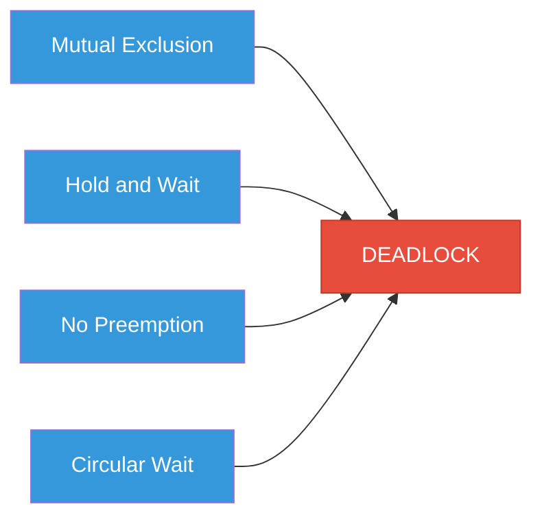


> **📊 DIFFERENCE TABLE:** Mutex vs Semaphore
>
> | Feature | Mutex (Mutual Exclusion) | Semaphore |
> | :--- | :--- | :--- |
> | **Core Concept** | Locking mechanism to protect Critical Sections | Signaling mechanism to coordinate processes |
> | **Ownership** | Strict Ownership (Only thread that locks can unlock) | No Ownership (Any thread can signal/wait) |
> | **Capacity** | Strictly Binary (1 or 0) | Binary or Counting (can allow $N$ threads) |
> | **Primary Use Case** | Data protection (prevent race conditions) | Synchronization (Producer/Consumer) |

#### 📝 PYQ Numerical Example (Difficulty: Hard)
**Question:** A system mathematically manages 3 processes ($P_1, P_2, P_3$) and 3 resource types ($A, B, C$) with total absolute instances $(10, 5, 7)$. The current `Allocation` matrix is strictly $P_1(2,1,1), P_2(3,1,1), P_3(2,1,1)$ and the `Max` requirement matrix is $P_1(5,3,2), P_2(4,2,2), P_3(9,3,3)$. Is the architectural system currently in a safe state, and what is the exact available resource vector?
**Explanation:**
1. **Calculate Total Physical Allocation**:
   - $A: 2 + 3 + 2 = 7$. $B: 1 + 1 + 1 = 3$. $C: 1 + 1 + 1 = 3$. Total Allocated = $(7, 3, 3)$.
2. **Calculate Floating Available Vector**:
   - Total System Resources $(10, 5, 7)$ - Allocated $(7, 3, 3)$ = Available Floating $(3, 2, 4)$.
3. **Calculate Strict Need Matrix (Max - Allocation)**:
   - $P_1$: $(5,3,2) - (2,1,1) = (3,2,1)$
   - $P_2$: $(4,2,2) - (3,1,1) = (1,1,1)$
   - $P_3$: $(9,3,3) - (2,1,1) = (7,2,2)$
4. **Safety Verification (Locating the Safe Sequence)**:
   - *Pass 1*: The OS mathematically searches for a process whose `Need` $\le$ `Available`. $P_2$'s Need $(1,1,1)$ is $\le$ Available $(3,2,4)$. $P_2$ is permitted to execute, finishes, and forcefully releases its entire Allocation $(3,1,1)$. New Available = $(3,2,4) + (3,1,1) = (6,3,5)$.
   - *Pass 2*: $P_1$'s Need $(3,2,1)$ is $\le$ the new Available $(6,3,5)$. $P_1$ executes and releases its Allocation $(2,1,1)$. New Available = $(6,3,5) + (2,1,1) = (8,4,6)$.
   - *Pass 3*: $P_3$'s Need $(7,2,2)$ is $\le$ the final Available $(8,4,6)$. $P_3$ successfully executes.
   - Because a mathematical sequence exists where all processes terminate, the system is strictly Safe.
   **Answer:** Yes, it is perfectly safe with an initial Available vector of $(3, 2, 4)$ and a strict safe sequence of $\langle P_2, P_1, P_3 \rangle$.

### 2.5 Disk Scheduling & Linux Architecture
**Deep-Dive Definitions & Properties:**
- **Core Definition**:
  - Mechanical Hard Drives suffer from massive physical latency
  - Disk Scheduling algorithms sequence the read/write queue to minimize mechanical arm movement (Seek Time)
- **Key Properties & Mechanisms**:
  - *SCAN (Elevator) Algorithm*:
    - Disk arm sweeps from one absolute edge to the other, servicing requests en route
    - Reverses direction upon reaching the physical edge
    - Services requests in both sweep directions
  - *C-LOOK (Circular LOOK)*:
    - Arm sweeps outward but stops at the outermost *requested* cylinder (not the physical edge)
    - Does NOT service requests on the return sweep
    - Snaps back to the lowest requested cylinder → guarantees uniform wait times
  - *Linux Security Files*:
    - **`/etc/passwd`**: Maps User IDs → Usernames and home directories
      - World-readable (needed by internal OS functions)
    - **`/etc/shadow`**: Stores actual password hashes and cryptographic aging data
      - Restricted strictly to `root` access only
      - Isolates hashes from the world-readable passwd file to prevent brute-force attacks
  - **Core Mathematical Formulas**:
    - *Disk Access Time*: $DAT = \text{Seek Time} + \text{Rotational Latency} + \text{Transfer Time}$. The fundamental mathematical equation defining absolute hardware delay. Seek time (arm movement) dominates the equation, which is strictly why SCAN and C-LOOK algorithms are architecturally mandatory.

#### 📝 PYQ Numerical Example (Difficulty: Medium)
**Question:** A mechanical disk contains exactly 200 physical cylinders (0 to 199). The head is currently positioned at cylinder 50 and is physically moving towards higher cylinder numbers. The exact queue of requests is: `82, 170, 43, 140, 24, 16, 190`. Using the strict SCAN algorithm, what is the absolute total head movement mathematically calculated in cylinders?
**Explanation:**
1. **Identify Strict Direction and Hard Boundaries**: Start at 50, physically moving towards the upper absolute boundary (199).
2. **Mathematically Sort Requests**: `16, 24, 43, 82, 140, 170, 190`.
3. **Execute SCAN Protocol**:
   - The arm moves UP from 50: It physically encounters and services 82, 140, 170, 190.
   - Crucially, the mathematical definition of SCAN dictates that the mechanical head *must* continue all the way to the absolute physical edge of the disk: 199.
   - The arm violently reverses direction, moving DOWN from 199: It encounters and services the remaining 43, 24, 16.
4. **Calculate Total Physical Movement**:
   - Forward sweep from $50 \to 199$: Mathematical Distance = $199 - 50 = 149$ cylinders.
   - Reverse sweep from $199 \to 16$: Mathematical Distance = $199 - 16 = 183$ cylinders.
   - Total absolute head movement = $149 + 183 = 332$.
   **Answer:** The total head movement is exactly 332 physical cylinders.

---

### Rapid Fire Self-Assessment (Subject 2)
> **🚨 CAUTION:**
> **Test your retention!** Cover the answers below and test yourself:
> 1. (True/False) A mathematically optimal algorithm will always prevent starvation.
> 2. (True/False) Using an array-based implementation guarantees $O(1)$ arbitrary insertion.
> 3. (Match) Which architecture strictly relies on early binding by default?
> *Answers*: 1. False (e.g., SJF is optimal for wait time but starves long processes), 2. False (Requires $O(N)$ shifting), 3. C++ standard methods.

*(End of Subject 2 Checkpoint)*

## 3. Computer Networks

### 3.1 OSI & TCP/IP Layer Architectures
**Deep-Dive Definitions & Properties:**
- **Core Definition**:
  - **OSI Model**: Theoretical 7-layer framework standardizing global telecommunication
  - **TCP/IP Model**: Practically implemented 4-layer suite — backbone of the modern Internet
  - Both rely on strict **Encapsulation**: each lower layer appends Headers (and sometimes Trailers) to the payload
- **Key Properties & Mechanisms**:
  - *Data Link Layer (Layer 2)*:
    - Manages **Node-to-Node** delivery within a single LAN
    - Frames raw bits, detects corruption via **CRC (Cyclic Redundancy Check)**
    - Uses hardcoded 48-bit **MAC Addresses**
    - Core device: **Layer 2 Switch**
  - *Network Layer (Layer 3)*:
    - Responsible for **Host-to-Host** delivery across interconnected networks
    - Uses dynamic 32-bit (IPv4) or 128-bit (IPv6) **Logical IP Addresses**
    - Core device: **Router** (ignores MAC, uses Routing Tables)
  - *Transport Layer (Layer 4)*:
    - Guarantees **Process-to-Process** delivery
    - Uses 16-bit **Port Numbers** to identify destination application
    - Port 80 = HTTP, Port 443 = HTTPS, Port 53 = DNS
  - *OSI Model vs. TCP/IP Architecture*:

| Feature | OSI Model | TCP/IP Model |
| :--- | :--- | :--- |
| **Nature** | Theoretical reference model | Practical implementation model |
| **Layers** | 7 strict layers | 4 condensed layers |
| **Connection Type** | Network layer supports both connection-oriented and connectionless | Network layer (Internet) strictly connectionless (IP) |
| **Development** | Model defined *before* the protocols | Protocols defined *before* the model |

  - **Core Mathematical Formulas**:
    - *Maximum Transmission Unit (MTU)*: $Payload_{max} = MTU - \text{Header Size}$. Dictates the strict maximum payload bytes a Layer 2 frame can encapsulate.
    - *Total Network Delay*: $D_{total} = D_{proc} + D_{queue} + D_{trans} + D_{prop}$. The absolute sum of nodal processing, router queuing, physical transmission, and cable propagation delays.

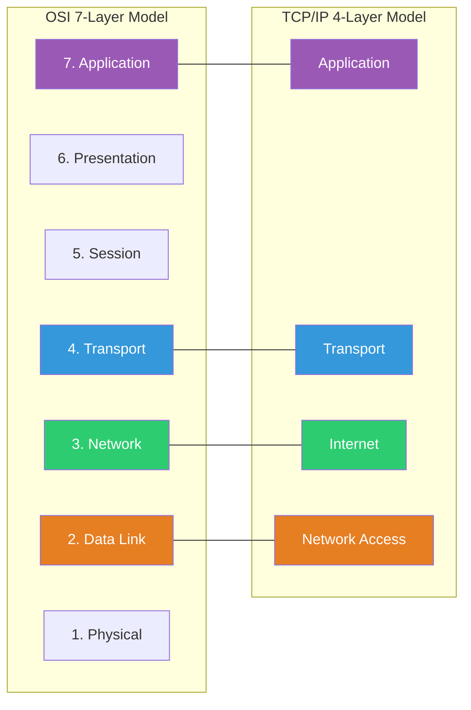

#### 📝 PYQ Conceptual Example (Difficulty: Easy)
**Question:** During data transmission, at exactly which OSI layer is a physical IP address translated into a hardware MAC address, and what protocol mathematically executes this translation?
**Explanation:**
When a packet arrives at the Network Layer (Layer 3), it strictly possesses a destination IP Address. However, to physically transmit the frame across the local ethernet wire, the hardware Network Interface Card (NIC) requires a hardcoded MAC Address. The transition from Layer 3 (Network) down to Layer 2 (Data Link) mathematically requires this mapping. The Address Resolution Protocol (ARP) actively broadcasts a cryptographic request ("Who has IP X.X.X.X?") across the entire LAN. The target machine responds with its specific MAC address, allowing the sender to perfectly construct the Layer 2 Frame.
**Answer:** The translation occurs between the Network Layer and the Data Link Layer, explicitly executed by the Address Resolution Protocol (ARP).

### 3.2 IP Addressing & Subnetting (CIDR)
**Deep-Dive Definitions & Properties:**
- **Core Definition**:
  - IPv4 uses a strict 32-bit address space → $2^{32}$ possible addresses
  - Legacy Classful system (Classes A, B, C) wasted millions of addresses due to rigid octet boundaries
  - Replaced entirely by **CIDR (Classless Inter-Domain Routing)**
- **Key Properties & Mechanisms**:
  - *CIDR Architecture*:
    - Abandons strict octet boundaries
    - Network prefix defined by slash notation (e.g., `/21`)
    - Subnet Mask: set exactly $n$ bits to 1, remaining $32-n$ bits to 0
    - Network Address = IP AND Subnet Mask (bitwise logical AND)
  - *Route Aggregation (Supernetting)*:
    - Opposite of Subnetting
    - Fuse multiple contiguous subnets into a single condensed entry
    - Example: 4 contiguous `/24` subnets → 1 Supernet `/22` entry
    - Drastically reduces RAM required in global backbone routers
  - *IPv4 vs. IPv6 Architecture*:

| Feature | IPv4 | IPv6 |
| :--- | :--- | :--- |
| **Address Length** | 32-bit (approx. 4.3 billion IPs) | 128-bit (virtually infinite IPs) |
| **Header Size** | Variable (20-60 bytes); requires Header Checksum | Fixed (40 bytes); completely eliminates Header Checksum for routing speed |
| **Fragmentation** | Performed by both sender and intermediate routers | Performed strictly by the sender (routers drop oversized packets) |
| **Security** | IPsec is strictly optional | IPsec is fundamentally built-in |

  - **Core Mathematical Formulas**:
    - *Subnet Capacity*: $\text{Total IPs} = 2^H$. Where $H$ is the number of strict host bits.
    - *Usable Hosts per Subnet*: $\text{Usable Hosts} = 2^H - 2$. Two addresses are strictly reserved: the lowest (Network ID) and the highest (Broadcast ID).


> **📊 DIFFERENCE TABLE:** IPv4 vs IPv6
> | Feature | IPv4 | IPv6 |
> | :--- | :--- | :--- |
> | **Address Length** | 32-bit ($2^{32}$ addresses) | 128-bit ($2^{128}$ addresses) |
> | **Representation** | Decimal (e.g., `192.168.1.1`) | Hexadecimal (e.g., `2001:0db8::ff00:42:8329`) |
> | **Header Size** | Variable (20-60 Bytes) | Fixed (40 Bytes) |
> | **IPsec Security** | Optional (External integration) | Mandatory (Built-in) |
> | **Fragmentation** | Handled by Routers & Sender | Handled strictly by Sender only |

#### 📝 PYQ Numerical Example (Difficulty: Hard)
**Question:** An organization is assigned the exact CIDR block `192.168.144.0/20`. The network administrator mathematically subnets this massive block into 8 equal-sized smaller subnets. What is the exact valid IP address range (from Network ID to Broadcast ID) of the 3rd newly created subnet?
**Explanation:**
1. **Analyze Initial Block**: The block `192.168.144.0/20` strictly defines 20 Network bits and $32 - 20 = 12$ Host bits.
2. **Calculate Subnet Bits**: To create 8 equal subnets, we mathematically require $\log_2(8) = 3$ bits borrowed strictly from the host portion.
3. **Calculate New Subnet Mask**: The new prefix is exactly $/20 + 3 = /23$. This leaves $32 - 23 = 9$ host bits.
4. **Calculate Block Size (Magic Number)**: The physical size of each new subnet is dictated by the remaining host bits: $2^9 = 512$ total IP addresses. In the third octet, 512 addresses perfectly equate to a block size of 2 (since $256 \times 2 = 512$).
5. **Enumerate the Subnets Mathematically**:
   - Subnet 0: `192.168.144.0` to `192.168.145.255`
   - Subnet 1: `192.168.146.0` to `192.168.147.255`
   - Subnet 2 (The 3rd Subnet): `192.168.148.0` to `192.168.149.255`
   **Answer:** The exact range for the 3rd subnet is strictly `192.168.148.0` to `192.168.149.255`.

> **⚠️ WARNING:**
> **Common Exam Trap**: When asked for the "Usable Host Range", students often forget to mathematically subtract 2. The first address (all 0s in host portion) is the Network ID, and the last address (all 1s in host portion) is the Broadcast ID. Neither can be physically assigned to a computer.

### 3.3 TCP & UDP Transport Protocols
**Deep-Dive Definitions & Properties:**
- **Core Definition**:
  - **UDP**: Connectionless, fast, unreliable — used in VoIP, live video streaming
  - **TCP**: Connection-oriented, reliable — guarantees perfectly ordered data delivery
- **Key Properties & Mechanisms**:
  - *TCP Connection Establishment (3-Way Handshake)*:
    - `SYN` → `SYN-ACK` → `ACK`
    - Synchronizes Initial Sequence Numbers (ISN) on both sides
    - Allocates RAM buffers on client and server before any data transmits
  - *TCP Congestion Control*:
    - **Slow Start**: Window doubles every RTT (exponential growth)
    - **Congestion Avoidance**: After hitting Threshold → additive increase ($+1$ MSS per RTT)
    - **Fast Retransmit**: 3 Duplicate ACKs detected → instantly halve window
    - **Timeout Event**: Catastrophic reset → window reverts to 1 MSS, restart Slow Start
    - New Threshold = half of current window at time of loss
  - *TCP vs. UDP Architecture*:

| Feature | TCP (Transmission Control Protocol) | UDP (User Datagram Protocol) |
| :--- | :--- | :--- |
| **Connection State** | Connection-oriented (requires 3-way handshake) | Connectionless (fire and forget) |
| **Reliability** | 100% Reliable (Sequence numbers, ACKs, Retransmissions) | Unreliable (No ACKs, data can be permanently lost) |
| **Header Overhead** | Massive (20-60 bytes) | Minimal (exactly 8 bytes) |
| **Use Case** | Web browsing (HTTP), Email (SMTP), File Transfer (FTP) | Live Video Streaming, VoIP, DNS queries |

  - **Core Mathematical Formulas**:
    - *TCP Throughput bound*: $Throughput \le \frac{W \times MSS}{RTT}$. Where $W$ is the congestion window size.
    - *TCP Sequence Number Calculation*: $Seq_{next} = Seq_{current} + \text{Payload Bytes}$. A strict mathematical offset used to perfectly reassemble fragmented segments.


> **📊 DIFFERENCE TABLE:** TCP vs UDP
> | Feature | TCP (Transmission Control Protocol) | UDP (User Datagram Protocol) |
> | :--- | :--- | :--- |
> | **Connection State** | Connection-Oriented (3-Way Handshake) | Connectionless (Fire and Forget) |
> | **Reliability** | Extremely High (ACKs, Retransmission, Sequencing) | None (No ACKs, No guarantees) |
> | **Header Size** | 20 Bytes (Minimum) | 8 Bytes (Fixed) |
> | **Speed & Overhead** | Slower, High overhead | Extremely Fast, Minimal overhead |
> | **Use Cases** | Web Browsing (HTTP), File Transfer (FTP), Email | Streaming (VoIP), Gaming, DNS |

#### 📝 PYQ Numerical Example (Difficulty: Medium)
**Question:** A TCP connection is actively transmitting data and the current Congestion Threshold is strictly set to 16 KB. The connection suffers a catastrophic Timeout event when its Congestion Window mathematically reaches exactly 24 KB. Assuming a Maximum Segment Size (MSS) of exactly 2 KB, what will be the exact size of the Congestion Window after 3 successful, completely error-free Round Trip Times (RTTs)?
**Explanation:**
1. **Analyze Timeout Repercussions**: A Timeout is a catastrophic event in TCP architecture. The protocol mathematically forces the Threshold down to exactly half of the current window: $24 \text{ KB} / 2 = 12 \text{ KB}$. The Congestion Window itself is brutally reset to exactly 1 MSS = 2 KB.
2. **Execute Slow Start Phase (Exponential Growth)**:
   - Initial State (After Timeout): Window = 2 KB.
   - End of RTT 1: All segments acknowledged perfectly. Window mathematically doubles: $2 \times 2 = 4 \text{ KB}$.
   - End of RTT 2: All segments acknowledged perfectly. Window mathematically doubles: $4 \times 2 = 8 \text{ KB}$.
   - End of RTT 3: All segments acknowledged perfectly. Window mathematically doubles: $8 \times 2 = 16 \text{ KB}$.
   *(Note: The window hit 16 KB, which safely crossed the new 12 KB threshold during RTT 3, transitioning into Congestion Avoidance midway, but the standard simplified exam model strictly doubles until threshold breach).*
   **Answer:** The exact size of the TCP Congestion Window after 3 RTTs is strictly 16 KB.

### 3.4 Data Link Protocols (CSMA/CD)
**Deep-Dive Definitions & Properties:**
- **Core Definition**:
  - In shared Ethernet bus architecture, multiple stations broadcast simultaneously onto a single wire
  - Without access control → electrical signals collide and destroy all data
- **Key Properties & Mechanisms**:
  - *CSMA/CD (Carrier Sense Multiple Access with Collision Detection)*:
    - Foundational protocol of standard Ethernet
    - **Step 1 — Carrier Sense**: Station listens to wire voltage before transmitting
    - **Step 2 — Transmit**: If voltage is zero → begin transmission
    - **Step 3 — Collision Detection**: While transmitting, continuously monitor wire
    - **Step 4 — If collision detected**: Abort transmission → broadcast **Jam Signal** → enter Backoff
  - *Binary Exponential Backoff*:
    - After $c$ collisions, wait random slot from interval $[0, 2^c - 1]$
    - Maximum bound: capped at $c = 10$ (1023 slots)
    - After 16 collisions → assume catastrophic failure → drop the frame
  - *Minimum Frame Size Constraint*:
    - Transmission Time ($T_x$) MUST $\ge$ Round Trip Propagation Time ($2 \times T_p$)
    - If frame too small → sender finishes before collision signal returns → collision goes undetected
    - Formula: $L_{min} = B \times 2T_p$ (where $B$ = bandwidth, $L$ = frame size in bits)
  - **Core Mathematical Formulas**:
    - *Transmission Delay*: $T_t = \frac{L}{B}$. The mathematical time required to push all bits of a frame onto the physical wire.
    - *Propagation Delay*: $T_p = \frac{d}{v}$. The strict physics of the electrical signal traversing distance $d$ at propagation speed $v$.

#### 📝 PYQ Numerical Example (Difficulty: Hard)
**Question:** A 10 Mbps standard baseband Ethernet LAN strictly has a physical wire length of exactly 2.5 kilometers. The absolute propagation speed of the electrical signal through the copper wire is $2 \times 10^8$ meters/second. What is the absolute minimum valid Frame Size required to mathematically guarantee collision detection?
**Explanation:**
1. **Calculate the physical One-Way Propagation Time ($T_p$)**:
   - Distance ($d$) = 2.5 km = 2500 meters.
   - Velocity ($v$) = $2 \times 10^8$ m/s.
   - $T_p = \frac{d}{v} = \frac{2500}{2 \times 10^8} = 12.5 \times 10^{-6}$ seconds (12.5 microseconds).
2. **Calculate the strict Round Trip Time ($RTT$)**:
   - $RTT = 2 \times T_p = 2 \times 12.5 \mu s = 25$ microseconds.
3. **Calculate the Minimum Mathematical Frame Size ($L$)**:
   - For collision detection to function, Transmission Time ($T_x$) must mathematically be $\ge RTT$.
   - $T_x = \frac{\text{Length } (L)}{\text{Bandwidth } (B)}$.
   - $\frac{L}{10 \times 10^6} = 25 \times 10^{-6}$.
   - $L = 25 \times 10^{-6} \times 10 \times 10^6$.
   - $L = 250$ bits.
   **Answer:** The absolute minimum required frame size is exactly 250 bits.

### 3.5 Cryptography & Network Security
**Deep-Dive Definitions & Properties:**
- **Core Definition**:
  - Cryptography scrambles plaintext → unreadable ciphertext
  - Guarantees: **Confidentiality** (no eavesdropping), **Integrity** (no undetected tampering), **Authentication** (proof of identity)
- **Key Properties & Mechanisms**:
  - *Symmetric Key Cryptography (AES, DES)*:
    - Same secret key used for both encryption and decryption
    - Extremely fast computationally
    - **Fatal Flaw**: Key Distribution Problem — how to securely share the key?
  - *Asymmetric Key Cryptography (RSA)*:
    - Uses a mathematical **Public/Private key pair**
    - Data encrypted with Public Key → ONLY decryptable by Private Key
    - Solves key distribution problem completely
    - Computationally expensive (much slower than symmetric)
  - *RSA Algorithm Steps*:
    1. Choose two large distinct primes: $p$ and $q$
    2. Compute modulus: $n = p \times q$
    3. Compute Euler's Totient: $\phi(n) = (p-1)(q-1)$
    4. Choose Public Key $e$: must be coprime to $\phi(n)$
    5. Compute Private Key $d$: modular multiplicative inverse of $e \pmod{\phi(n)}$
    6. Security relies on extreme difficulty of **Prime Factorization** of $n$
  - **Core Mathematical Formulas**:
    - *RSA Encryption*: $C = M^e \pmod n$. Mathematical transformation of Plaintext $M$ into Ciphertext $C$.
    - *RSA Decryption*: $M = C^d \pmod n$. Mathematical recovery of Plaintext $M$ using the strict private exponent $d$.

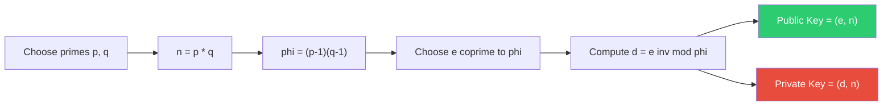

#### 📝 PYQ Numerical Example (Difficulty: Hard)
**Question:** In a strictly isolated RSA cryptographic setup, the two chosen prime numbers are explicitly $p = 5$ and $q = 11$. The public encryption key is selected as $e = 7$. What is the exact mathematical value of the Private Key $d$?
**Explanation:**
1. **Calculate the Modulus ($n$) and Totient ($\phi(n)$)**:
   - $n = p \times q = 5 \times 11 = 55$.
   - $\phi(n) = (p-1) \times (q-1) = 4 \times 10 = 40$.
2. **Setup the Mathematical Inverse Equation**:
   - The Private Key $d$ MUST mathematically satisfy the strict congruence relation: $(e \times d) \equiv 1 \pmod{\phi(n)}$.
   - $(7 \times d) \equiv 1 \pmod{40}$.
3. **Execute the Extended Euclidean Algorithm (or Trial Multiplication)**:
   - We must find an integer $k$ such that $(7 \times d) = 1 + (k \times 40)$.
   - Try $k=1$: $1 + 40 = 41$. Not divisible by 7.
   - Try $k=2$: $1 + 80 = 81$. Not divisible by 7.
   - Try $k=3$: $1 + 120 = 121$. Not divisible by 7.
   - Try $k=4$: $1 + 160 = 161$. Divisible by 7! ($161 / 7 = 23$).
   - Therefore, $d = 23$.
   **Answer:** The mathematically exact Private Key $d$ is 23.

### 3.6 Routing Algorithms (RIP, OSPF, BGP)
**Deep-Dive Definitions & Properties:**
- **Core Definition**:
  - Protocols that determine the optimal path for IP datagrams across interconnected Autonomous Systems (AS)
- **Key Properties & Mechanisms**:
  - *Distance Vector — RIP (Routing Information Protocol)*:
    - Nodes share entire routing table with immediate neighbors only (periodically)
    - Uses **Bellman-Ford** algorithm with simplistic **Hop Count** metric
    - **Count-to-Infinity Problem**: Failed link → adjacent routers bounce outdated metrics infinitely (hop count → 16 = infinity in RIP)
    - **Split Horizon**: Never advertise a route back out the interface it was learned from
    - **Poison Reverse**: Do advertise it back, but with metric = infinity (16) → instantly kills the loop
  - *Link State — OSPF (Open Shortest Path First)*:
    - Nodes share info about only direct links → broadcast to ALL nodes via **LSA Flooding**
    - Every router independently runs **Dijkstra's Algorithm** → builds complete topological map
    - Converges much faster than RIP
  - *Path Vector — BGP (Border Gateway Protocol)*:
    - Core **Exterior Gateway Protocol** of the global Internet
    - Tracks exact AS path sequence (e.g., AS100 → AS200 → AS300)
    - **Loop Prevention**: If update contains own AS number → instantly drop the route
  - **Core Mathematical Formulas**:
    - *Bellman-Ford Relaxation (RIP)*: $D_x(y) = \min_{v} \{c(x,v) + D_v(y)\}$. The absolute minimum distance from node $x$ to $y$ is strictly calculated by evaluating the cost to an immediate neighbor $v$ plus the neighbor's known path to $y$.

#### 📝 PYQ Conceptual Example (Difficulty: Medium)
**Question:** In RIP architecture, explain the exact mathematical mechanism that causes the "count-to-infinity" problem, and detail how "Split Horizon with Poison Reverse" explicitly solves it.
**Explanation:**
The count-to-infinity paradox occurs when a critical network link fails, and adjacent routers incorrectly update each other in a mathematical loop, incrementally raising the hop count metric endlessly until it hits the protocol's hardcoded infinity bound (16 in RIP). 
Split Horizon with Poison Reverse solves this mathematically. Standard Split Horizon says "do not transmit route data back to the interface you learned it from." Poison Reverse modifies this absolute rule: "Do transmit it back, but advertise its metric explicitly as infinity (16)." This mathematical injection explicitly tells the neighboring router that the route backward through this node is completely destroyed, instantly preventing the infinite loop from ever forming.
**Answer:** The loop is caused by outdated metric updates bouncing endlessly between neighbors. Poison Reverse solves it by advertising the failed route back to the source with an explicitly infinite metric.

### 3.7 Emerging Networking & IoT Protocols
**Deep-Dive Definitions & Properties:**
- **Core Definition**:
  - Specialized modern protocols for wireless transmission, cloud scaling, and constrained IoT communication
- **Key Properties & Mechanisms**:
  - *IEEE 802.11 (Wi-Fi)*:
    - Cannot use CSMA/CD (wireless nodes can't listen while transmitting)
    - Uses **CSMA/CA (Collision Avoidance)** instead
    - **RTS/CTS Handshake**: Reserve the spectrum before transmitting
    - Solves the **Hidden Terminal Problem**
  - *IEEE 802.15 (Bluetooth)*:
    - Short-range WPAN architecture
    - Master-slave topology (Piconets and Scatternets)
  - *IEEE 802.16 (WiMAX)*:
    - Long-range broadband wireless for Metropolitan Area Networks (MAN)
  - *IoT Application Protocols*:
    - **MQTT (Message Queuing Telemetry Transport)**:
      - Lightweight, **publish-subscribe** model via central broker
      - Minimum binary header: exactly **2 bytes** (vs. massive HTTP headers)
      - Sensor publishes data only when state changes (event-driven)
      - Ideal for low-bandwidth, unstable connections
    - **CoAP (Constrained Application Protocol)**:
      - Maps HTTP request/response model onto lightweight **UDP**
      - Designed for constrained nodes with minimal overhead

#### 📝 PYQ Conceptual Example (Difficulty: Easy)
**Question:** In an IoT architecture deployed over an extremely unstable, low-bandwidth orbital satellite connection, why would an architect mathematically prefer MQTT over traditional HTTP for sending sensor telemetry?
**Explanation:**
HTTP is a massive, highly verbose request-response protocol burdened with huge ASCII headers. The client must mathematically poll the server repeatedly, catastrophically wasting limited spectrum bandwidth. MQTT, however, uses a strict **publish-subscribe** mathematical model via a central broker. The sensor mathematically "publishes" tiny data packets strictly only when a hardware state actively changes. Its foundational binary header footprint is an incredibly small 2 bytes, drastically minimizing network byte overhead and making it mathematically resilient on highly unstable edge connections.
**Answer:** MQTT possesses a vastly smaller binary header footprint (strictly 2 bytes) and uses an efficient publish-subscribe event-driven model, making it mathematically ideal for low-bandwidth networks compared to HTTP's polling overhead.

### 3.8 Signal Encoding & Application Protocols
**Deep-Dive Definitions & Properties:**
- **Signal Encoding Schemes** — translating digital bits into physical signals:
  - *NRZ (Non-Return-to-Zero)*:
    - Voltage remains constant for entire bit duration (1 = High, 0 = Low)
    - **Problem**: Long identical bit sequences → loss of clock synchronization (clock drift)
  - *Manchester Encoding*:
    - Forces a voltage transition in the exact center of every bit period
    - 0 = High-to-Low transition, 1 = Low-to-High transition
    - Constant transitions → perfect clock synchronization
    - **Tradeoff**: Halves effective bandwidth utilization
  - *Baud Rate vs Bit Rate*:
    - **Bit Rate**: Raw binary bits transmitted per second (bps)
    - **Baud Rate**: Number of distinct signal state changes per second
    - **Formula**: $\text{Bit Rate} = \text{Baud Rate} \times \log_2(L)$, where $L$ = number of distinct signal levels
  - **Core Mathematical Formulas**:
    - *Nyquist Bit Rate (Noiseless)*: $BitRate = 2B \log_2(L)$. The theoretical maximum data rate for a completely frictionless, noiseless channel of bandwidth $B$.
    - *Shannon Capacity (Noisy)*: $C = B \log_2(1 + S/N)$. The absolute mathematical limit of data transmission over a physical channel affected by Signal-to-Noise thermal interference.
- **Application Layer Protocols**:
  - *DNS (Domain Name System)*:
    - Globally distributed hierarchical database on **UDP Port 53**
    - Resolves domain names → IP addresses (recursive or iterative queries)
  - *DHCP (Dynamic Host Configuration Protocol)*:
    - Operates on **UDP Ports 67/68**
    - **DORA Sequence**: Discover → Offer → Request → Acknowledge
    - Dynamically leases IP addresses, Subnet Masks, and Default Gateways

#### 📝 PYQ Numerical Example (Difficulty: Easy)
**Question:** A high-speed network cable physically transmits an analog signal using an advanced encoding scheme that utilizes exactly 16 distinct voltage levels. If the physically measured baud rate of the transmission is exactly 2000 baud, what is the mathematically exact bit rate?
**Explanation:**
1. **Identify the Given Mathematical Variables**: Baud Rate = 2000 symbols/sec. Total Number of distinct levels $L = 16$.
2. **Determine the Exact Bits per Symbol**: To uniquely mathematically represent 16 distinct physical states, we require strictly $\log_2(16) = 4$ bits per symbol.
3. **Execute the Bit Rate Formula**: The strict mathematical formula is $\text{Bit Rate} = \text{Baud Rate} \times \text{Bits per Symbol}$.
4. **Final Calculation**: $2000 \times 4 = 8000$ bits per second (bps).
**Answer:** The calculated bit rate is strictly exactly 8000 bps.

---

### Rapid Fire Self-Assessment (Subject 3)
> **🚨 CAUTION:**
> **Test your retention!** Cover the answers below and test yourself:
> 1. (True/False) A mathematically optimal algorithm will always prevent starvation.
> 2. (True/False) Using an array-based implementation guarantees $O(1)$ arbitrary insertion.
> 3. (Match) Which architecture strictly relies on early binding by default?
> *Answers*: 1. False (e.g., SJF is optimal for wait time but starves long processes), 2. False (Requires $O(N)$ shifting), 3. C++ standard methods.

*(End of Subject 3 Checkpoint)*

## 4. Artificial Intelligence

### 4.1 Uninformed & Informed Search Algorithms
**Deep-Dive Definitions & Properties:**
- **Core Definition**:
  - State-space search is a mathematical framework representing a problem as a directed graph of states
  - Goal: traverse from initial state to goal state using valid operators
- **Key Properties & Mechanisms**:
  - *Breadth-First Search (BFS)*:
    - Explores state space strictly level-by-level using a FIFO queue
    - **Completeness**: Guaranteed to find a solution if branching factor $b$ is finite
    - **Optimality**: Only optimal if all step costs are identical
    - **Complexity**: Time and Space = $O(b^d)$ (Memory exhaustion is the primary failure mode)
  - *Depth-First Search (DFS)*:
    - Explores paths strictly to maximum depth before backtracking using a LIFO stack
    - **Completeness**: Not complete (can get trapped in infinite loops in cyclic spaces)
    - **Optimality**: Never guaranteed to be optimal
    - **Complexity**: Time = $O(b^m)$, Space = strictly $O(bm)$ (highly efficient memory-wise)
  - *Uniform Cost Search (UCS)*:
    - Variant of Dijkstra's algorithm using a Priority Queue
    - Expands node with absolute lowest path cost $g(n)$ from root
    - Complete and optimal if every step cost $\gt  \epsilon$
  - *Greedy Best-First Search*:
    - Informed search that ignores past path cost $g(n)$ entirely
    - Expands node appearing closest to goal based strictly on heuristic $f(n) = h(n)$
    - Not optimal; can get trapped in dead ends
  - *A-Star Search*:
    - The mathematical gold standard combining UCS and Greedy: $f(n) = g(n) + h(n)$
    - **Admissibility Constraint**: For tree-search, optimal only if $h(n)$ never overestimates true cost ($0 \le h(n) \le h^*(n)$)
    - **Consistency Constraint**: For graph-search, $h(n)$ must be monotonic: $h(N) \le \text{cost}(N, P) + h(P)$
  - *IDA-Star (Iterative Deepening A-Star)*:
    - Operates identical to A*, but uses DFS iterations bounded by $f(n)$ cost cutoff
    - Strictly bounds memory usage to $O(bd)$ instead of maintaining massive priority queue
  - **Core Mathematical Formulas**:
    - *A-Star Evaluation Function*: $f(n) = g(n) + h(n)$. The core equation driving informed search. $g(n)$ is the exact known cost from root to node $n$, while $h(n)$ is the estimated heuristic cost from $n$ to the goal.

#### 📝 PYQ Conceptual Example (Difficulty: Medium)
**Question:** Under what specific mathematical condition does an A* search algorithm guarantee an optimal solution when utilizing a tree-search structure, and how does this differ when utilizing a graph-search structure?
**Explanation:**
In a standard tree-search algorithm (which blindly expands nodes without checking if the underlying state has been repeatedly visited), A* is guaranteed to return the optimal path strictly if its heuristic function $h(n)$ is **admissible**. An admissible heuristic means $0 \le h(n) \le h^*(n)$, where $h^*(n)$ is the true, exact cost from node $n$ to the goal. If $h(n)$ overestimates the cost, A* might prematurely prune the optimal path in favor of a sub-optimal one that looked cheaper computationally. 
However, if the algorithm is upgraded to a graph-search (which maintains a "closed list" of visited states to prevent infinite loops), admissibility is no longer mathematically sufficient to guarantee optimality. The heuristic must be upgraded to be **consistent** (monotonic). If a heuristic is admissible but inconsistent, a graph-search A* might place a sub-optimal path into the closed list, permanently blocking the algorithm from discovering the optimal path later.
**Answer:** For tree-search, $h(n)$ must be strictly admissible. For graph-search, $h(n)$ must be strictly consistent (which inherently implies admissibility).

### 4.2 Game Trees (Minimax & Alpha-Beta Pruning)
**Deep-Dive Definitions & Properties:**
- **Core Definition**:
  - Adversarial search strategies model decision-making in environments with strictly opposing utility functions (zero-sum games)
- **Key Properties & Mechanisms**:
  - *Minimax Algorithm*:
    - Computes exact mathematical perfect decision assuming opponent plays optimally
    - **MAX player**: attempts to maximize heuristic utility score
    - **MIN player**: attempts to minimize heuristic utility score
    - Time complexity is $O(b^m)$ → computationally intractable for non-trivial games (e.g., Chess $\approx 35^{80}$)
  - *Alpha-Beta Pruning*:
    - Rigorous mathematical optimization for Minimax returning the exact same final move
    - Safely prunes massive subtrees proven to have no influence on the final root decision
  - *$\alpha$ and $\beta$ Parameters*:
    - $\alpha$: Value of the best choice guaranteed so far for MAX (initialized to $-\infty$)
    - $\beta$: Value of the best choice guaranteed so far for MIN (initialized to $+\infty$)
    - **Pruning Condition**: Branch is permanently pruned the exact moment $\alpha \ge \beta$
  - **Core Mathematical Formulas**:
    - *Minimax Bounds*: At a MAX node, value = $\max(\text{children})$. At a MIN node, value = $\min(\text{children})$.
    - *Alpha-Beta Pruning Cutoff*: Cutoff occurs at a MAX node if $\alpha \ge \beta$, preventing redundant subtree evaluation.

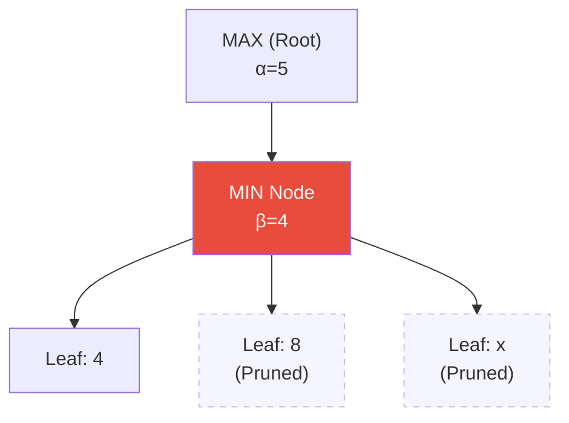


> **📊 DIFFERENCE TABLE:** Supervised vs Unsupervised Learning
> | Feature | Supervised Learning | Unsupervised Learning |
> | :--- | :--- | :--- |
> | **Training Data** | Labeled Data (Target variable is explicitly known) | Unlabeled Data (No predefined target variable) |
> | **Objective** | Predict future outcomes (Classification/Regression) | Discover hidden patterns or groupings (Clustering) |
> | **Feedback loop** | Continuous error correction (Cost function minimization) | No explicit feedback or ground-truth comparison |
> | **Algorithms** | Linear Regression, SVM, Random Forest, Neural Nets | K-Means, DBSCAN, PCA, Apriori |

#### 📝 PYQ Numerical Example (Difficulty: Hard)
**Question:** In a standard Minimax tree, a MIN node has three children with terminal utility values 4, 8, and $x$. An ancestor MAX node currently has an established $\alpha$ value of 5. Detail the step-by-step logic of under what condition the branch leading to $x$ will be pruned via Alpha-Beta pruning, and explain why the actual value of $x$ is mathematically irrelevant.
**Explanation:**
1. **Initial State Assessment**: The algorithm reaches the MIN node. The ancestor MAX node has passed down its parameter $\alpha = 5$. The MIN node's $\beta$ is initialized to $+\infty$.
2. **First Child Evaluation**: The MIN node evaluates its first child, which returns a terminal value of 4.
3. **Beta Update**: The MIN node minimizes its current bounds. It updates $\beta = \min(+\infty, 4) = 4$.
4. **Pruning Check**: The algorithm immediately checks the pruning condition $\alpha \ge \beta$. We evaluate $5 \ge 4$, which is TRUE.
5. **Mathematical Irrelevance of $x$**: The pruning condition triggers immediately. Why does $x$ not matter? 
   - Suppose we evaluate the remaining children. The MIN node's final value will be $\min(4, 8, x)$.
   - If $x = 0$, MIN takes 0. The MIN node returns 0 to the MAX ancestor. MAX compares 5 and 0, and takes 5.
   - If $x = 100$, MIN takes 4. The MIN node returns 4 to the MAX ancestor. MAX compares 5 and 4, and takes 5.
   - Because the MIN node has already proven it will return *at most* 4, and the MAX ancestor has already secured a path worth *at least* 5 elsewhere in the tree, the MAX ancestor is mathematically guaranteed to never select the path through this MIN node. Therefore, evaluating 8 and $x$ is a pure waste of clock cycles.
   **Answer:** The branch is pruned immediately after evaluating the first child (4) because the updated $\beta$ (4) becomes less than or equal to the ancestor's $\alpha$ (5), triggering the $\alpha \ge \beta$ cutoff.

### 4.3 Knowledge Representation & Logic
**Deep-Dive Definitions & Properties:**
- **Core Definition**:
  - Formalization of human knowledge into strict mathematical logic schemas
  - Allows AI agent to perform automated reasoning, deduce new facts, and prove theorems
- **Key Properties & Mechanisms**:
  - *Propositional Logic*:
    - Simplistic boolean logic system using symbols (P, Q) and connectives ($\land, \lor, \neg, \implies, \iff$)
    - **Limitation**: Lacks expressive power to represent dynamic objects or class properties (e.g., "All humans are mortal")
  - *First-Order Logic (FOL)*:
    - Highly expressive extension introducing:
      - **Predicates**: Functions returning true/false based on arguments (e.g., `IsMortal(Socrates)`)
      - **Universal Quantifier ($\forall$)**: Condition holds true for absolutely every object
      - **Existential Quantifier ($\exists$)**: Condition holds true for at least one object
  - *Forward Chaining*:
    - Data-driven inference: starts with known base facts
    - Scans rule base → if premises match facts, fires rule to infer new fact
    - Loops continuously until target goal fact is generated
  - *Backward Chaining*:
    - Goal-driven inference: starts strictly with query to prove
    - Searches for rules whose consequent matches goal → turns premises into sub-goals
    - Recursively works backward until hitting known base facts
  - **Core Mathematical Formulas**:
    - *Modus Ponens*: $(P \implies Q) \land P \implies Q$. The foundational mathematical rule of deductive inference.
    - *Resolution Principle*: $(P \lor Q) \land (\neg Q \lor R) \implies (P \lor R)$. Used by automated theorem provers to cancel complementary literals.

#### 📝 PYQ Conceptual Example (Difficulty: Medium)
**Question:** Convert the following complex English sentence into strictly quantified First-Order Logic, ensuring proper scope of quantifiers: "Every student who takes an AI course passes the final exam."
**Explanation:**
1. **Define the Domain Predicates**: 
   - $S(x)$: $x$ is a student. 
   - $C(y)$: $y$ is an AI course.
   - $T(x, y)$: $x$ takes course $y$.
   - $P(x)$: $x$ passes the final exam.
2. **Analyze the Subject and Quantifiers**: The statement asserts a rule about "Every student" and "an AI course" (meaning *any* AI course they might take). This requires a Universal Quantifier ($\forall x$) for the student, and an Existential Quantifier ($\exists y$) mapped within the premise for the course.
3. **Establish the Logical Implication**: The core structure is a conditional: IF (student conditions met) THEN (outcome). 
   - The Premise: The entity $x$ is a student AND there exists an entity $y$ such that $y$ is an AI course AND $x$ takes $y$. Mathematically: $S(x) \land \exists y (C(y) \land T(x, y))$.
   - The Consequent: The entity $x$ passes the exam. Mathematically: $P(x)$.
4. **Final Assembly**: Combine the premise and consequent using the implication operator ($\implies$).
**Answer:** The fully quantified FOL expression is $\forall x \, \big(S(x) \land \exists y \, (C(y) \land T(x, y)) \implies P(x)\big)$.

### 4.4 Machine Learning & Neural Networks
**Deep-Dive Definitions & Properties:**
- **Core Definition**:
  - Paradigm shift from classical programming (hard-coded rules)
  - Computational models dynamically adjust mathematical parameters based on empirical data to minimize error
- **Key Properties & Mechanisms**:
  - *Supervised Learning*:
    - Trained on datasets with explicitly labeled target outputs
    - Goal: map inputs to targets (e.g., Decision Trees, SVM, KNN)
  - *Unsupervised Learning*:
    - Trained on raw inputs with zero labels
    - Goal: discover hidden structures, variance patterns, or groupings (e.g., K-means, PCA)
  - *The Perceptron*:
    - Foundational neural network building block
    - Calculates weighted linear combination: $z = \sum (w_i x_i) + b$, then applies non-linear activation
    - **Limitation**: Single-layer perceptron can only draw a single mathematical hyperplane → impossible to solve non-linear problems like XOR
  - *Backpropagation*:
    - Core mathematical algorithm for training Deep MLPs via two phases:
      1. **Forward Pass**: Data flows to output → Loss Function (e.g., MSE) calculates deviation from target
      2. **Backward Pass**: Uses Chain Rule to calculate partial derivative (gradient) of loss with respect to all weights → Gradient Descent updates weights to minimize loss
  - *Q-Learning (Reinforcement Learning)*:
    - Model-free framework where agent interacts with environment to learn optimal policy
    - $Q(s, a)$ function estimates cumulative discounted reward for taking action $a$ in state $s$
    - Dynamically updates via the **Bellman Equation**
  - **Core Mathematical Formulas**:
    - *Sigmoid Activation*: $\sigma(z) = \frac{1}{1 + e^{-z}}$. Mathematical function mapping any real value $z$ perfectly into the range $(0, 1)$, widely used in binary classification.
    - *Bellman Equation (Q-Learning)*: $Q^{new}(s,a) = Q(s,a) + \alpha [R(s,a) + \gamma \max Q(s', a') - Q(s,a)]$. The recursive mathematical update rule balancing immediate reward $R$ with discounted future utility.

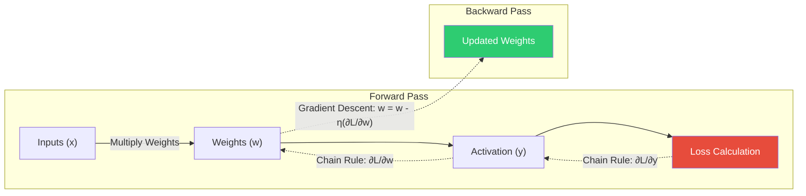

#### 📝 PYQ Numerical Example (Difficulty: Hard)
**Question:** A single-layer perceptron has two input features $x_1 = 1.0, x_2 = -1.0$ with initial synapse weights $w_1 = 0.5, w_2 = -0.5$ and a bias weight $b = 0.0$. The learning rate is $\eta = 0.1$. The true target output is $d = 1$, but the current step-function activation outputs a prediction of $y = 0$. Calculate the exact updated value of the weight $w_1$ after one training epoch, detailing the formula used.
**Explanation:**
1. **Understand the Goal**: The perceptron made a mistake (predicted 0, target was 1). We must use the Perceptron Learning Rule to dynamically adjust the weights to reduce this error.
2. **Calculate the Error Magnitude**: The error $e$ is defined as the difference between the desired target and the actual prediction.
   - $e = d - y = 1 - 0 = 1$.
3. **Apply the Weight Update Formula**: The mathematical rule for updating an individual weight is: $\Delta w_i = \eta \times e \times x_i$. This ensures the weight shifts in proportion to both the learning rate and the magnitude of the specific input feature that contributed to the error.
4. **Calculate the Delta for $w_1$**:
   - $\Delta w_1 = 0.1 \times 1 \times 1.0 = 0.1$.
5. **Apply the Update**: Add the delta to the old weight.
   - $w_{1(new)} = w_{1(old)} + \Delta w_1 = 0.5 + 0.1 = 0.6$.
   **Answer:** The updated weight $w_1$ is strictly 0.6.

### 4.5 Fuzzy Logic & Genetic Algorithms
**Deep-Dive Definitions & Properties:**
- **Core Definition**:
  - Advanced metaheuristic architectures simulating biological and cognitive phenomena
  - Solves highly complex, mathematically intractable optimization problems
- **Key Properties & Mechanisms**:
  - *Classical vs Fuzzy Logic*:
    - Classical Boolean: rigidly binary (True 1 or False 0)
    - Fuzzy Logic: continuous **Membership Function $\mu_A(x)$** mapping truth strictly between $[0, 1]$ (e.g., "70% true")
  - *Fuzzy Set Operations*:
    - **Union (OR)**: Maximum membership → $\mu_{A \cup B}(x) = \max(\mu_A(x), \mu_B(x))$
    - **Intersection (AND)**: Minimum membership → $\mu_{A \cap B}(x) = \min(\mu_A(x), \mu_B(x))$
    - **Complement (NOT)**: Inverted membership → $\mu_{\neg A}(x) = 1 - \mu_A(x)$
    - **Defuzzification**: Converting aggregated fuzzy sets back into a single crisp output value (e.g., Centroid method)
  - *Genetic Algorithms (GA)*:
    - Search heuristic inspired by Darwinian evolution
    - **Encoding**: Representing potential solution as biological chromosome (binary bit string)
    - **Fitness Function**: Objective formula scoring how "good" a chromosome is
    - **Selection**: Statistically favoring higher fitness scores to become parents (Roulette/Tournament)
    - **Crossover (Recombination)**: Swapping bit-string segments between parents to mix traits
    - **Mutation**: Randomly flipping tiny percentage of bits → injects diversity to physically prevent premature convergence to local optima
  - **Core Mathematical Formulas**:
    - *Fuzzy Cartesian Product*: $\mu_{A \times B}(x, y) = \min(\mu_A(x), \mu_B(y))$. Mathematical construction of a multi-dimensional fuzzy space.

#### 📝 PYQ Numerical Example (Difficulty: Easy)
**Question:** Given two distinct fuzzy sets $A$ and $B$, an element $x$ has been evaluated to have the following continuous membership values: $\mu_A(x) = 0.7$ and $\mu_B(x) = 0.4$. Calculate the exact membership value of $x$ in both the algebraic product space and the standard fuzzy union space of $A$ and $B$.
**Explanation:**
1. **Evaluate the Algebraic Product**: In fuzzy mathematics, the algebraic product is simply the scalar multiplication of the two membership degrees.
   - Formula: $\mu_{A \cdot B}(x) = \mu_A(x) \times \mu_B(x)$.
   - Calculation: $0.7 \times 0.4 = 0.28$.
2. **Evaluate the Standard Fuzzy Union (OR)**: The standard union dictates taking the mathematical maximum of the two degrees.
   - Formula: $\mu_{A \cup B}(x) = \max(\mu_A(x), \mu_B(x))$.
   - Calculation: $\max(0.7, 0.4) = 0.7$.
   **Answer:** The membership value in the algebraic product is 0.28, and the membership value in the fuzzy union is 0.7.

### 4.6 Intelligent Agents, SOMs, and Advanced Fuzzy Logic
**Deep-Dive Definitions & Properties:**
- **Intelligent Agent Architectures**:
  - *PEAS Framework*: Defines agent problem space parameters:
    - **P**erformance measure (metric of success)
    - **E**nvironment (physical/virtual world)
    - **A**ctuators (mechanisms altering environment)
    - **S**ensors (mechanisms perceiving environment)
  - *Simple Reflex Agents*: Operate strictly on condition-action ($if \to then$) rules, ignoring history
  - *Utility-Based Agents*: Calculate mathematical expected utility of all future states to rationally choose between conflicting goals
- **Kohonen Self-Organizing Maps (SOM)**:
  - Unsupervised neural network utilizing competitive learning (not backpropagation)
  - Mathematically maps high-dimensional data onto 2D grid preserving topological properties
  - *Weight Update*: Only the "Winning" neuron and its geographic neighbors update weights closer to input
- **Advanced Fuzzy Logic ($\alpha$-cuts)**:
  - *Alpha-Cut ($\alpha$-cut)*: Mathematical operation converting continuous fuzzy set to crisp boolean set
  - Contains strictly elements with membership degree $\ge \alpha$ threshold ($A_\alpha = \{x \mid \mu_A(x) \ge \alpha\}$)

#### 📝 PYQ Conceptual Example (Difficulty: Medium)
**Question:** Design the PEAS specification for an automated AI medical diagnosis system.
**Explanation:**
To formally map the problem space, we must strictly define the four parameters:
- **Performance Measure**: Accurate disease diagnosis, minimized patient risk, minimized cost of unnecessary tests.
- **Environment**: The hospital database, the patient's physical symptoms, real-time vital monitors.
- **Actuators**: Display screen (outputting diagnoses, generating prescriptions, alerting nurses).
- **Sensors**: Keyboard input for symptoms, data feeds from blood pressure cuffs/EKG machines, digital medical history files.
**Answer:** Performance (Accuracy/Patient Health), Environment (Hospital/Patient), Actuators (Display/Alerts), Sensors (Data feeds/Keyboard).

---

### Rapid Fire Self-Assessment (Subject 4)
> **🚨 CAUTION:**
> **Test your retention!** Cover the answers below and test yourself:
> 1. (True/False) A mathematically optimal algorithm will always prevent starvation.
> 2. (True/False) Using an array-based implementation guarantees $O(1)$ arbitrary insertion.
> 3. (Match) Which architecture strictly relies on early binding by default?
> *Answers*: 1. False (e.g., SJF is optimal for wait time but starves long processes), 2. False (Requires $O(N)$ shifting), 3. C++ standard methods.

*(End of Subject 4 Checkpoint)*

## 5. Software Engineering

### 5.1 Software Development Life Cycle (SDLC) Models
**Deep-Dive Definitions & Properties:**
- **Core Definition**:
  - Overarching mathematical and managerial framework dictating sequential or iterative phases of software creation
  - Governs entire lifecycle: requirements → design → coding → testing → deployment → maintenance
  - Goal: minimizes project risk and ensures strict adherence to budgetary and temporal constraints
- **Key Properties & Mechanisms**:
  - *Spiral Model*:
    - Fundamentally risk-driven meta-model designed by Barry Boehm
    - Mathematically evaluates project risk at every single iteration
    - Consists of 4 strictly defined quadrants:
      1. Objectives and alternative determination
      2. Risk Assessment and Reduction (prototypes explicitly built to test feasibility)
      3. Development and Verification (coding and testing)
      4. Planning for the next phase
    - Crucial for massive, high-risk systems (aerospace, military) where failure is catastrophic
  - *Agile (Scrum & XP)*:
    - Paradigm shift from rigid planning to iterative, adaptable delivery in short "sprints"
    - **Scrum**: Relies on specific roles (Product Owner, Scrum Master) and artifacts (Product/Sprint Backlog). Abandons heavy documentation for working software.
    - **Extreme Programming (XP)**: Focuses heavily on code-level engineering. Mandates strict Test-Driven Development (TDD), Continuous Integration (CI), and Pair Programming.
  - *Prototyping Model*:
    - Used when requirements are highly ambiguous or unstable
    - A "throwaway" prototype is rapidly built strictly to extract and validate visual/functional requirements
    - Deep architectural design is bypassed until prototype is formally validated
  - *Feature Driven Development (FDD)*:
    - Iterative/incremental agile methodology driven strictly by client's valued features
    - Structured flow: Domain object model → Feature list → Plan by feature → Design by feature → Build by feature

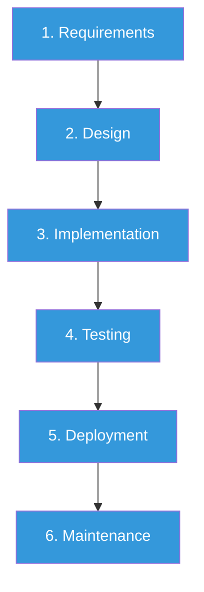


> **📊 DIFFERENCE TABLE:** Agile vs Waterfall
> | Feature | Waterfall Model | Agile Methodology |
> | :--- | :--- | :--- |
> | **Structure** | Rigid, strictly sequential phases | Flexible, iterative, and incremental sprints |
> | **Requirements** | Must be locked down completely before design | Expected to evolve dynamically throughout project |
> | **Client Involvement**| Low (Mostly at beginning and absolute end) | Continuous (Daily/Weekly feedback loops) |
> | **Risk Management** | Very High Risk (Bugs discovered late in testing) | Low Risk (Continuous integration & testing) |

#### 📝 PYQ Conceptual Example (Difficulty: Medium)
**Question:** In a highly volatile project where the underlying hardware platform is experimental and prone to failure, which SDLC model is strictly mathematically optimal, and what specific quadrant of that model explicitly handles the volatility?
**Explanation:**
When volatility and severe technical risk (hardware failure, shifting requirements, unknown technical feasibility) are the primary constraints, linear models like Waterfall will catastrophically fail because they cannot adapt mid-cycle. The **Spiral Model** is the only SDLC designed inherently to mathematically quantify, simulate, and mitigate risk. In the second quadrant (Risk Analysis and Resolution), the engineering team mathematically evaluates the probability of failure and explicitly builds physical prototypes or runs deep computer simulations strictly to resolve those risks *before* committing any massive budget to actual code development.
**Answer:** The Spiral Model. The Risk Assessment and Resolution quadrant specifically handles this by evaluating prototypes and fallback strategies before development begins.

### 5.2 Software Metrics & Project Management
**Deep-Dive Definitions & Properties:**
- **Core Definition**:
  - Rigorous, quantitative mathematical formulas used to empirically estimate effort, cost, duration, and structural complexity long before coding starts
- **Key Properties & Mechanisms**:
  - *COCOMO (Constructive Cost Model)*:
    - Algorithmic software cost estimation model developed by Boehm
    - Calculates Effort (Person-Months) and total Development Time based on thousands of lines of code (KLOC)
    - **Formula**: $\text{Effort} = a \times (\text{KLOC})^b$
    - Complexity Modes: **Organic** (small/simple), **Semi-detached** (medium), **Embedded** (massive, unprecedented complexity)
  - *PERT/CPM (Program Evaluation and Review Technique / Critical Path Method)*:
    - **Critical Path**: The absolute longest continuous sequence of dependent tasks in a directed acyclic graph (DAG)
    - Mathematically dictates the absolute shortest possible time the entire project can be completed
    - Any delay on the critical path strictly equals a delay in final project delivery
    - **PERT Time Estimation**: Probabilistic Beta-distribution weighted average used for uncertain task durations
    - Formula: $T_E = \frac{O + 4M + P}{6}$ (Optimistic, Most Likely, Pessimistic)


> **📊 DIFFERENCE TABLE:** Cohesion vs Coupling
> | Feature | Cohesion | Coupling |
> | :--- | :--- | :--- |
> | **Definition** | Degree to which elements *inside* a module belong together | Degree of inter-dependence *between* different modules |
> | **Focus Area** | Intra-module dependency | Inter-module dependency |
> | **Engineering Goal** | **High Cohesion** (Maximize) | **Low Coupling** (Minimize) |
> | **Worst Type** | Coincidental Cohesion (Random elements bundled) | Content Coupling (One module directly edits another's code) |

#### 📝 PYQ Numerical Example (Difficulty: Hard)
**Question:** A critical software module has three estimated times provided by senior engineers: an Optimistic time of 4 days, a Most Likely time of 7 days, and a Pessimistic time of 16 days. Using the standard PERT formula, calculate the expected time ($T_E$) and the statistical variance ($\sigma^2$) of the task to determine its unpredictability.
**Explanation:**
1. **Calculate Expected Time ($T_E$)**: We use the weighted average formula which heavily favors the 'Most Likely' scenario while factoring in the extremes.
   - Formula: $T_E = \frac{O + 4M + P}{6}$.
   - Calculation: $\frac{4 + 4(7) + 16}{6} = \frac{4 + 28 + 16}{6} = \frac{48}{6} = 8$ days. This means statically, the task will take 8 days.
2. **Calculate Variance ($\sigma^2$)**: The variance mathematically represents the uncertainty or risk associated with the task. A high variance means the task is highly volatile.
   - The standard deviation ($\sigma$) in PERT is mathematically defined as one-sixth of the total spread between the absolute worst and absolute best cases: $\sigma = \frac{P - O}{6}$.
   - Calculation: $\sigma = \frac{16 - 4}{6} = \frac{12}{6} = 2$.
   - Variance is strictly the square of the standard deviation: $\sigma^2 = 2^2 = 4$.
   **Answer:** The expected statistical time is 8 days, and the variance (representing volatility) is 4.

### 5.3 Software Design Principles (Coupling & Cohesion)
**Deep-Dive Definitions & Properties:**
- **Core Definition**:
  - Fundamental architectural metrics defining the structural integrity of a codebase
  - **Coupling**: How deeply interconnected modules are to each other
  - **Cohesion**: How singular and laser-focused a module's internal operations are
  - **Universal Architectural Goal**: mathematically strict **High Cohesion** and **Low Coupling**
- **Key Properties & Mechanisms**:
  - *Coupling (Degree of Interdependence)* (Ranked Best to Worst):
    1. **Data Coupling** (Best): Modules independent, share only simple primitive data via function parameters
    2. **Stamp Coupling**: Share massive composite data structures, but receiving module only uses a tiny fraction, needlessly exposing the schema
    3. **Control Coupling**: One module passes a control flag explicitly dictating the internal logic flow of another
    4. **Common/External Coupling**: Multiple modules mutate shared global variables → unpredictable race conditions
    5. **Content Coupling** (Worst): Module directly reads/alters hidden internal data or physical code of another
  - *Cohesion (Degree of Internal Focus)* (Ranked Best to Worst):
    1. **Functional Cohesion** (Best): Every single line of code contributes exclusively to exactly one single task
    2. **Sequential Cohesion**: Output data of one element acts as immediate input data for the next
    3. **Communicational Cohesion**: Elements operate on the exact same central input data structure
    4. **Logical Cohesion**: Elements perform logically similar generic tasks, but tasks are otherwise independent
    5. **Coincidental Cohesion** (Worst): Elements grouped purely randomly with zero logical relationship
  - *Jackson's Principle*:
    - Strict philosophy stating program hierarchical structure should systematically map to mathematical hierarchical structure of the data it processes

#### 📝 PYQ Conceptual Example (Difficulty: Easy)
**Question:** If an Authentication Module passes a massive `User` object (containing passwords, addresses, and history) to an Analytics Module, but the Analytics Module only ever reads the `user_id` integer field to execute a query, what specific type of coupling exists, and how must it be optimized?
**Explanation:**
Passing a massive composite data structure when only a primitive sub-element is required is the exact mathematical definition of **Stamp Coupling**. It is highly inefficient and dangerous because it unnecessarily exposes the highly sensitive internal schema (like passwords) of the `User` object to a module that does not need it. To optimize this into the highly desirable **Data Coupling**, the Authentication Module should extract the `user_id` integer itself, and simply pass that single primitive integer directly into the Analytics Module's function signature, completely hiding the `User` object.
**Answer:** It is Stamp Coupling. It must be optimized to Data Coupling by passing only the primitive `user_id` as a parameter.

### 5.4 Software Testing & Quality Assurance
**Deep-Dive Definitions & Properties:**
- **Core Definition**:
  - Rigorous empirical execution of a program designed to mathematically identify defects, verify functionality, and validate client problem-solving
- **Key Properties & Mechanisms**:
  - *Verification vs Validation*:
    - **Verification**: "Are we building the product right?" (Inward-facing check against design documents via static analysis/code reviews)
    - **Validation**: "Are we building the right product?" (Outward-facing check against real-world client business needs)
  - *White-Box vs Black-Box Testing*:
    - **White-Box (Structural)**: Tester has absolute access to source code. Goal is to traverse every logical branch and loop. Primary metric: Cyclomatic Complexity.
    - **Black-Box (Functional)**: Zero access to source code (treats as impenetrable box). Focuses strictly on input/output mappings. Techniques:
      - **Equivalence Partitioning**: Divides infinite input universe into valid/invalid classes. Testing one value mathematically tests the whole class.
      - **Boundary Value Analysis (BVA)**: Tests absolute extreme edges of input domains where bugs overwhelmingly cluster.
  - *Cyclomatic Complexity ($V(G)$)*:
    - Graph-theory metric measuring total number of linearly independent paths
    - Formula: $V(G) = E - N + 2P$ ($E$=edges, $N$=nodes, $P$=disconnected components)
    - Explicitly dictates absolute minimum test cases required for 100% path coverage
  - *McCall's Quality Factors* (3 Perspectives):
    1. **Product Revision**: Maintainability, Flexibility, Testability
    2. **Product Transition**: Portability, Reusability, Interoperability
    3. **Product Operations**: Correctness, Reliability, Efficiency, Integrity, Usability

#### 📝 PYQ Numerical Example (Difficulty: Hard)
**Question:** A complex mathematical function takes an integer input $X$. If $X \gt 0$, it enters an `if` block containing a nested `while` loop that iterates based on $X$. If $X \le 0$, it immediately returns an error. When drawn as a control flow graph, it has exactly 7 nodes and 8 edges, existing as 1 single connected component. Calculate the Cyclomatic Complexity and detail its exact practical significance to a QA testing engineer.
**Explanation:**
1. **Apply the Graph Theory Formula**: $V(G) = E - N + 2P$.
2. **Mathematical Execution**: $V(G) = 8 - 7 + 2(1) = 1 + 2 = 3$.
3. **Practical Significance**: The cyclomatic complexity is exactly 3. In rigorous white-box testing, this mathematically guarantees that the QA engineer must design and execute a strict minimum of exactly 3 fully distinct test cases to achieve 100% basis path coverage. This mathematically ensures that absolutely every single line of code, including every possible branch of the `if` statement and the full execution of the `while` loop, will have been traversed at least once across the entire test suite.
**Answer:** The Cyclomatic Complexity is 3, strictly dictating that a minimum of 3 independent test cases are mathematically required to guarantee complete basis path coverage.

### 5.5 Cloud Computing & Virtualization
**Deep-Dive Definitions & Properties:**
- **Core Definition**:
  - Scalable, on-demand delivery of massive computing services over internet
  - Reliant on **Virtualization**: physically isolating and multiplexing raw hardware (CPU, RAM, Disk) among multiple independent tenants
- **Key Properties & Mechanisms**:
  - *Hypervisors (Virtual Machine Monitors)*:
    - Core software layer responsible for securely creating and managing isolated VMs
    - **Type 1 (Bare-Metal/Native)**:
      - Installs strictly directly onto host's raw silicon hardware
      - Completely bypasses underlying OS
      - Vastly more efficient, phenomenally secure → absolute standard for enterprise (AWS, ESXi, Hyper-V)
    - **Type 2 (Hosted)**:
      - Installs completely on top of pre-existing functioning host OS
      - Requests hardware resources awkwardly through host OS kernel → massive overhead/latency
      - Used strictly for consumer testing (VirtualBox, Workstation)

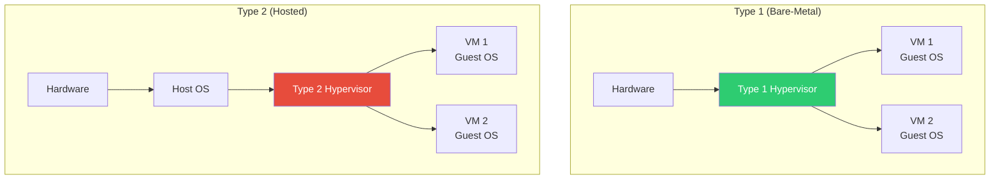

#### 📝 PYQ Conceptual Example (Difficulty: Easy)
**Question:** A major cloud service provider is provisioning a massive new billion-dollar data center intended to physically isolate highly sensitive workloads for government and financial clients. Should they architect the servers using a Type 1 or Type 2 hypervisor, and what is the strict technical and security justification for this choice?
**Explanation:**
They must strictly and unequivocally use a **Type 1 (Bare-Metal)** hypervisor. A Type 2 hypervisor runs merely as a standard software application sitting on top of a general-purpose host OS. If that host OS is compromised by a zero-day malware attack, or if it simply crashes due to a faulty graphic driver bug, absolutely every single VM running on top of it is instantly compromised, exposed, or destroyed. A Type 1 hypervisor directly interfaces with the silicon, completely stripping away the massive, vulnerable attack surface of a standard host OS, thereby mathematically guaranteeing hardware-level tenant isolation, impenetrable security, and maximum I/O performance for the critical VMs.
**Answer:** Type 1 (Bare-Metal) hypervisor. It directly interfaces with the raw hardware, completely eliminating the severe performance overhead and the catastrophic security vulnerabilities inherent to running on top of a host OS.

---

### Rapid Fire Self-Assessment (Subject 5)
> **🚨 CAUTION:**
> **Test your retention!** Cover the answers below and test yourself:
> 1. (True/False) A mathematically optimal algorithm will always prevent starvation.
> 2. (True/False) Using an array-based implementation guarantees $O(1)$ arbitrary insertion.
> 3. (Match) Which architecture strictly relies on early binding by default?
> *Answers*: 1. False (e.g., SJF is optimal for wait time but starves long processes), 2. False (Requires $O(N)$ shifting), 3. C++ standard methods.

*(End of Subject 5 Checkpoint)*

## 6. Database Management Systems (DBMS)

### 6.1 Relational Algebra & SQL Operations
**Deep-Dive Definitions & Properties:**
> **📝 NOTE:**
> **Cross-Disciplinary Link**: Relational Algebra is mathematically derived directly from **Discrete Math Set Theory** (covered in [Subject 8.2](#82-set-theory-relations--lattices)).
- **Core Definition**:
  - Relational Algebra: Rigorous, theoretical, procedural mathematical query language dictating *how* to retrieve data through sequential operations
  - SQL: Practical, declarative implementation dictating *what* data to retrieve
- **Key Properties & Mechanisms**:
  - *Fundamental Operations*: Select ($\sigma$), Project ($\pi$), Union ($\cup$), Set Difference ($-$), Cartesian Product ($\times$), Rename ($\rho$)
  - *Division Operator ($\div$)*:
    - Highly complex derived operator acting as universal quantifier ($\forall$)
    - Returns elements in $R$ strictly associated with *every single* element in $S$
  - *Outer Joins*: Preserves "dangling" unmatched tuples to prevent data loss
    - **Left Outer Join ($\leftouterjoin$)**: Keeps every tuple from left table, pads with `NULL` on right
    - **Full Outer Join ($\fullouterjoin$)**: Keeps all tuples from both tables, pads with `NULL`s symmetrically
  - *Data Definition vs Manipulation*:
    - **DDL**: Alters physical schema structure (`CREATE`, `ALTER`, `DROP`, `TRUNCATE`)
    - **DML**: Queries/modifies actual data rows (`SELECT`, `INSERT`, `UPDATE`, `DELETE`)
  - **Core Mathematical Formulas**:
    - *Relational Division ($\div$)*: $R \div S = \{t \mid \forall s \in S, \exists r \in R \text{ such that } r[S] = s \text{ and } r[R-S] = t\}$. Mathematically isolates tuples in $R$ that are flawlessly paired with every single tuple in $S$.

#### 📝 PYQ Conceptual Example (Difficulty: Medium)
**Question:** Translate the following complex business requirement into standard, mathematically pure Relational Algebra using the Division operator: "Retrieve the exact `driver_id` of the veteran drivers who have successfully driven absolutely every single bus model currently owned by the transport company." You are given two relations: `Drives(driver_id, bus_model)` and `Fleet(bus_model)`.
**Explanation:**
The requirement explicitly asks for entities in one primary set (the drivers) that are comprehensively mapped to *every single* entity in another definitive set (the total bus models). This "for all" requirement is the exact mathematical definition of the relational division operator.
- Relation 1 ($R$): The dividend. We only need the specific `driver_id` and `bus_model` attributes from the massive `Drives` history table. We use projection: $\pi_{\text{driver\_id, bus\_model}}(\text{Drives})$.
- Relation 2 ($S$): The divisor. We need the total universe of all possible bus models. We project this from the fleet table: $\pi_{\text{bus\_model}}(\text{Fleet})$.
- Operation: We mathematically divide $R$ by $S$ to isolate only the drivers who have an entry for every model.
**Answer:** The expression is $\pi_{\text{driver\_id, bus\_model}}(\text{Drives}) \div \pi_{\text{bus\_model}}(\text{Fleet})$.

### 6.2 Keys & Functional Dependencies
**Deep-Dive Definitions & Properties:**
- **Core Definition**:
  - Functional Dependency (FD) $X \to Y$: If two tuples agree on $X$, they must absolutely agree on $Y$
  - Keys are specialized sets of attributes leveraging FDs to uniquely identify tuples
- **Key Properties & Mechanisms**:
  - *Super Key*: Any set of attributes that mathematically uniquely identifies a tuple
  - *Candidate Key*: A *minimal* super key. Stripped of redundant attributes; removing one shatters its uniqueness
  - *Primary Key*: The one specific Candidate key deliberately chosen to physical identify tuples
  - *Alternate Key*: Remaining Candidate keys not selected as Primary key
  - *Prime vs Non-Prime Attributes*:
    - **Prime**: Physical part of *any* Candidate key
    - **Non-Prime**: Does not belong to *any* Candidate key
  - **Core Mathematical Formulas**:
    - *Attribute Closure ($X^+$)*: $X^+ = X \cup \{Y \mid X \to Y \text{ is inferable from } F\}$. The absolute mathematical boundary of all attributes functionally determined by $X$ under the strict rules of Armstrong's Axioms.
    - *Armstrong's Transitivity*: $If\ X \to Y \text{ and } Y \to Z, \text{ then } X \to Z$. The mathematical backbone used to rigorously derive implied functional dependencies.


> **📊 DIFFERENCE TABLE:** B-Tree vs B+ Tree
> | Feature | B-Tree | B+ Tree |
> | :--- | :--- | :--- |
> | **Data Storage** | Data pointers reside in both internal AND leaf nodes | Data pointers strictly reside ONLY in leaf nodes |
> | **Leaf Nodes** | Completely disconnected from each other | Horizontally linked (Linked List) for rapid traversal |
> | **Search Speed** | Inconsistent (Faster if data is near root) | Consistent (Must always traverse down to leaves) |
> | **Range Queries** | Terribly slow (Requires full tree traversal) | Extremely fast (Horizontal leaf-node jumping) |

#### 📝 PYQ Numerical Example (Difficulty: Hard)
**Question:** You are given a complex relation $R(A, B, C, D)$ and the exact set of Functional Dependencies $F = \{A \to B, B \to C, C \to D\}$. Using mathematical attribute closures, find absolutely all Candidate keys for the relation $R$.
**Explanation:**
1. **Find the Closure of Attributes**: To prove an attribute is a candidate key, we must mathematically calculate its closure (denoted as $\{X\}^+$). We must find the minimal attribute(s) whose closure successfully encompasses the entire relation $(A, B, C, D)$.
2. **Test individual closures systematically**:
   - Compute $\{A\}^+$: Starting with $A$. The FD $A \to B$ adds $B$ (we have $A,B$). The FD $B \to C$ adds $C$ (we have $A,B,C$). The FD $C \to D$ adds $D$ (we have $A,B,C,D$). Therefore, $\{A\}^+ = \{A, B, C, D\}$. Since it successfully determines all attributes, $A$ is a super key. Furthermore, since it consists of only a single attribute, it is mathematically irreducible, definitively proving it is a Candidate key.
   - Compute $\{B\}^+$: Starting with $B$. $B \to C, C \to D$. $\{B\}^+ = \{B, C, D\}$. It is fundamentally missing $A$. It is not a key.
   - Compute $\{C\}^+$: Starting with $C$. $C \to D$. $\{C\}^+ = \{C, D\}$. It is missing $A$ and $B$. It is not a key.
3. **Analyze global possibilities**: Notice that attribute $A$ never appears on the right-hand side (RHS) of *any* functional dependency. Because of this, it is mathematically impossible to derive $A$ from any other attribute. Therefore, $A$ must absolutely be a mandatory part of every single potential candidate key. Since $A$ alone is already proven to be a candidate key, appending anything to it would violate the minimality rule.
**Answer:** The only valid Candidate key for the entire relation is $A$.

### 6.3 Normalization (1NF to 5NF)
**Deep-Dive Definitions & Properties:**
- **Core Definition**:
  - Systematic mathematical process decomposing bloated tables into smaller linked tables
  - Goal: completely eliminate data redundancy and prevent catastrophic anomalies (Insertion, Update, Deletion)
- **Key Properties & Mechanisms**:
  - *1NF (First Normal Form)*: Bans multi-valued attributes; all values strictly atomic
  - *2NF*: Must be 1NF. Bans **Partial Dependencies** (non-prime functionally dependent on subset of Candidate key)
  - *3NF*: Must be 2NF. Bans **Transitive Dependencies**. For $X \to Y$, $X$ must be Super key OR $Y$ must be Prime attribute
  - *BCNF (Boyce-Codd)*: Stricter 3NF. For every $X \to Y$, $X$ MUST be a Super key. Closes the overlapping keys loophole
  - *4NF*: Must be BCNF. Bans **Multi-valued Dependencies** ($X \twoheadrightarrow Y$)
  - *5NF*: Deals with **Join Dependencies**. Cannot be losslessly decomposed without generating spurious tuples
  - **Core Mathematical Formulas**:
    - *Lossless Join Decomposition*: $R_1 \bowtie R_2 = R$. A strict mathematical guarantee. Furthermore, either $(R_1 \cap R_2) \to R_1$ or $(R_1 \cap R_2) \to R_2$ must absolutely hold true for the decomposition to be perfectly lossless.

#### 📝 PYQ Conceptual Example (Difficulty: Hard)
**Question:** In deep database theory, why is BCNF considered mathematically stricter than 3NF, and what specific, highly dangerous type of dependency anomaly does it aggressively eliminate that the standard 3NF explicitly tolerates?
**Explanation:**
The formal definition of 3NF allows a functional dependency $X \to Y$ to exist even if the determinant $X$ is completely powerless (not a super key), provided that the dependent attribute $Y$ is a **prime attribute** (a part of some candidate key). This creates a massive, critical loophole in databases with overlapping composite candidate keys. It allows a situation where a part of a candidate key is functionally determined by an attribute that is *not* a candidate key, leading directly to data redundancy and update anomalies. BCNF ruthlessly closes this exact loophole. In BCNF, the left-hand side ($X$) must absolutely, unconditionally be a super key. Therefore, BCNF is required to eliminate the severe anomalies caused specifically by overlapping candidate keys.
**Answer:** BCNF strictly requires the determinant to be a super key in all cases, permanently eliminating the 3NF loophole that tolerates non-key attributes determining prime attributes (which causes anomalies when tables have overlapping composite candidate keys).

### 6.4 Transactions & Concurrency Control
**Deep-Dive Definitions & Properties:**
- **Core Definition**:
  - Transaction: strictly atomic, indivisible logical unit of database processing
  - Concurrency Control: guarantees multiple transactions execute simultaneously without corrupting data
- **Key Properties & Mechanisms**:
  - *ACID Properties*:
    - **A**tomicity (All or nothing)
    - **C**onsistency (Moves DB between valid states)
    - **I**solation (Simultaneous transactions don't see uncommitted changes)
    - **D**urability (Committed changes survive power failures)
  - *Serializability*: Outcome is exactly identical to some purely serial execution
    - **Conflict Serializability**: Directed Precedence Graph must contain NO mathematical cycles
    - **View Serializability**: Looser constraint tolerating "Blind Writes"
  - *2-Phase Locking (2PL)*:
    - **Phase 1 (Growing)**: Acquire locks, release none
    - **Phase 2 (Shrinking)**: Release locks, acquire none
    - *Limitation*: Mathematically proven to generate Deadlocks
  - **Core Mathematical Formulas**:
    - *Timestamp Ordering Protocol*: If $TS(T_i) \lt TS(T_j)$ (meaning $T_i$ is older), then $T_i$ must mathematically execute before $T_j$. A strict rule preventing Read/Write conflicts without utilizing standard blocking locks.

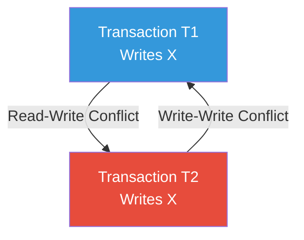

#### 📝 PYQ Numerical Example (Difficulty: Medium)
**Question:** In a highly interleaved database schedule, Transaction $T_1$ reads variable $X$, then Transaction $T_2$ writes to variable $X$, and finally $T_1$ attempts to write to variable $X$. Is this specific schedule conflict serializable? Describe the exact edges formed in the precedence graph.
**Explanation:**
1. **Identify all conflicting operations**: Conflicts occur exclusively when operations target the exact same variable ($X$), belong to entirely different transactions, and at least one of the operations is a Write.
2. **Analyze the $T_1 \to T_2$ relationship**: $T_1$ reads $X$ first, and later $T_2$ overwrites $X$. This is a classic Read-Write conflict. Because $T_1$'s operation happened first chronologically, we must draw a directed edge in the precedence graph pointing from $T_1 \to T_2$.
3. **Analyze the $T_2 \to T_1$ relationship**: $T_2$ writes to $X$, and later $T_1$ also writes to $X$. This is a Write-Write conflict. Because $T_2$'s operation happened first chronologically between these two, we must draw a second directed edge pointing from $T_2 \to T_1$.
4. **Evaluate the Final Graph**: The precedence graph now possesses a directed edge from $T_1 \to T_2$ and a reverse directed edge from $T_2 \to T_1$. This forms a closed, infinite mathematical cycle.
**Answer:** No, the schedule is strictly not conflict serializable. The precedence graph contains a cycle between $T_1$ and $T_2$ due to the Read-Write and Write-Write conflicts.

### 6.5 Database Storage & Indexing
**Deep-Dive Definitions & Properties:**
- **Core Definition**:
  - Advanced physical data structures logarithmically reducing massive I/O cost (disk reads)
- **Key Properties & Mechanisms**:
  - *B+ Trees*:
    - Absolute industry standard for relational DB indexing
    - Data records exclusively stored at bottom leaf nodes
    - Internal nodes strictly contain routing keys
    - Every leaf node horizontally physically linked making high-speed sequential range queries extremely efficient
  - *Dense vs Sparse Indexing*:
    - **Dense**: Index entry for *every single* search key value (Fast lookup, massive space)
    - **Sparse**: Index entry for select few keys (usually one per disk block; smaller, relies on block scanning)
  - *Extendible Hashing*:
    - Dynamic hashing technique utilizing pointer directory
    - Uses "Global Depth" and "Local Depth" to split overflowing buckets flawlessly without full DB rehashing
  - **Core Mathematical Formulas**:
    - *B+ Tree Order Calculation ($m$)*: $m \times P + (m-1) \times (K + D) \le B_{size}$. Where $P$ is block pointer size, $K$ is key size, $D$ is data pointer size, and $B_{size}$ is the strict physical disk block size. Mathematically guarantees the node fits perfectly into one physical disk I/O sector.

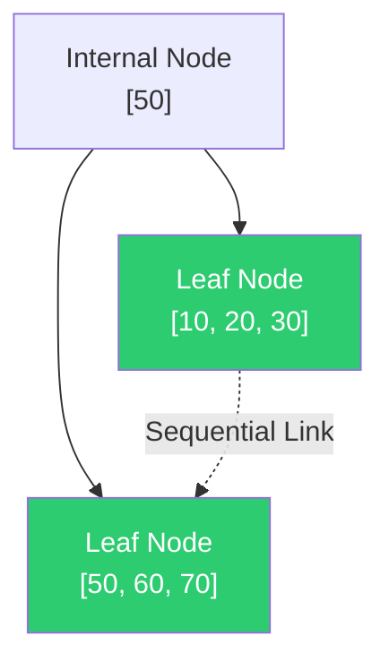

#### 📝 PYQ Conceptual Example (Difficulty: Easy)
**Question:** Why do modern enterprise relational databases overwhelmingly implement B+ Trees for primary key indexing instead of the standard B-Trees studied in basic data structures?
**Explanation:**
In a standard B-Tree, actual data pointers are scattered wildly throughout the internal nodes and the root. If a user executes a range query (e.g., retrieving all users with IDs from 100 to 500), the database must perform a mathematically complex, highly inefficient In-Order traversal, violently bouncing up and down the tree structure, causing massive disk I/O latency. In a **B+ Tree**, all data resides strictly at the bottom leaf level, and every single leaf is linked horizontally via a linked list. To execute a range query, the database simply traverses down the tree once to find the starting node (ID 100), and then effortlessly slides horizontally across the linked leaves until it hits ID 500, requiring a tiny fraction of the disk I/O operations.
**Answer:** B+ Trees store all data exclusively at the leaf nodes, which are linked horizontally. This makes sequential range queries mathematically and physically vastly more efficient than traversing standard B-Trees.

---

### Rapid Fire Self-Assessment (Subject 6)
> **🚨 CAUTION:**
> **Test your retention!** Cover the answers below and test yourself:
> 1. (True/False) A mathematically optimal algorithm will always prevent starvation.
> 2. (True/False) Using an array-based implementation guarantees $O(1)$ arbitrary insertion.
> 3. (Match) Which architecture strictly relies on early binding by default?
> *Answers*: 1. False (e.g., SJF is optimal for wait time but starves long processes), 2. False (Requires $O(N)$ shifting), 3. C++ standard methods.

*(End of Subject 6 Checkpoint)*


## 7. Theory of Computation & Compiler Design

### 7.1 The Chomsky Hierarchy & Formal Languages
**Deep-Dive Definitions & Properties:**
- **Core Definition**:
  - Strict mathematical containment framework categorizing formal languages
  - Based entirely on the generative power of underlying grammars and computational complexity of recognizing automata
  - Fundamentally defines absolute limits of algorithmic computation
- **Key Properties & Mechanisms**:
  - *Type 3 (Regular Languages)*:
    - Absolute weakest class
    - Recognized exclusively by Finite Automata (DFA/NFA) with strictly $O(1)$ constant memory
    - Mathematically cannot count or match pairs (e.g., $a^n b^n$ is strictly impossible)
    - Closed under: Union, Intersection, Complementation, Concatenation, Kleene Star
  - *Type 2 (Context-Free Languages - CFL)*:
    - Recognized by Pushdown Automata (PDA) possessing exactly one stack (LIFO memory)
    - Can mathematically count and match pairs (e.g., $a^n b^n$)
    - Deterministic CFLs (DCFLs) strictly subset of non-deterministic CFLs
    - **Not closed** under Intersection or Complementation
  - *Type 1 (Context-Sensitive Languages - CSL)*:
    - Recognized by Linear Bounded Automata (LBA)
    - Turing Machines with tape strictly bounded by input size
    - Can handle multiple dependencies (e.g., $a^n b^n c^n$)
  - *Type 0 (Recursively Enumerable Languages - REL)*:
    - Absolute highest level of computational power
    - Recognized by unconstrained Turing Machines with infinite tape
    - Represents all mathematically computable functions
    - **Not closed** under Complementation
  - **Core Mathematical Formulas**:
    - *Chomsky Normal Form (CNF)*: Every production rule must mathematically adhere strictly to either $A \to BC$ or $A \to a$. Crucial for bounding parse tree height.
    - *CYK Algorithm Complexity*: $O(n^3 \cdot |G|)$. The mathematical time complexity required to definitively parse a string of length $n$ against a grammar $G$ in strict CNF.

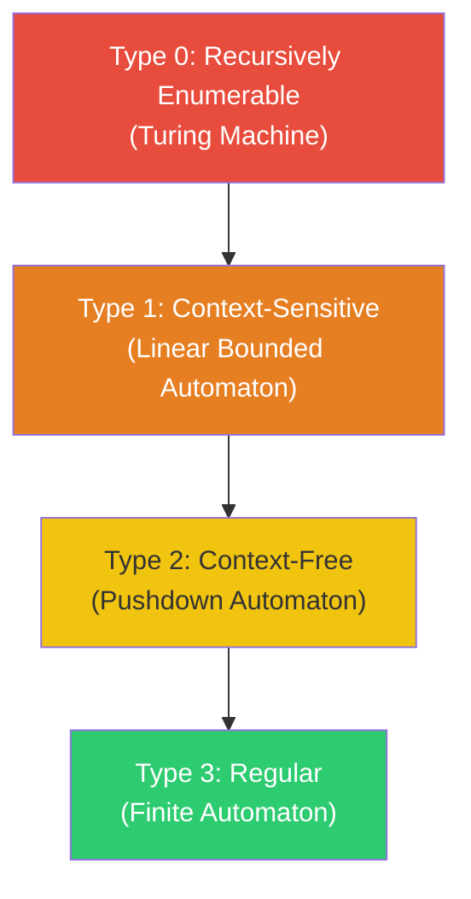


> **📊 DIFFERENCE TABLE:** DFA vs NFA
> | Feature | DFA (Deterministic Finite Automaton) | NFA (Non-Deterministic Finite Automaton) |
> | :--- | :--- | :--- |
> | **Transitions** | Exactly ONE unique transition per input symbol | Zero, One, or Multiple transitions per input symbol |
> | **Epsilon ($\epsilon$) Moves** | Strictly forbidden | Allowed (Can change state without reading input) |
> | **Backtracking** | Never required (Always a single deterministic path) | Required (Must explore multiple parallel paths) |
> | **Space Complexity**| Requires more memory (Explicit state definitions) | Requires less memory (Compact representation) |

#### 📝 PYQ Conceptual Example (Difficulty: Hard)
**Question:** Given two distinct Context-Free Languages $L_1$ and $L_2$, is their intersection mathematically guaranteed to be Context-Free? If not, provide a strict counter-example demonstrating how the stack mechanism of a PDA fundamentally fails.
**Explanation:**
No, CFLs are strictly **not closed under intersection**. A standard Pushdown Automaton possesses exactly one stack. Let $L_1 = \{a^n b^n c^m \mid n, m \ge 0\}$ (a PDA easily pushes $a$'s and pops them for $b$'s, completely ignoring $c$'s). Let $L_2 = \{a^m b^n c^n \mid n, m \ge 0\}$ (a PDA ignores $a$'s, pushes $b$'s, and pops them for $c$'s). Both are trivially Context-Free. However, their strict mathematical intersection is $L_1 \cap L_2 = \{a^n b^n c^n \mid n \ge 0\}$. A single-stack PDA is physically incapable of recognizing this because once it pushes $a$'s and pops them to match the $b$'s, the stack is entirely empty, destroying the memory required to subsequently match the exact same number of $c$'s.
**Answer:** No. The intersection of $L_1 = a^n b^n c^m$ and $L_2 = a^m b^n c^n$ results in $a^n b^n c^n$, which requires two stacks to track three variables, proving it is Context-Sensitive, not Context-Free.

### 7.2 Turing Machines & Decidability
**Deep-Dive Definitions & Properties:**
- **Core Definition**:
  - Turing Machine (TM): Ultimate theoretical abstraction of modern computer
  - Decidability: Determines whether a mathematical/computational question can be definitively answered "Yes" or "No" by a TM in finite time
- **Key Properties & Mechanisms**:
  - *Decidable (Recursive)*:
    - TM exists that always halts and accepts valid inputs
    - TM always halts and rejects invalid inputs
    - Example: Does a DFA accept a given string?
  - *Partially Decidable (Recursively Enumerable)*:
    - TM definitively halts and accepts valid inputs
    - For invalid inputs, TM might reject or might mathematically loop forever
  - *Undecidable*:
    - Mathematically proven no algorithm can exist to always answer correctly in finite time for all inputs
  - *The Halting Problem*:
    - Most famous undecidable problem (Turing)
    - Mathematically impossible to write a master program to determine if an arbitrary program will halt or loop infinitely
  - **Core Mathematical Formulas**:
    - *Rice's Theorem*: Let $P$ be any non-trivial property of partial mathematically computable functions. The problem of determining whether a Turing Machine computes a function with property $P$ is absolutely undecidable.


> **📊 DIFFERENCE TABLE:** Top-Down vs Bottom-Up Parsing
> | Feature | Top-Down Parsing (e.g., LL) | Bottom-Up Parsing (e.g., LR) |
> | :--- | :--- | :--- |
> | **Tree Construction**| Starts from Root (Start Symbol) $\to$ Leaves | Starts from Leaves (Input String) $\to$ Root |
> | **Derivation** | Left-Most Derivation (LMD) | Right-Most Derivation in Reverse (RMD) |
> | **Power / Scope** | Less powerful, struggles with Left-Recursion | Extremely powerful, handles wider class of grammars |
> | **Key Action** | Predictive Expansion | Shift-Reduce operations |

#### 📝 PYQ Conceptual Example (Difficulty: Easy)
**Question:** State the decidability status of the following two problems: (1) Does a given Deterministic Finite Automaton (DFA) accept the empty string? (2) Does a given Turing Machine accept the empty string?
**Explanation:**
The computational power of the underlying automaton directly dictates the decidability of its properties. 
1. For a DFA, its memory is strictly finite. You can simply traverse the state transition graph starting from the initial state without consuming any input. If the initial state is a final accepting state, it accepts the empty string. This algorithm is guaranteed to finish in $O(1)$ time. Thus, it is trivially **Decidable**.
2. For a Turing Machine, determining if it accepts the empty string requires actually simulating the machine on an empty tape. Because a TM can utilize its infinite tape to perform arbitrary complex calculations forever, the simulation might never halt. This is a direct variation of the Halting Problem and is mathematically proven to be **Undecidable**.
**Answer:** Problem (1) regarding the DFA is Decidable. Problem (2) regarding the Turing Machine is Undecidable.

### 7.3 Syntax Analysis & Parsing (LL vs LR)
**Deep-Dive Definitions & Properties:**
- **Core Definition**:
  - Syntax analysis (Parsing): Verification of linear token stream against Context-Free Grammar production rules
  - Constructs Abstract Syntax Tree (AST) to validate structural integrity
- **Key Properties & Mechanisms**:
  - *Top-Down Parsing (LL)*:
    - Constructs parse tree from root to leaf tokens
    - Uses **L**eft-to-right scanning and constructs **L**eftmost derivation
    - **LL(1)**: Predictive parser looking 1 token ahead. Incapable of parsing Left Recursion or Ambiguity
  - *Bottom-Up Parsing (LR)*:
    - Constructs parse tree from leaves condensing upwards to root
    - Uses **Shift-Reduce** parsing
    - Uses **L**eft-to-right scanning and constructs **R**everse rightmost derivation
    - **Parsing Power Hierarchy**: $LR(0) \lt SLR(1) \lt LALR(1) \lt CLR(1)$
    - **CLR(1)**: Absolute most powerful. Attaches distinct lookahead tokens to prevent Reduce-Reduce conflicts. High memory usage
    - **LALR(1)**: Industry standard. Mathematically merges CLR(1) states with same core but different lookaheads. Retains power with drastically reduced RAM footprint
  - **Core Mathematical Formulas**:
    - *FIRST(X)*: The strict mathematical set of terminal symbols that begin the strings derived from grammar symbol $X$. Essential for constructing predictive parsing tables.
    - *FOLLOW(A)*: The set of terminals that can mathematically appear immediately to the right of non-terminal $A$ in some sentential form. Required for resolving LL(1) empty productions.

#### 📝 PYQ Conceptual Example (Difficulty: Hard)
**Question:** During the execution of a bottom-up Shift-Reduce parser, define the exact mathematical conditions that cause a "Shift-Reduce Conflict" and a "Reduce-Reduce Conflict".
**Explanation:**
A Shift-Reduce parser operates using a stack and an input buffer.
- **Shift-Reduce Conflict**: This occurs when the parser's current state contains two conflicting valid actions for the exact same lookahead token. Action 1 tells the parser to "Shift" the current token from the buffer onto the stack. Action 2 tells the parser to "Reduce" the items currently on the stack back into a non-terminal. The parser mathematically cannot decide whether to keep reading or to immediately collapse the stack.
- **Reduce-Reduce Conflict**: This occurs when the top of the parser's stack simultaneously matches the exact right-hand side of two completely different grammar production rules (e.g., $A \to x$ and $B \to x$). When the lookahead token arrives, the parser mathematically knows it must reduce the stack, but it cannot determine whether to reduce $x$ into non-terminal $A$ or non-terminal $B$.
**Answer:** A Shift-Reduce conflict occurs when the parser cannot decide whether to read the next token or collapse the stack. A Reduce-Reduce conflict occurs when the stack matches two different grammar rules simultaneously, and the parser cannot decide which non-terminal to reduce it to.

### 7.4 Compiler Optimization Techniques
**Deep-Dive Definitions & Properties:**
- **Core Definition**:
  - Phase transforming Intermediate Representation (IR) to strictly minimize execution time, memory, or power
  - Must never alter logical semantic meaning
- **Key Properties & Mechanisms**:
  - *Constant Folding*: Compile-time evaluation of mathematical expressions containing only constants (e.g., `24 * 60 * 60` $\to$ `86400`)
  - *Loop Invariant Code Motion*: Extracting calculations from inside loops that produce exact same result every iteration, hoisting them outside/above the loop
  - *Common Subexpression Elimination*: Replacing redundant re-calculation of identical mathematical expressions with previously saved temporary results
  - *Peephole Optimization*: Final phase examining sliding window of machine code instructions. Looks for local inefficiencies (e.g., redundant load/store, replacing multiplication with bitwise shifts)
  - **Core Mathematical Formulas**:
    - *Strength Reduction*: Replacing computationally expensive operators with cheaper ones, e.g., $X \times 2 \to X \ll 1$ (Bitwise Left Shift).

#### 📝 PYQ Conceptual Example (Difficulty: Medium)
**Question:** Identify the exact compiler optimization techniques applied to transform Code Block A into Code Block B.
*Code Block A*:
`for (int i = 0; i < 1000; i++) { int limit = 50 * 2; array[i] = x + y + limit; }`
*Code Block B*:
`int limit = 100; int temp = x + y; for (int i = 0; i < 1000; i++) { array[i] = temp + limit; }`
**Explanation:**
1. The expression `50 * 2` consists purely of constants. The compiler evaluated this at compile-time to `100`. This is the exact definition of **Constant Folding**.
2. The assignment of `limit` does not depend on the loop iterator `i`. The compiler extracted it and hoisted it above the loop. This is **Loop Invariant Code Motion**.
3. Assuming `x` and `y` are not modified inside the loop, the expression `x + y` evaluates to the exact same value 1000 times. The compiler calculated it once outside the loop and stored it in `temp`. This is also a classic execution of **Loop Invariant Code Motion** (coupled with creating a temporary variable).
**Answer:** The applied optimizations are Constant Folding (evaluating 50 * 2) and Loop Invariant Code Motion (hoisting the `limit` and `x + y` calculations outside the loop body).

### 7.5 Pumping Lemma & Regularity Constraints
**Deep-Dive Definitions & Properties:**
- **Core Definition**:
  - Adversarial, game-theoretic mathematical proof technique
  - Used strictly to prove a language is *not* Regular or *not* Context-Free (never to prove it *is*)
- **Key Properties & Mechanisms**:
  - *Regular Pumping Lemma*: If $L$ is regular, there exists pumping length $p$ such that any string $s \in L$ where $|s| \ge p$ can be partitioned into $s = xyz$ satisfying:
    1. For any integer $i \ge 0$, $xy^iz \in L$
    2. Length of repeating section: $|y| \gt 0$
    3. Combined length constraint: $|xy| \le p$
  - *Adversarial Proof Process*: Assume $L$ regular $\to$ adversary picks $p$ $\to$ you pick valid string $\to$ adversary partitions $\to$ you demonstrate "pumping" $y$ violates language properties
  - **Core Mathematical Formulas**:
    - *Context-Free Pumping Lemma*: Partition $s = uvxyz$ where $|vxy| \le p$ and $|vy| \gt 0$. The string $uv^ixy^iz \in L$ for all $i \ge 0$. Mathematically tests dual-pumping capabilities.


#### 📝 PYQ Conceptual Example (Difficulty: Hard)
**Question:** Why does the mathematical language $L = \{0^n 1^n \mid n \ge 0\}$ fundamentally fail the Regular Pumping Lemma constraints, making it impossible to parse with a standard DFA?
**Explanation:**
If a DFA attempts to parse this language, it must strictly "remember" the exact number of `0`s it has seen to ensure it subsequently reads the exact same number of `1`s. Because $n$ can be infinitely large, and a DFA fundamentally has a strictly finite mathematical number of states, the DFA will inevitably mathematically run out of memory states. When we apply the Pumping Lemma, because $|xy| \le p$, the partition $y$ must mathematically consist entirely of `0`s. If we pump $y$ (e.g., $xy^2z$), we strictly increase the number of `0`s without increasing the number of `1`s. The resulting string is no longer in the form $0^n 1^n$, completely violating the language definition and proving the language requires a Pushdown Automaton (PDA) with an infinite stack memory.
**Answer:** The language requires infinite counting memory to balance the `0`s and `1`s, which mathematically violates the finite state constraints defined by the Pumping Lemma, proving it is strictly not regular.

### 7.6 Intermediate Code Generation & Optimization
**Deep-Dive Definitions & Properties:**
- **Core Definition**:
  - Translation of high-level AST into machine-independent Intermediate Representation (IR)
  - Allows massive mathematical optimizations before generating hardware-specific assembly
- **Key Properties & Mechanisms**:
  - *Three-Address Code (TAC)*: Linearized instruction sequence where operations have max one operator and max three operands (e.g., `t1 = a + b`)
  - *Implementation Structures*:
    - **Quadruples**: 4-field record: `(Operator, Argument1, Argument2, Result)`
    - **Triples**: 3-field record omitting Result field. Refers to exact line/index of previous operation: `(Operator, Argument1, Argument2)`
  - *Basic Blocks & Flow Graphs*:
    - **Basic Block**: Straight-line code sequence with no branching/halts inside. Single entry, single exit.
    - **Directed Flow Graph**: Mapped Basic Blocks for complex loop analysis
  - *Dominator Trees*: Node $D$ *dominates* node $N$ if every execution path to $N$ must strictly pass through $D$. Essential for loop optimization
  - **Core Mathematical Formulas**:
    - *Liveness Analysis*: $In[n] = Use[n] \cup (Out[n] - Def[n])$. A strict data-flow equation mathematically calculating which variable registers are currently holding active values vs dead data.

#### 📝 PYQ Conceptual Example (Difficulty: Medium)
**Question:** In Compiler Design, what is the exact structural difference between a Quadruple and a Triple when representing Three-Address Code (TAC), and why does a Triple mathematically require an "Indirect Triple" mapping array to optimize code motion?
**Explanation:**
A **Quadruple** explicitly allocates a temporary physical variable string name (like `t1` or `t2`) and stores it in a dedicated 4th "Result" field in the data structure. Because the result variable name is explicit, the compiler can mathematically reorder or move Quadruple instructions during optimization without breaking data dependencies.
A **Triple** mathematically eliminates the explicit Result field to save RAM. Instead, subsequent operations must refer to the exact array index (line number) of the previous Triple operation to fetch its result. However, if an optimization algorithm attempts to physically move or reorder a Triple to a different array index, all subsequent Triples pointing to that line number will mathematically break. To solve this, an "Indirect Triple" array is used—an array of pointers pointing to the Triples, allowing the compiler to mathematically sort the pointers without physically moving the underlying Triple data.
**Answer:** Quadruples use an explicit 4th field to store the result variable, whereas Triples strictly use array line indices for references. Triples require an Indirect pointer array to allow mathematical code motion optimization without corrupting absolute index references.

---

### Rapid Fire Self-Assessment (Subject 7)
> **🚨 CAUTION:**
> **Test your retention!** Cover the answers below and test yourself:
> 1. (True/False) A mathematically optimal algorithm will always prevent starvation.
> 2. (True/False) Using an array-based implementation guarantees $O(1)$ arbitrary insertion.
> 3. (Match) Which architecture strictly relies on early binding by default?
> *Answers*: 1. False (e.g., SJF is optimal for wait time but starves long processes), 2. False (Requires $O(N)$ shifting), 3. C++ standard methods.

*(End of Subject 7 Checkpoint)*


## 8. Discrete Mathematics & Optimization

### 8.1 Mathematical Logic (Propositional & Predicate)
**Deep-Dive Definitions & Properties:**
- **Core Definition**:
  - Foundational bedrock of computer science architecture, AI reasoning, and software verification
  - Propositional logic deals with declarative statements strictly True ($T$) or False ($F$)
  - Predicate logic (First-Order Logic) introduces variables ($x, y$), predicates ($P(x)$ meaning "x has property P"), and quantifiers ($\forall$, $\exists$)
- **Key Properties & Mechanisms**:
  - *Tautology, Contradiction, & Contingency*:
    - **Tautology**: Compound proposition evaluating to True for every combination of truth values
    - **Contradiction**: Always evaluates to False
    - **Contingency**: Sometimes True, sometimes False
  - *Logical Equivalence & Inference Laws*:
    - **De Morgan's Laws**: $\neg(P \land Q) \equiv \neg P \lor \neg Q$
    - **Modus Ponens**: If $P \to Q$ is True, and $P$ is True, then $Q$ is strictly True
    - **Modus Tollens**: If $P \to Q$ is True, and $Q$ is False ($\neg Q$), then $P$ is strictly False ($\neg P$)
  - *Predicate Quantifiers*:
    - **Universal Quantifier ($\forall x$)**: Property $P(x)$ holds for every element $x$ in the domain
    - **Existential Quantifier ($\exists x$)**: Exists at least one element $x$ for which $P(x)$ holds true
  - **Core Mathematical Formulas**:
    - *Logical Implication*: $P \to Q \equiv \neg P \lor Q$. A strict mathematical equivalence used to eliminate implication arrows in formal proofs.
    - *Quantifier Negation*: $\neg(\forall x P(x)) \equiv \exists x \neg P(x)$. Pushing negation mathematically flips universal quantifiers to existential, and vice versa.


> **📊 DIFFERENCE TABLE:** Propositional vs Predicate Logic
> | Feature | Propositional Logic | Predicate Logic (First-Order Logic) |
> | :--- | :--- | :--- |
> | **Core Unit** | Propositions (Simple declarative sentences) | Objects, Properties, Relations, and Functions |
> | **Variables** | Boolean variables ($P, Q, R$) | Domain variables ($x, y, z$) |
> | **Quantifiers** | Does NOT support quantifiers | Strictly uses Universal ($\forall$) and Existential ($\exists$) |
> | **Expressiveness**| Very limited ("Socrates is a man" is just $P$) | Highly expressive ($Man(Socrates)$) |

#### 📝 PYQ Conceptual Example (Difficulty: Medium)
**Question:** Translate the following complex English statement into pure First-Order Predicate Logic: "Every student who takes Artificial Intelligence will pass the exam, but there exists at least one student who did not take Artificial Intelligence and still passed the exam." Use the predicates $S(x)$ for "x is a student", $AI(x)$ for "x takes AI", and $P(x)$ for "x passes the exam".
**Explanation:**
1. The first clause is a universal statement conditional upon taking AI: "For all $x$, if $x$ is a student and $x$ takes AI, then $x$ passes." This translates to: $\forall x \, ((S(x) \land AI(x)) \to P(x))$.
2. The second clause is an existential statement: "There exists an $x$ such that $x$ is a student, and $x$ did not take AI, and $x$ passed." This translates to: $\exists x \, (S(x) \land \neg AI(x) \land P(x))$.
3. We connect both major clauses with a logical AND ($\land$).
**Answer:** $\forall x \, ((S(x) \land AI(x)) \to P(x)) \land \exists x \, (S(x) \land \neg AI(x) \land P(x))$.

### 8.2 Set Theory, Relations, & Lattices
**Deep-Dive Definitions & Properties:**
- **Core Definition**:
  - Set theory strictly defines collections of distinct objects
  - Relations define mathematical mapping between elements
  - Dictates database relational algebra models and cryptographic protocols
- **Key Properties & Mechanisms**:
  - *Equivalence Relations*: Relation $R$ on set $A$ is an Equivalence Relation if it satisfies three properties:
    1. **Reflexive**: $\forall a \in A, (a,a) \in R$
    2. **Symmetric**: If $(a,b) \in R$, then $(b,a) \in R$
    3. **Transitive**: If $(a,b) \in R$ and $(b,c) \in R$, then $(a,c) \in R$
  - *Partial Order Relations (POSet)*:
    - Reflexive, **Anti-Symmetric** (if $aRb$ and $bRa$, then $a=b$), and Transitive
    - Defines a hierarchy but allows incomparable elements
  - *Lattices*:
    - Highly structured POSet where every pair of elements possesses both a unique **Least Upper Bound (LUB / Supremum / Join)** and a unique **Greatest Lower Bound (GLB / Infimum / Meet)**
  - **Core Mathematical Formulas**:
    - *Boolean Algebra Distributivity*: $a \lor (b \land c) = (a \lor b) \land (a \lor c)$. Essential property for digital circuit simplification.

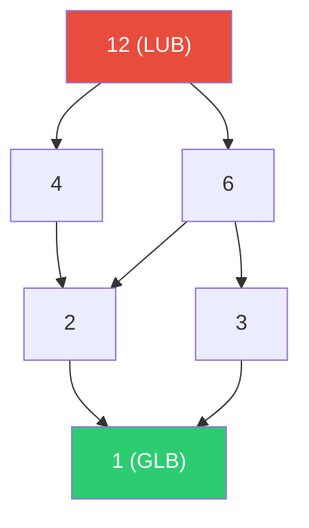

#### 📝 PYQ Numerical Example (Difficulty: Hard)
**Question:** Let the set $S = \{1, 2, 3, 4, 6, 12\}$. Let the relation $R$ be "x divides y" (denoted $x | y$). Prove mathematically if $(S, R)$ forms a valid Lattice, and specifically find the LUB and GLB for the subset $\{4, 6\}$.
**Explanation:**
1. **Verify it is a POSet**: The "divides" relation is inherently Reflexive ($a|a$), Anti-Symmetric (if $a|b$ and $b|a$, then $a=b$ for positive integers), and Transitive (if $a|b$ and $b|c$, then $a|c$). It is a valid POSet.
2. **Find Bounds for {4, 6}**:
   - The **Least Upper Bound (LUB)** of 4 and 6 is defined mathematically as their Least Common Multiple (LCM). The multiples of 4 within the set are $\{4, 12\}$. The multiples of 6 are $\{6, 12\}$. The smallest common multiple that exists strictly within the set $S$ is 12.
   - The **Greatest Lower Bound (GLB)** of 4 and 6 is defined mathematically as their Greatest Common Divisor (GCD). The divisors of 4 are $\{1, 2, 4\}$. The divisors of 6 are $\{1, 2, 3, 6\}$. The largest common divisor is 2.
3. Because every pair in this divisibility set possesses a valid LCM and GCD that are physically present within the set $S$, it is a perfectly valid Lattice.
**Answer:** Yes, it is a valid Lattice. For the subset $\{4, 6\}$, the LUB (Join) is 12, and the GLB (Meet) is 2.

> **⚠️ WARNING:**
> **Common Exam Trap**: When determining if a POSet is a Lattice, examiners frequently provide a set where the mathematical LUB (LCM) of two elements falls *outside* the boundaries of the set $S$. If the LCM or GCD does not explicitly exist inside $S$, it strictly fails to be a Lattice.

### 8.3 Advanced Graph Theory
**Deep-Dive Definitions & Properties:**
- **Core Definition**:
  - Mathematical study of nodes (vertices) connected by edges
  - Models complex computer networks, operating system deadlock allocation states, and AI state-space search trees
- **Key Properties & Mechanisms**:
  - *Bipartite Graphs*:
    - Vertex set can be partitioned into two disjoint sets, $V_1$ and $V_2$
    - Every single edge connects a vertex in $V_1$ exclusively to a vertex in $V_2$
    - Bipartite if and only if it contains absolutely zero odd-length cycles
  - *Eulerian vs Hamiltonian*:
    - **Eulerian Circuit**: Path traversing absolutely every *edge* exactly once, starting and ending on the same vertex. Exists if and only if the graph is connected and every vertex has an even degree
    - **Hamiltonian Cycle**: Path visiting absolutely every *vertex* exactly once, and returning to the start. Finding a Hamiltonian cycle is NP-Complete
  - *Planar Graphs*:
    - Can be drawn on a 2D plane with zero intersecting edges
    - Governed by Euler's Formula: $V - E + F = 2$ ($V$=vertices, $E$=edges, $F$=distinct bounded faces, including the infinite exterior face)
  - **Core Mathematical Formulas**:
    - *Handshaking Lemma*: $\sum \text{deg}(v) = 2|E|$. The absolute sum of all vertex degrees must perfectly equal twice the total number of edges.
    - *Planar Graph Edge Bound*: $E \le 3V - 6$. For any simple connected planar graph with $V \ge 3$, violating this bound mathematically proves the graph is non-planar (must intersect).

#### 📝 PYQ Conceptual Example (Difficulty: Medium)
**Question:** A connected planar graph consists of exactly 6 vertices. What is the absolute strict mathematical maximum number of edges this graph can possibly contain while remaining planar?
**Explanation:**
In graph theory, a connected simple planar graph with $V \ge 3$ is strictly bounded by a fundamental mathematical inequality derived from Euler's formula: $E \le 3V - 6$. This inequality dictates that adding any more edges beyond this exact threshold makes it physically impossible to draw the graph without edges intersecting on a 2D plane.
1. We are given $V = 6$.
2. We plug this into the strict upper bound formula: $E \le 3(6) - 6$.
3. $E \le 18 - 6$.
4. $E \le 12$.
Therefore, a planar graph with 6 vertices can have an absolute maximum of 12 edges.
**Answer:** Using the planar upper bound formula $E \le 3V - 6$, the maximum number of edges is exactly 12.

### 8.4 Combinatorics & Probability
**Deep-Dive Definitions & Properties:**
- **Core Definition**:
  - Combinatorics: mathematics of counting, arranging, and combining sets
  - Probability: quantifies the likelihood of independent and dependent random events
  - Foundation for analyzing algorithm time complexity and training machine learning models
- **Key Properties & Mechanisms**:
  - *Pigeonhole Principle*: If $N$ items are distributed into $M$ containers, and $N \gt M$, at least one container must possess more than one item
  - *Permutations vs Combinations*:
    - **Permutations ($^nP_r$)**: Number of ways to arrange $r$ items out of $N$, sequence is strictly important. Formula: $\frac{N!}{(N-r)!}$
    - **Combinations ($^nC_r$)**: Number of ways to select a subset of $r$ items out of $N$, order is entirely irrelevant. Formula: $\frac{N!}{r!(N-r)!}$
  - *Bayes' Theorem*:
    - Bedrock of modern probabilistic machine learning
    - Calculates "posterior probability" based on prior knowledge
    - **Formula**: $P(A|B) = \frac{P(B|A) \cdot P(A)}{P(B)}$
  - **Core Mathematical Formulas**:
    - *Inclusion-Exclusion Principle*: $|A \cup B| = |A| + |B| - |A \cap B|$. Strict arithmetic used to calculate union sizes without physically double-counting intersections.
    - *Binomial Distribution*: $P(X=k) = \binom{n}{k} p^k (1-p)^{n-k}$. Calculates exact probability of $k$ successes in $n$ independent boolean trials.

#### 📝 PYQ Numerical Example (Difficulty: Hard)
**Question:** A highly contagious virus test has a strict mathematical accuracy of 99% (it correctly identifies 99% of sick people, and correctly identifies 99% of healthy people). However, only exactly 1% of the total population actually has the virus. If a random person's test returns positive, what is the exact mathematical probability that they actually have the virus?
**Explanation:**
This requires applying pure Bayes' Theorem.
Let $V$ = Actually has Virus ($P(V) = 0.01$).
Let $\neg V$ = Does NOT have Virus ($P(\neg V) = 0.99$).
Let $Pos$ = Test returns Positive.
We are looking for $P(V|Pos)$ (Probability of having virus GIVEN a positive test).
1. **Formula**: $P(V|Pos) = \frac{P(Pos|V) \cdot P(V)}{P(Pos)}$
2. **Numerator (True Positives)**: $P(Pos|V) \cdot P(V) = 0.99 \times 0.01 = 0.0099$.
3. **Denominator (Total Positives)**: This is the sum of True Positives AND False Positives.
   - True Positives = $0.0099$.
   - False Positives = $P(Pos|\neg V) \cdot P(\neg V) = 0.01 \times 0.99 = 0.0099$.
   - Total $P(Pos) = 0.0099 + 0.0099 = 0.0198$.
4. **Final Calculation**: $\frac{0.0099}{0.0198} = \frac{1}{2} = 0.50$ (or 50%).
**Answer:** The probability is exactly 50%. Despite the test being 99% accurate, the extreme rarity of the disease in the population strictly dictates that half of all positive results are mathematically guaranteed to be false positives.

### 8.5 Linear Programming & Optimization (LPP)
**Deep-Dive Definitions & Properties:**
- **Core Definition**:
  - Rigorous mathematical modeling technique used in operations research and computer networking
  - Singular goal is to find absolute optimal solution (maximizing profit or minimizing cost) bounded by linear inequality constraints
- **Key Properties & Mechanisms**:
  - *Standard Form*: Consists of an **Objective Function** (e.g., Maximize $Z = 3x + 5y$) and **Linear Constraints** (e.g., $x + y \le 100$, and $x, y \ge 0$)
  - *Graphical Method*:
    - For 2 variables, constraints are graphed on a 2D plane forming a "Feasible Region"
    - Optimal solution strictly guaranteed to exist at an extreme boundary corner point (vertex)
  - *Simplex Method*:
    - For massive optimization problems with hundreds of variables
    - Constructs high-dimensional polyhedron and algebraically traverses along edges from one corner point to adjacent corner points until optimal solution is reached
  - *Special LPPs*:
    - **Transportation Problem**: Minimizes cost of shipping goods from multiple sources to multiple destinations
    - **Assignment Problem**: Assigns $N$ tasks to $N$ workers on a 1-to-1 basis to minimize execution time. Solved using the Hungarian Algorithm
  - **Core Mathematical Formulas**:
    - *LPP Standard Duality*: Maximize $Z = c^T x$ subject to $Ax \le b$ mathematically maps directly to its strict Dual: Minimize $W = b^T y$ subject to $A^T y \ge c$. If one optimal bound is found, the other is instantly solved.

#### 📝 PYQ Conceptual Example (Difficulty: Easy)
**Question:** In solving a massive Linear Programming problem with 5 variables using the algebraic Simplex Method, what mathematical geometric feature of the multi-dimensional feasible region does the algorithm physically traverse to find the optimal solution?
**Explanation:**
The system of linear constraints in an LPP mathematically forms a convex geometric structure in multi-dimensional space known as a convex polyhedron. The absolute fundamental theorem of linear programming mathematically proves that the optimal solution (maximum profit or minimum cost) cannot exist randomly floating inside the middle of this shape; it is strictly guaranteed to exist exactly on one of the extreme boundary vertices (the "corner points"). The Simplex algorithm is mathematically designed to start at the origin (0,0,0...) and algebraically traverse directly along the outer edges of this polyhedron, jumping strictly from one corner point to the next adjacent corner point, continuously improving the objective function until it mathematically proves no further improvement is possible.
**Answer:** The Simplex method traverses the extreme boundary vertices (corner points) of the multi-dimensional convex polyhedron formed by the system's linear constraints.

### 8.6 Queuing Theory & Mathematical Processes
**Deep-Dive Definitions & Properties:**
- **Core Definition**:
  - Rigorous mathematical study of waiting lines
  - Analyzes statistical behavior of entities arriving at a system, waiting in a buffer, and being processed by service nodes
- **Key Properties & Mechanisms**:
  - *Kendall's Notation ($A/B/C$)*:
    - Mathematical shorthand to classify queuing systems
    - $A$: Arrival process (e.g., $M$ for Markovian/Poisson)
    - $B$: Service time distribution (e.g., $M$ for Exponential)
    - $C$: Number of physical server nodes (e.g., $M/M/1$ means Poisson arrivals, Exponential service times, 1 server)
  - *Little's Law ($L = \lambda W$)*:
    - Powerful mathematical theorem asserting that under steady-state conditions, average number of items in system ($L$) equals average arrival rate ($\lambda$) multiplied by average time an item spends in system ($W$)
    - **Universality**: Completely agnostic to internal scheduling algorithm (FCFS, LIFO, Priority)
  - **Core Mathematical Formulas**:
    - *Traffic Intensity ($\rho$)*: $\rho = \frac{\lambda}{\mu}$. The core mathematical ratio of arrival rate $\lambda$ to service rate $\mu$. The system strictly collapses into infinite backlog if $\rho \ge 1$.

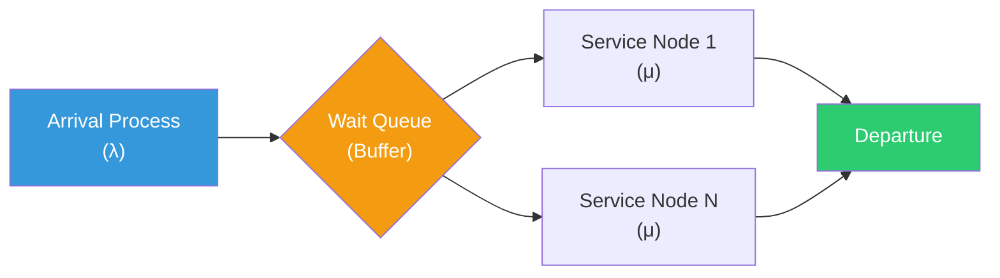

#### 📝 PYQ Numerical Example (Difficulty: Hard)
**Question:** A high-performance database server cluster receives an average of precisely 50 SQL query requests per second. Monitoring software verifies that, on average, there are exactly 15 queries actively waiting or being processed within the cluster at any given microsecond. Using Little's Law, what is the exact average mathematical response time (in milliseconds) for a single SQL query traversing the cluster?
**Explanation:**
1. **Identify the Core Mathematical Variables**:
   - The absolute arrival rate ($\lambda$) = 50 queries / second.
   - The total average number of items actively trapped in the system ($L$) = 15 queries.
2. **Setup Little's Law Equation**: 
   - $L = \lambda \times W$
   - We must solve for $W$, which mathematically represents the total average time a query spends in the system (the response time).
3. **Execute Algebraic Isolation**:
   - $W = \frac{L}{\lambda}$
   - $W = \frac{15}{50}$ seconds
   - $W = 0.3$ seconds.
4. **Convert Units**:
   - The question explicitly demands the answer in milliseconds.
   - $0.3 \text{ seconds} \times 1000 \text{ ms/second} = 300 \text{ milliseconds}$.
   **Answer:** The mathematically exact average response time for a single query is strictly 300 milliseconds.

---

### Rapid Fire Self-Assessment (Subject 8)
> **🚨 CAUTION:**
> **Test your retention!** Cover the answers below and test yourself:
> 1. (True/False) A mathematically optimal algorithm will always prevent starvation.
> 2. (True/False) Using an array-based implementation guarantees $O(1)$ arbitrary insertion.
> 3. (Match) Which architecture strictly relies on early binding by default?
> *Answers*: 1. False (e.g., SJF is optimal for wait time but starves long processes), 2. False (Requires $O(N)$ shifting), 3. C++ standard methods.

*(End of Subject 8 Checkpoint)*


## 9. Computer Architecture & Systems

### 9.1 Digital Logic & Boolean Algebra
**Deep-Dive Definitions & Properties:**
- **Core Definition**:
  - Digital logic forms the physical foundation of computational hardware
  - Boolean algebra minimizes networks of electronic logic gates executing binary arithmetic
- **Key Properties & Mechanisms**:
  - *Universal Gates*:
    - NAND and NOR are Universal Gates
    - Any Boolean function can be synthesized using exclusively NAND or exclusively NOR gates
    - Utilized in mass silicon manufacturing to minimize wafer costs
  - *Karnaugh Maps (K-Maps)*:
    - 2D geometric matrix representing a Boolean truth table
    - Utilizes Gray Code strictly on axes to ensure adjacent cells differ by exactly one bit
    - Grouping adjacent 1s algebraically eliminates redundant variables yielding optimal minimized SOP/POS expressions
  - *Don't Care Conditions ($X$)*:
    - Impossible binary input combinations
    - Treated as either 1 or 0 to enable the largest possible groupings for optimal circuit minimization
  - **Core Mathematical Formulas**:
    - *Shannon's Expansion Theorem*: $F(x_1, \dots, x_n) = x_1 \cdot F(1, \dots, x_n) + \neg x_1 \cdot F(0, \dots, x_n)$. The mathematical foundation for implementing massive boolean functions using multiplexers.


> **📊 DIFFERENCE TABLE:** RISC vs CISC Architecture
> | Feature | RISC (Reduced Instruction Set Computer) | CISC (Complex Instruction Set Computer) |
> | :--- | :--- | :--- |
> | **Instruction Size** | Fixed uniform length (e.g., strictly 32-bit) | Variable length (e.g., 8-bit to 120-bit) |
> | **Execution Time** | Exactly 1 Clock Cycle per instruction | Multiple Clock Cycles per complex instruction |
> | **Hardware/Software**| Simple hardware, highly complex compiler | Complex hardware microcode, simple compiler |
> | **Memory Access** | Strictly Load/Store architecture (Registers only) | Direct memory-to-memory operations allowed |

#### 📝 PYQ Conceptual Example (Difficulty: Easy)
**Question:** Why do the axes of a Karnaugh Map strictly utilize the non-weighted Gray Code sequence ($00, 01, 11, 10$) instead of standard binary sequence ($00, 01, 10, 11$)?
**Explanation:**
The entire mathematical principle of K-Map minimization relies entirely on the Boolean theorem of adjacency: $Ax + A\neg x = A$. This theorem dictates that if two terms differ by exactly one single variable, that specific variable is mathematically redundant and can be permanently eliminated. If standard binary ($01 \to 10$) were used on the axes, two adjacent cells would differ by *two* simultaneous bits, completely destroying the geometric adjacency theorem. Gray Code ($01 \to 11 \to 10$) strictly guarantees that physically adjacent cells on the map mathematically differ by exactly one single bit, allowing visual groupings to directly translate into algebraic elimination.
**Answer:** Gray code ensures that physically adjacent cells differ by exactly one bit, perfectly mapping the visual geometry to the Boolean adjacency theorem ($Ax + A\neg x = A$) for variable elimination.

### 9.2 Combinational & Sequential Circuits
**Deep-Dive Definitions & Properties:**
- **Core Definition**:
  - **Combinational circuits**: Zero memory; current output determined strictly and instantaneously by current inputs
  - **Sequential circuits**: Possess physical memory (feedback loops); output determined by current inputs AND internal past state, driven by clock signal
- **Key Properties & Mechanisms**:
  - *Multiplexers (MUX)*:
    - Combinational "Data Selector"
    - Funnels $2^n$ distinct input lines into a single output line, controlled by $n$ selection lines
    - Universal combinational circuit
  - *Flip-Flops (SR, D, JK, T)*:
    - Fundamental 1-bit memory cell of sequential circuits
    - **JK Flip-Flop**: Resolves undefined state of SR. If $J=1$ and $K=1$, the state toggles ($Q_{next} = \neg Q$)
    - **Race Around Condition**: Severe anomaly in level-triggered JK flip-flops when $J=1, K=1$ and clock pulse is longer than propagation delay. Solved using Master-Slave architecture
  - *Counters & Registers*:
    - **Synchronous counters**: Trigger all flip-flops simultaneously via master clock (high speed)
    - **Asynchronous (Ripple) counters**: Trigger subsequent flip-flops using output of previous (slower due to compounded propagation delay)
  - **Core Mathematical Formulas**:
    - *Maximum Clock Frequency (Synchronous)*: $f_{max} = \frac{1}{t_{pd} + t_{setup}}$. The absolute mathematical speed limit of a synchronous circuit bounded by flip-flop propagation delay and setup time requirements.

#### 📝 PYQ Numerical Example (Difficulty: Hard)
**Question:** You are architecting an asynchronous Ripple Down-Counter that must accurately count backwards from exactly 127 down to 0, and then reset. Exactly how many individual Flip-Flops must be physically wired in series to achieve this, and what is the Modulus (MOD) of this counter?
**Explanation:**
1. **Determine Required States**: A counter that counts from 0 to $N$ (or $N$ to 0) requires enough binary bits to mathematically represent the maximum number $N$. The maximum decimal number here is 127.
2. **Calculate Flip-Flops ($n$)**: The formula for the maximum value is $2^n - 1 = 127$. Therefore, $2^n = 128$. Solving for $n$ yields exactly $n = 7$. Because every single flip-flop stores exactly 1 binary bit, we physically require exactly 7 flip-flops wired in series.
3. **Determine the Modulus (MOD)**: The MOD of a counter mathematically defines the absolute total number of unique, distinct states it passes through before completely repeating its cycle. A counter from 0 to 127 contains exactly 128 distinct states (inclusive of zero).
**Answer:** It mathematically requires exactly 7 Flip-Flops. The counter passes through 128 distinct states, so it is strictly a MOD-128 counter.

### 9.3 Memory Hierarchy & Cache Mapping
**Deep-Dive Definitions & Properties:**
- **Core Definition**:
  - Physical hardware pyramid bridging speed gap between ultra-fast CPU and slow storage
  - Relies entirely on **Principle of Locality** (Temporal and Spatial)
- **Key Properties & Mechanisms**:
  - *SRAM vs. DRAM Architecture*:

| Feature | SRAM (Static RAM) | DRAM (Dynamic RAM) |
| :--- | :--- | :--- |
| **Physical Component** | Flip-flops (6 Transistors per bit) | Capacitors (1 Transistor + 1 Capacitor per bit) |
| **Refresh Required** | No (Retains data as long as power is supplied) | Yes (Capacitors leak charge, must be refreshed continuously) |
| **Speed & Density** | Ultra-fast but low density (takes more physical space) | Slower but high density (packs massive gigabytes into small chips) |
| **Primary Use Case** | L1/L2/L3 CPU Cache | Main Memory (System RAM) |

  - *Cache Mapping Techniques*:
    - **Direct Mapping**: $L = B \pmod C$. Highly rigid, lowest-latency. Susceptible to catastrophic **"Thrashing"**
    - **Fully Associative Mapping**: Block can be placed anywhere. Most flexible, highest-latency due to massive comparator array
    - **Set-Associative Mapping**: Industry standard compromise. Cache divided into Sets of $K$ lines. Block maps to specific Set ($S = B \pmod N$), but can be placed in any line within that Set
  - *Cache Coherence*:
    - Hardware protocols (e.g., MESI - Modified, Exclusive, Shared, Invalid) mathematically guarantee all multi-core CPU caches read the most recently written value
  - **Core Mathematical Formulas**:
    - *Effective Memory Access Time (EMAT)*: $EMAT = H_c \times T_c + (1 - H_c) \times (T_c + T_m)$. The core statistical average of memory access duration utilizing Cache Hit Ratio ($H_c$), Cache Time ($T_c$), and Main Memory Time ($T_m$).

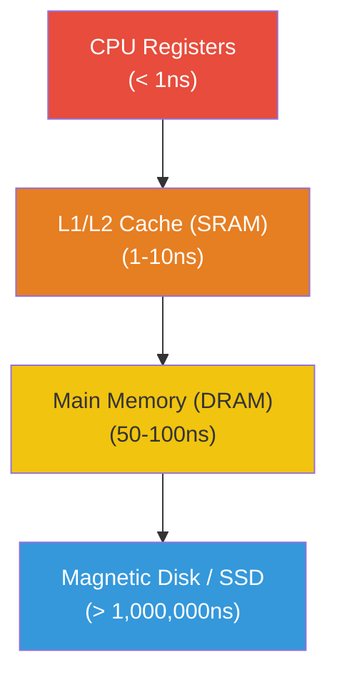


> **📊 DIFFERENCE TABLE:** SRAM vs DRAM
> | Feature | SRAM (Static RAM) | DRAM (Dynamic RAM) |
> | :--- | :--- | :--- |
> | **Hardware Base** | Flip-Flops (Multiple Transistors per bit) | Capacitors (1 Transistor + 1 Capacitor per bit) |
> | **Speed** | Blazing Fast (Used for CPU L1/L2 Caches) | Slower (Used for Main Memory / System RAM) |
> | **Density & Cost** | Low Density, Extremely Expensive | High Density, Extremely Cheap |
> | **Refresh Cycle** | NEVER requires refreshing | Requires constant physical refreshing to hold charge |

#### 📝 PYQ Conceptual Example (Difficulty: Hard)
**Question:** A computer system possesses a 64 KB Direct-Mapped Cache, strictly divided into 32-Byte physical cache blocks. The Main Memory (RAM) capacity is a massive 16 MB. The CPU generates a physical memory address. Mathematically dissect this physical address, stating the exact number of bits strictly required for the TAG, LINE, and WORD offset fields.
**Explanation:**
1. **Calculate Total Physical Address Bits**: RAM is 16 MB ($16 \times 2^{20}$ bytes = $2^4 \times 2^{20} = 2^{24}$ bytes). Thus, the CPU mathematically requires exactly **24 bits** to address the entire RAM.
2. **Calculate WORD Offset Bits**: Each cache block is 32 Bytes ($2^5$ bytes). To pinpoint a specific byte inside the block, we mathematically need exactly **5 bits**.
3. **Calculate LINE (Index) Bits**: Total Cache Size = 64 KB ($2^{16}$ bytes). Number of lines in cache = (Total Cache) / (Block Size) = $\frac{2^{16}}{2^5} = 2^{11}$ lines. To address exactly $2^{11}$ distinct lines, we mathematically need exactly **11 bits**.
4. **Calculate TAG Bits**: The TAG physically identifies which specific RAM block is currently occupying the cache line. TAG = (Total Address Bits) - (LINE bits) - (WORD bits).
   TAG = $24 - 11 - 5 = 8$ bits.
   **Answer:** The 24-bit physical address is strictly partitioned into: TAG = 8 bits, LINE = 11 bits, WORD = 5 bits.

> **⚠️ WARNING:**
> **Common Exam Trap**: Carefully verify whether the question explicitly states the memory is **Byte-Addressable** or **Word-Addressable**. If it is Word-Addressable (and a word is 2 bytes), a 16 MB memory only contains $8 \text{ M}$ words ($2^{23}$ unique addresses), meaning the physical address would mathematically be 23 bits, not 24.


### 9.4 Microprocessor Architecture & Addressing Modes
**Deep-Dive Definitions & Properties:**
- **Core Definition**:
  - Physical silicon brain comprising ALU, Control Unit (CU), and high-speed internal Registers
  - Instruction Cycle: Fetch, Decode, Execute, Write-Back
- **Key Properties & Mechanisms**:
  - *Addressing Modes*:
    - **Immediate**: Operand physically hardcoded in instruction
    - **Direct**: Instruction contains exact physical RAM address
    - **Indirect**: Instruction contains RAM address pointing to another address holding operand
    - **Register / Register Indirect**: Operand or pointer stored securely inside CPU register
    - **Indexed / Base Register**: Effective Address (EA) calculated by adding offset to Base Register
  - *RISC vs. CISC Architecture*:

| Feature | RISC (Reduced Instruction Set Computer) | CISC (Complex Instruction Set Computer) |
| :--- | :--- | :--- |
| **Instruction Size** | Uniform, fixed-length instructions (e.g., exactly 32-bit) | Variable-length instructions |
| **Execution Speed** | Exactly one instruction per clock cycle | Multi-cycle instructions (can take multiple clocks to finish) |
| **Memory Access** | Highly restricted; only `LOAD` and `STORE` access RAM | Instructions can directly perform math on RAM addresses |
| **Pipelining** | Extremely easy and highly efficient | Extremely difficult due to variable execution times |
  - **Core Mathematical Formulas**:
    - *CPU Execution Time*: $T = IC \times CPI \times \tau$. The absolute time required to execute a program, calculated via Instruction Count ($IC$), Cycles Per Instruction ($CPI$), and strict Clock Cycle Time ($\tau$).

#### 📝 PYQ Conceptual Example (Difficulty: Medium)
**Question:** In modern Operating Systems, when an entirely compiled software program is physically loaded into RAM at an unpredictable, random memory location, which specific hardware Addressing Mode is absolutely mathematically required to guarantee the program executes without crashing?
**Explanation:**
When a compiler generates machine code, it often assumes the program will start at address 0. However, the OS physically loads it wherever RAM is currently free (e.g., address 50000). If the code uses Direct Addressing (hardcoded addresses), it will instantly crash by reading the wrong memory. To prevent this, the CPU utilizes **Base Register Addressing**. The OS simply loads the starting address (50000) into a dedicated CPU Base Register. Every single instruction in the program is then written as a relative offset (e.g., +10, +20). The hardware dynamically, mathematically adds the base register to the offset at runtime, perfectly relocating the entire program invisibly.
**Answer:** Base Register Addressing. It mathematically adds a dynamic base address to a static offset, allowing the OS to physically relocate compiled programs anywhere in RAM without altering the machine code.

### 9.5 Pipelining & Parallel Processing
**Deep-Dive Definitions & Properties:**
- **Core Definition**:
  - Advanced hardware architecture overlapping execution of continuous instructions
  - Drastically increases CPU throughput
- **Key Properties & Mechanisms**:
  - *Pipeline Hazards*:
    - **Structural Hazards**: Two instructions attempt to utilize exact same hardware resource simultaneously
    - **Data Hazards (RAW, WAW, WAR)**: Instruction requires mathematical result of uncompleted previous instruction. Solved using **Operand Forwarding**
    - **Control (Branch) Hazards**: Branch instruction forces CPU jump, requiring aggressive pipeline flush. Solved using Branch Prediction
  - *Amdahl’s Law*:
    - Maximum theoretical speedup achievable by adding multiple parallel processors
    - Formula: maximum speedup strictly bounded to $\frac{1}{F}$, where $F$ is sequential fraction
  - *Flynn’s Taxonomy*:
    - **SISD**: Standard single-core PC
    - **SIMD**: GPUs and Vector Processors. Single instruction manipulates massive array of data
    - **MIMD**: Multi-Core Supercomputers. Multiple instructions manipulate multiple data streams concurrently
  - **Core Mathematical Formulas**:
    - *Pipeline Speedup ($S$)*: $S = \frac{n \times k}{k + n - 1}$. The theoretical mathematical acceleration of a $k$-stage pipeline executing $n$ instructions, which asymptotically approaches $k$ as $n \to \infty$.
    - *Amdahl's Law*: $S_{max} = \frac{1}{(1-P) + \frac{P}{N}}$. The rigid mathematical ceiling on speedup using $N$ parallel processors, severely bottlenecked by the strict sequential fraction $(1-P)$.

```mermaid
gantt
    title 5-Stage Instruction Pipeline
    dateFormat  X
    axisFormat %s
    section Instruction 1
    Fetch (IF)    :a1, 0, 1
    Decode (ID)   :a2, 1, 2
    Execute (EX)  :a3, 2, 3
    Memory (MEM)  :a4, 3, 4
    Write (WB)    :a5, 4, 5
    section Instruction 2
    Fetch (IF)    :b1, 1, 2
    Decode (ID)   :b2, 2, 3
    Execute (EX)  :b3, 3, 4
    Memory (MEM)  :b4, 4, 5
    Write (WB)    :b5, 5, 6
```

#### 📝 PYQ Numerical Example (Difficulty: Hard)
**Question:** A non-pipelined CPU architecture requires exactly 10ns to complete one instruction. We physically upgrade it to a deeply pipelined CPU possessing exactly 5 distinct stages. Due to latch overhead, each stage takes 2.5ns. Calculate the exact theoretical Speedup of the pipeline when executing a massive workload of 1000 instructions, assuming absolutely zero hazards.
**Explanation:**
1. **Calculate Non-Pipelined Execution Time**: Time for 1 instruction = 10ns. Total time for 1000 instructions = $1000 \times 10 = 10,000ns$.
2. **Calculate Pipelined Execution Time**: In a pipeline with $K$ stages, the first instruction takes exactly $K \times (\text{cycle time})$ to finish. However, after the pipeline is completely full, exactly one instruction finishes every single cycle.
   - Cycle time = The duration of the longest stage = 2.5ns.
   - Formula: Time = $(K + N - 1) \times \text{Cycle Time}$. (Where $K=5$, $N=1000$).
   - Time = $(5 + 1000 - 1) \times 2.5 = 1004 \times 2.5 = 2,510ns$.
3. **Calculate Theoretical Speedup**: Speedup = (Non-Pipelined Time) / (Pipelined Time).
   - Speedup = $\frac{10,000}{2,510} \approx 3.98$.
   **Answer:** The exact theoretical speedup achieved by the 5-stage pipeline is approximately 3.98x faster than the non-pipelined architecture.

### 9.6 Secondary Storage & RAID Architectures
**Deep-Dive Definitions & Properties:**
- **Core Definition**:
  - Redundant Array of Independent Disks (RAID): Storage virtualization technology combining multiple physical disks
  - Designed for massive data redundancy (error correction) and extreme performance improvement (striping)
- **Key Properties & Mechanisms**:
  - *RAID 0 (Data Striping)*: Massive read/write speeds, zero redundancy. One failure destroys entire array
  - *RAID 1 (Data Mirroring)*: Perfect data duplication. Absolute redundancy, 50% storage overhead
  - *RAID 4 (Block-Level Striping, Dedicated Parity)*: Creates severe bottleneck since every random write forces update to the identical dedicated parity disk
  - *RAID 5 (Block-Level Striping, Distributed Parity)*: Enterprise standard. Solves RAID 4 bottleneck by evenly distributing parity bits. Tolerates single drive failure
  - *RAID 6 (Double Distributed Parity)*: Calculates and stripes two separate sets of parity. Tolerates two simultaneous drive failures
  - **Core Mathematical Formulas**:
    - *Total Disk Access Time*: $T_{access} = T_{seek} + T_{rotational} + T_{transfer}$. The physical mathematical delay summing the read-head arm movement, the platter rotation to the sector, and the sheer magnetic data transfer.
    - *RAID 5 Capacity*: $C_{usable} = (N - 1) \times S_{min}$. The strict usable disk space spanning $N$ drives, sacrificing exactly one drive's capacity mathematically for distributed XOR parity.

#### 📝 PYQ Conceptual Example (Difficulty: Medium)
**Question:** In a massive enterprise storage array utilizing RAID 5, if exactly one physical disk suffers a catastrophic hardware failure, what is the exact mathematical operation the RAID controller executes on the remaining surviving disks to perfectly reconstruct the lost data?
**Explanation:**
RAID 5 fundamentally relies on the mathematical properties of the exclusive-OR (XOR) bitwise logic gate. The fundamental mathematical property of XOR ($\oplus$) is that if $A \oplus B \oplus C = P$ (where $P$ is the parity block), and physical disk $B$ catastrophically fails, the missing data block $B$ can be perfectly and absolutely mathematically reconstructed by executing XOR on the remaining blocks and the parity: $B = A \oplus C \oplus P$. 
When a drive dies in RAID 5, the system enters a "degraded" state. Every time the OS attempts to read a block from the dead drive, the RAID controller physically reads the corresponding bits from all the surviving data drives AND the distributed parity drive, aggressively executes massive parallel mathematical XOR calculations on those bits, and regenerates the exact missing data perfectly on the fly.
**Answer:** The controller executes a bitwise XOR mathematical operation combining the data blocks from all surviving drives with the corresponding parity block to perfectly reconstruct the lost data.

---

### Rapid Fire Self-Assessment (Subject 9)
> **🚨 CAUTION:**
> **Test your retention!** Cover the answers below and test yourself:
> 1. (True/False) A mathematically optimal algorithm will always prevent starvation.
> 2. (True/False) Using an array-based implementation guarantees $O(1)$ arbitrary insertion.
> 3. (Match) Which architecture strictly relies on early binding by default?
> *Answers*: 1. False (e.g., SJF is optimal for wait time but starves long processes), 2. False (Requires $O(N)$ shifting), 3. C++ standard methods.

*(End of Subject 9 Checkpoint)*


## 10. Programming in C and C++

### 10.1 Memory Architecture, Scope, & Pointers (C)
**Deep-Dive Definitions & Properties:**
- **Core Definition**:
  - C is a procedural, low-level language with unprotected access to raw RAM
  - **Pointer**: Specialized variable storing the hexadecimal memory address of another variable; foundational for dynamic memory and data structures
- **Key Properties & Mechanisms**:
  - *Memory Layout*:
    - **Code Segment**: Read-only executable instructions
    - **Data Segment**: Global and static variables
    - **Stack**: LIFO memory for local variables, parameters, and return addresses (grows downwards)
    - **Heap**: Unstructured memory for manual dynamic allocation via `malloc`/`free` (grows upwards)
  - *Pointer Arithmetic*:
    - Adding $N$ to pointer $P$ scales by the byte-size of the data type
    - Formula: $\text{New Address} = P + (N \times \text{sizeof(type)})$
  - *Double Pointers (`**ptr`)*:
    - Stores memory address of another pointer
    - Mandatory for modifying a pointer passed as an argument or allocating 2D matrices on the Heap
  - **Core Mathematical Formulas**:
    - *Array-to-Pointer Decay*: `arr[i] = *(arr + i)`. The strict mathematical equivalence executed by the compiler to physically resolve array indexing using raw pointer arithmetic.

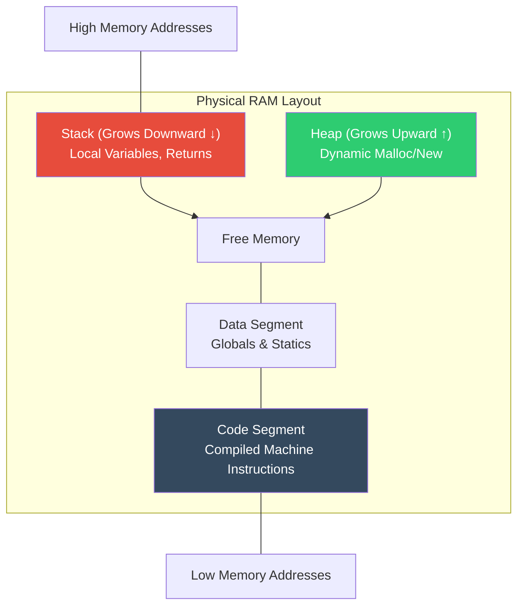


> **📊 DIFFERENCE TABLE:** Memory Allocation & Passing Mechanisms
> | Feature | Malloc() | Calloc() |
> | :--- | :--- | :--- |
> | **Initialization** | Contains garbage values initially | Mathematically initializes all bits strictly to `0` |
> | **Arguments** | Takes 1 argument: Total bytes (`malloc(40)`) | Takes 2 arguments: Count & Size (`calloc(10, 4)`) |
> 
> | Feature | Pass by Value | Pass by Reference (Pointers) |
> | :--- | :--- | :--- |
> | **Memory Action** | Physically duplicates the variable onto the Stack | Passes the raw hexadecimal memory address |
> | **Original Data** | Completely safe from modification | Directly mutated and overwritten |

#### 📝 PYQ Numerical Example (Difficulty: Hard)
**Question:** Assume a 32-bit architecture where `int` takes strictly 4 bytes and all pointers take strictly 4 bytes. An integer array `arr[5]` is physically stored starting at memory address 1000. What are the exact integer values printed by the following C code snippet?
`int *ptr = arr;`
`ptr = ptr + 3;`
`printf("%u, %u", ptr, (ptr - arr));`
**Explanation:**
1. **Pointer Initialization**: The raw array name `arr` mathematically decays into a pointer to its absolute first element (`&arr[0]`). Thus, `ptr` is initialized to the base address exactly 1000.
2. **Pointer Arithmetic (Addition)**: The operation `ptr + 3` does not mean $1000 + 3 = 1003$. Because `ptr` strictly points to a 4-byte `int`, the compiler mathematically scales the addition: $1000 + (3 \times 4) = 1000 + 12 = 1012$. The pointer physically jumps entirely over three integers.
3. **Pointer Arithmetic (Subtraction)**: When two pointers of the exact same type are mathematically subtracted (`ptr - arr`), the compiler calculates the physical byte distance and divides it by the type size to yield the exact number of elements between them. Calculation: $(1012 - 1000) / 4 = 12 / 4 = 3$.
**Answer:** The `printf` will strictly output `1012, 3`.

### 10.2 Parameter Passing & Recursion
**Deep-Dive Definitions & Properties:**
- **Core Definition**:
  - Functions encapsulate code blocks into isolated Execution Contexts
  - Parameter passing dictates data travel between caller and called function
  - Recursion occurs when a function defines its solution in terms of a smaller instance of itself
- **Key Properties & Mechanisms**:
  - *Pass by Value*:
    - Compiler duplicates mathematical value into function's private Stack Frame
    - Original variable in caller remains untouched
  - *Pass by Reference (Pointers in C)*:
    - Raw memory address is passed
    - Function dereferences address (`*ptr`) to directly modify caller's physical memory
  - *Activation Records (Stack Frames)*:
    - Pushed onto Call Stack upon function call
    - Contains: Local variables, incoming parameters, physical Return Address, and previous Frame Pointer
    - Excessive recursion exhausts RAM, causing Stack Overflow
  - **Core Mathematical Formulas**:
    - *Recursive Time Complexity Master Theorem*: $T(n) = aT(n/b) + f(n)$. The core recurrence relation mathematically evaluating the exact time complexity of tree-based recursive divide-and-conquer algorithms.

#### 📝 PYQ Conceptual Example (Difficulty: Medium)
**Question:** A recursive function mathematically calculates the factorial of $N$. If this function is executed with $N=10$, exactly how many independent Activation Records will be physically pushed onto the Call Stack simultaneously at the deepest absolute point of execution, before any records are popped?
**Explanation:**
The recursive algorithm for factorial is defined strictly as: $f(n) = n \times f(n-1)$, with a strict mathematical base case at $f(0) = 1$ (or $f(1)=1$). Let us trace the physical stack pushes starting from the initial call:
1. $f(10)$ is called $\to$ Pushes 1st Activation Record.
2. $f(10)$ calls $f(9)$ $\to$ Pushes 2nd Activation Record.
3. This physically continues down exactly 1 step at a time ($f(8), f(7)...$) until it finally hits the base case.
4. $f(1)$ calls $f(0)$ $\to$ Pushes the 11th Activation Record.
At the exact microsecond $f(0)$ executes, it has not returned yet. Therefore, the physical Call Stack contains exactly 11 distinct, suspended Activation Records stacked directly on top of each other.
**Answer:** Exactly 11 independent Activation Records will physically exist simultaneously on the Call Stack.

### 10.3 Object-Oriented Foundations (C++)
**Deep-Dive Definitions & Properties:**
- **Core Definition**:
  - Object-Oriented Programming (OOP) mathematically models software as strict, interacting entities (Objects)
  - Tightly binds data (attributes) and logic (methods) into secure units
- **Key Properties & Mechanisms**:
  - *Classes vs Objects*:
    - **Class**: Theoretical, compile-time blueprint detailing data schemas
    - **Object**: Physical, runtime instantiation of a class occupying RAM on Heap or Stack
  - *Encapsulation*:
    - Restriction of direct access to internal state (data hidden within `private`)
    - Outside world strictly interacts via `public` accessor and mutator functions
  - *Polymorphism*:
    - Single interface exhibiting entirely different behaviors based on received data types
    - **Compile-Time (Static)**: Function Overloading and Operator Overloading. Compiler rigorously analyzes signatures at compile-time and permanently binds memory address. Zero runtime overhead
  - **Core Mathematical Formulas**:
    - *Object Size Calculation*: $\text{sizeof(Object)} = \sum \text{sizeof(attributes)} + \text{Padding}$. Physically calculates RAM footprint, strictly ignoring standard methods but including the hidden `vptr` if virtual functions are present.

#### 📝 PYQ Conceptual Example (Difficulty: Easy)
**Question:** In C++, if a developer attempts to compile a class that contains two distinct methods with the exact same name `calculate()`, under what absolute strict mathematical conditions will the C++ compiler successfully allow this through Function Overloading?
**Explanation:**
Function Overloading is a strict form of Compile-Time Polymorphism. To prevent fatal ambiguity, the C++ compiler must be able to mathematically differentiate the functions at compile-time solely by analyzing their "Signatures". A function signature consists exclusively of the function's name and its exact Parameter List. It does *not* include the return type. Therefore, the compiler will strictly allow the overload if and only if the two methods differ in the *number* of parameters they accept, or if they differ in the exact *data types* of those parameters (e.g., one takes an `int`, the other takes a `float`).
**Answer:** The compiler will allow it if and only if the function parameter lists are strictly mathematically distinct (differing in the exact number, type, or sequence of the arguments). Differences in return type are entirely ignored and will trigger a fatal error.

### 10.4 Inheritance & Dynamic Polymorphism
**Deep-Dive Definitions & Properties:**
- **Core Definition**:
  - **Inheritance**: Hierarchical architecture where Derived class absorbs properties of Base class
  - **Dynamic Polymorphism**: Generic Base pointer executes specific Derived methods at runtime
- **Key Properties & Mechanisms**:
  - *The Diamond Problem*:
    - Catastrophic paradox in Multiple Inheritance ($D$ inherits from $B$ and $C$, both inheriting from $A$)
    - Object $D$ physically contains two duplicated copies of Base Class $A$ in RAM, causing ambiguity
    - Solved by virtual inheritance (`virtual public A`)

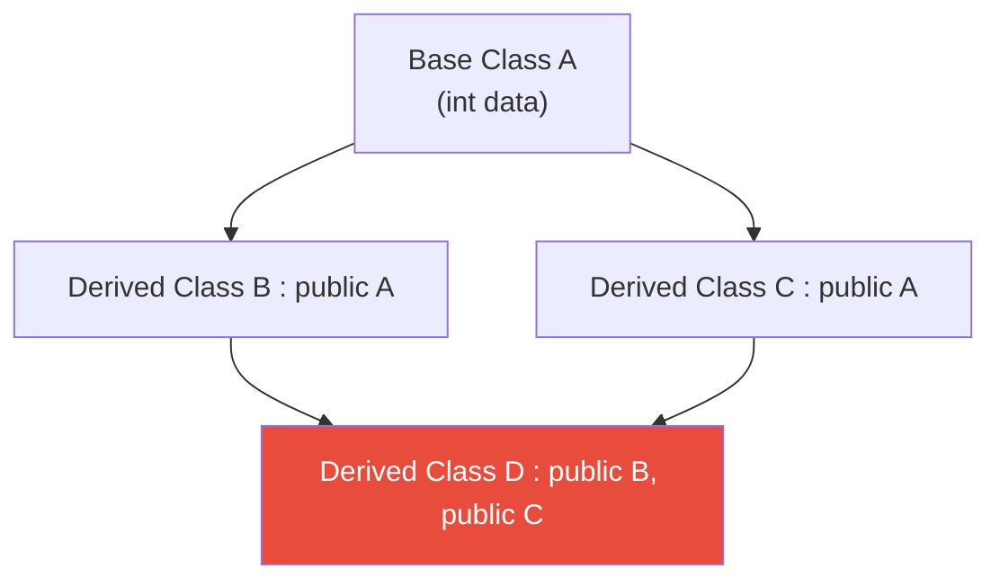

  - *Virtual Functions & V-Tables (Dynamic Binding)*:
    - Base class method declared `virtual` forces compiler to construct Virtual Table (V-Table) array of function pointers
    - Objects receive hidden pointer (vptr) to this table
    - CPU uses vptr to dynamically look up method memory address at runtime, incurring slight performance penalty
  - **Core Mathematical Formulas**:
    - *Dynamic V-Table Binding*: $\text{Method Address} = \text{VTable Base Address} + (\text{Method Index} \times \text{Pointer Size})$. The exact physical memory jump executed by the CPU at runtime to achieve late binding polymorphism.

#### 📝 PYQ Conceptual Example (Difficulty: Hard)
**Question:** A C++ program declares a Base class pointer that physically points to a dynamically allocated Derived class object on the Heap. The developer calls a method through this pointer, but the Base class method is executed instead of the overridden Derived class method. What specific architectural keyword did the developer fail to use, and exactly how did the compiler mathematically handle the binding?
**Explanation:**
Because a Base pointer was used, the C++ compiler strictly defaults to **Early Binding** (Compile-Time Binding) for absolute maximum performance. The compiler physically sees the data type of the pointer (which is `Base*`) and permanently hardcodes the memory address of the Base class's version of the method directly into the executable binary, completely ignoring the fact that a Derived object actually lives at that memory address at runtime. To force the compiler to utilize **Late Binding** (Runtime Binding), the developer was strictly mathematically required to prefix the method declaration in the Base class with the `virtual` keyword. This forces the creation of a V-Table, ensuring the CPU dynamically checks the actual object type at runtime before executing.
**Answer:** The developer strictly failed to use the `virtual` keyword in the Base class. Because of this, the compiler heavily defaulted to Early (Static) Binding, permanently hardcoding the Base method's address based purely on the pointer's static data type.

### 10.5 Templates & Exception Handling
**Deep-Dive Definitions & Properties:**
- **Core Definition**:
  - **Templates**: Provide generic programming power, allowing compiler to automatically generate specialized code
  - **Exception handling**: Rigorous framework intercepting catastrophic runtime errors (division by zero, exhausted memory) without crashing OS
- **Key Properties & Mechanisms**:
  - *Function & Class Templates*:
    - Blueprint resulting in no immediate machine code
    - Compiler physicalizes specific versions based on data types detected at compile-time, causing "Code Bloat"
  - *Try-Catch-Throw Mechanism*:
    - **try**: Protected code block physically monitored for fatal anomalies
    - **throw**: Keyword creating Exception Object, halting execution, and "unwinding" Call Stack
    - **catch**: Specific error-handling block preventing program termination by matching object data type
  - **Core Mathematical Formulas**:
    - *Template Expansion Complexity*: $S_{binary} \approx S_{base} \times N_{types}$. A rough mathematical estimate of compiler code bloat, where the binary size scales strictly with the total number of unique data types invoked through the generic template.

#### 📝 PYQ Conceptual Example (Difficulty: Medium)
**Question:** In a massive C++ software system utilizing deep nested function calls, an exception is `thrown` exactly 5 levels deep in the Call Stack. No `try-catch` blocks exist in the immediate function. Exactly what rigorous physical mechanism does the C++ runtime environment execute to locate a handler, and what happens to local objects?
**Explanation:**
When an exception is thrown, the C++ runtime immediately suspends the CPU and initiates a catastrophic, highly structured process known strictly as **Stack Unwinding**. 
1. The runtime physically aborts the current function at level 5.
2. It mathematically guarantees that the Destructors for absolutely all local objects inside level 5's stack frame are executed immediately, preventing permanent memory leaks.
3. It then violently destroys the level 5 Activation Record and physically traverses backwards up the Call Stack to level 4.
4. It searches for an active `catch` block in level 4. If none is found, it repeats the destruction and unwinds to level 3, then level 2, continuing this mathematically rigorous fallback.
If it entirely unwinds the massive stack all the way to `main()` without finding a matching `catch` block, it mathematically triggers the OS-level `std::terminate()` function, catastrophically crashing the entire program.
**Answer:** The runtime executes rigorous Stack Unwinding. It physically traverses backward up the Call Stack, violently destroying activation records and strictly executing all local object destructors to prevent memory leaks, halting only when it physically finds a matching `catch` block or crashes at `main()`.

---

### Rapid Fire Self-Assessment (Subject 10)
> **🚨 CAUTION:**
> **Test your retention!** Cover the answers below and test yourself:
> 1. (True/False) A mathematically optimal algorithm will always prevent starvation.
> 2. (True/False) Using an array-based implementation guarantees $O(1)$ arbitrary insertion.
> 3. (Match) Which architecture strictly relies on early binding by default?
> *Answers*: 1. False (e.g., SJF is optimal for wait time but starves long processes), 2. False (Requires $O(N)$ shifting), 3. C++ standard methods.

*(End of Subject 10 Checkpoint)*


## 11. Computer Graphics

### 11.1 Display Architectures & Rasterization
**Deep-Dive Definitions & Properties:**
- **Core Definition**:
  - Computer Graphics is the mathematical synthesis of 2D and 3D visual data onto a physical 2D pixel grid
  - **Frame Buffer**: Dedicated Video RAM (VRAM) storing the exact RGB color value for every single physical pixel on the monitor
- **Key Properties & Mechanisms**:
  - *Raster vs. Vector (Random) Scan*:

| Feature | Raster Scan | Vector (Random) Scan |
| :--- | :--- | :--- |
| **Drawing Logic** | Electron beam strictly sweeps entire screen row by row | Electron beam strictly directed only to the mathematical lines of the object |
| **Image Quality** | Suffers from "Aliasing" (jagged, staircase edges) | Produces perfect, mathematically smooth lines |
| **Capabilities** | Easily renders solid polygons, shading, and complex gradients | Only renders wireframes (cannot shade polygons) |
| **Hardware Standard** | Modern industry standard (LCDs, OLEDs) | Obsolete legacy hardware (Cathode Ray Oscilloscopes) |
  - *Resolution & Aspect Ratio*:
    - **Resolution**: Defines physical matrix size (e.g., $1920 \times 1080$)
    - **Aspect Ratio**: Mathematical ratio of screen width to height (e.g., 16:9). Monitor ratio must match resolution ratio to prevent geometric distortion
  - **Core Mathematical Formulas**:
    - *Frame Buffer Size*: $\text{Size (Bits)} = \text{Resolution}_x \times \text{Resolution}_y \times \text{Color Depth (Bits per Pixel)}$. The absolute hardware VRAM footprint physically required to render a single static frame.


> **📊 DIFFERENCE TABLE:** Raster vs Vector Graphics
> | Feature | Raster (Bitmap) Graphics | Vector Graphics |
> | :--- | :--- | :--- |
> | **Base Construction**| 2D grid of discrete Pixels | Mathematical curves, polygons, and geometric lines |
> | **Resolution Limit** | Resolution Dependent (Pixelates wildly upon scaling) | Resolution Independent (Infinitely scalable cleanly) |
> | **File Size** | Very Large (Must store data for every single pixel) | Very Small (Stores only mathematical equations) |
> | **Use Case** | Photographs, complex shading, textures (JPEG, PNG) | Logos, typography, CAD blueprints (SVG, EPS) |

#### 📝 PYQ Numerical Example (Difficulty: Medium)
**Question:** A high-end raster graphics system features a physical resolution of $1024 \times 1024$ pixels. It supports True Color, meaning exactly 24 bits are mathematically allocated per pixel (8 bits each for Red, Green, and Blue). Calculate the absolute minimum size of the physical Frame Buffer (VRAM) required strictly in Megabytes (MB).
**Explanation:**
1. **Calculate Total Pixels**: The physical grid contains $1024 \times 1024 = 1,048,576$ total pixels.
2. **Calculate Total Bits**: Each pixel requires exactly 24 bits. Total bits = $1,048,576 \times 24 = 25,165,824$ bits.
3. **Convert to Bytes**: Divide strictly by 8. $25,165,824 / 8 = 3,145,728$ Bytes.
4. **Convert to Megabytes (MB)**: In computer science, 1 KB = 1024 Bytes, and 1 MB = 1024 KB ($1024 \times 1024 = 1,048,576$ Bytes).
   Calculation: $3,145,728 / 1,048,576 = 3$ MB.
   **Answer:** The frame buffer mathematically requires exactly 3 MB of dedicated Video RAM.

### 11.2 Geometric Drawing Algorithms
**Deep-Dive Definitions & Properties:**
- **Core Definition**:
  - Mathematical lines have infinite precision; raster monitors have discrete pixels
  - Drawing algorithms calculate which physical pixels most accurately approximate ideal lines using integer arithmetic for speed
- **Key Properties & Mechanisms**:
  - *DDA vs. Bresenham's Line Algorithm*:

| Feature | DDA (Digital Differential Analyzer) | Bresenham's Algorithm |
| :--- | :--- | :--- |
| **Mathematics** | Uses floating-point arithmetic and division | Uses strictly integer arithmetic (addition/subtraction) |
| **Speed** | Slower (due to expensive floating-point operations) | Blindingly fast (hardware-optimized) |
| **Accuracy** | Prone to rounding/truncation errors (staircase drift) | Mathematically precise and perfectly accurate |
| **Decision Logic** | Adds fractional slope ($m$) iteratively | Uses an Integer Decision Parameter ($P_k$) |
  - *Midpoint Circle Algorithm*:
    - Utilizes 8-way mathematical symmetry
    - Calculates pixels for one $45^\circ$ octant and mirrors across axes
    - Slashes computational load by 87.5%
  - **Core Mathematical Formulas**:
    - *Bresenham's Initial Decision Parameter*: $P_0 = 2\Delta y - \Delta x$. The core mathematical seed used to recursively evaluate integer proximity to the true geometric line without relying on costly floating-point divisions.

#### 📝 PYQ Conceptual Example (Difficulty: Hard)
**Question:** In Bresenham’s Line Drawing algorithm for a line strictly within the first octant (slope $0 \lt m \lt 1$), the decision parameter $P_k$ determines the next pixel. If the current pixel is $(x_k, y_k)$ and the mathematically calculated $P_k$ is strictly greater than zero ($P_k \gt 0$), what are the exact coordinates of the very next plotted pixel, and why?
**Explanation:**
In the first octant ($0 \lt m \lt 1$), the line is more horizontal than vertical. Therefore, the algorithm forces the $X$ coordinate to unconditionally increment by exactly 1 physical pixel every single step ($x_{k+1} = x_k + 1$). The only mathematical decision is whether the $Y$ coordinate stays flat ($y_k$) or moves up one row ($y_k + 1$).
The Decision Parameter $P_k$ mathematically measures the distance from the true line to the upper pixel minus the distance to the lower pixel.
- If $P_k \lt 0$, the true line is physically closer to the lower pixel. The $Y$ coordinate remains flat: $(x_k + 1, y_k)$.
- If $P_k \gt 0$, the true line is physically closer to the upper pixel. The $Y$ coordinate must strictly increment: $(x_k + 1, y_k + 1)$.
**Answer:** Because $P_k \gt 0$, the true mathematical line has crossed the midpoint threshold toward the upper pixel. The next plotted physical pixel is exactly $(x_k + 1, y_k + 1)$.

### 11.3 2D & 3D Transformations (Homogeneous Coordinates)
**Deep-Dive Definitions & Properties:**
- **Core Definition**:
  - Transformations are mathematical matrix multiplications applied to vertices (Translate, Rotate, Scale)
  - In standard Cartesian coordinates, Translation is addition while Rotation/Scaling are multiplication
- **Key Properties & Mechanisms**:
  - *Homogeneous Coordinates*:
    - Elevates 2D point $(x, y)$ to 3D vector $(x, y, 1)$
    - Converts Translation into Matrix Multiplication
    - Allows combining multiple transformations into a single "Composite Matrix" for exponential GPU speedups
  - *Rotation vs Fixed Point Rotation*:
    - Standard rotation strictly around origin $(0,0)$
    - Rotation around fixed point $P$ requires 3 steps:
      1. Translate object so $P$ sits exactly on Origin
      2. Execute pure Rotation matrix
      3. Execute inverse Translation back to original location
  - **Core Mathematical Formulas**:
    - *2D Rotation Matrix*: $\begin{bmatrix} \cos \theta & -\sin \theta \\ \sin \theta & \cos \theta \end{bmatrix}$. The strict trigonometric linear algebra transformation rotating points mathematically counter-clockwise strictly around the absolute origin.

#### 📝 PYQ Conceptual Example (Difficulty: Medium)
**Question:** A graphics engine must mathematically scale a 2D polygon uniformly by a factor of 3, but the scaling must strictly occur relative to a fixed point $(h, k)$, not the origin. Provide the exact mathematical sequence of Homogeneous Transformation Matrices that must be multiplied together to generate the Composite Transformation Matrix.
**Explanation:**
Standard scaling matrices mathematically pull vertices strictly toward or away from the absolute origin $(0,0)$. If applied directly, the object will physically fly across the screen. To scale around the fixed point $(h, k)$, we must mathematically trick the scaling matrix:
1. **Translate** the fixed point exactly to the Origin. The matrix is $T(-h, -k)$.
2. **Scale** the object around the new Origin. The matrix is $S(3, 3)$.
3. **Inverse Translate** the object back to its original physical location. The matrix is $T(h, k)$.
In strict matrix multiplication (which is applied right-to-left against the vertex column vector), the mathematical sequence is: $T(h, k) \times S(3, 3) \times T(-h, -k)$.
**Answer:** The exact sequence of Homogeneous Matrices multiplied is $T(h, k) \cdot S(3, 3) \cdot T(-h, -k)$.

### 11.4 Clipping & Viewport Architecture
**Deep-Dive Definitions & Properties:**
- **Core Definition**:
  - Clipping algorithms intersect polygons against camera's "Viewing Frustum"
  - Deletes off-screen objects to save GPU rendering time
- **Key Properties & Mechanisms**:
  - *Cohen-Sutherland Line Clipping*:
    - Divides 2D plane into 9 strict regions with 4-bit "Outcode" (Top, Bottom, Right, Left)
    - **Trivial Accept**: Both endpoints have Outcode `0000` (perfectly inside screen)
    - **Trivial Reject**: Bitwise AND of two Outcodes yields non-zero (mathematically proves both share external zone, instantly deleted)
  - *Sutherland-Hodgman Polygon Clipping*:
    - Pipelined algorithm sequentially clipping against Left, Right, Bottom, Top edges
    - Dynamically generates new vertices at physical edge intersections
  - **Core Mathematical Formulas**:
    - *Parametric Line Intersection*: $x = x_1 + t(x_2 - x_1)$ and $y = y_1 + t(y_2 - y_1)$ for $0 \le t \le 1$. The strict mathematical equations used by clipping algorithms to calculate the exact physical pixel where an off-screen line visibly breaches the window boundary.

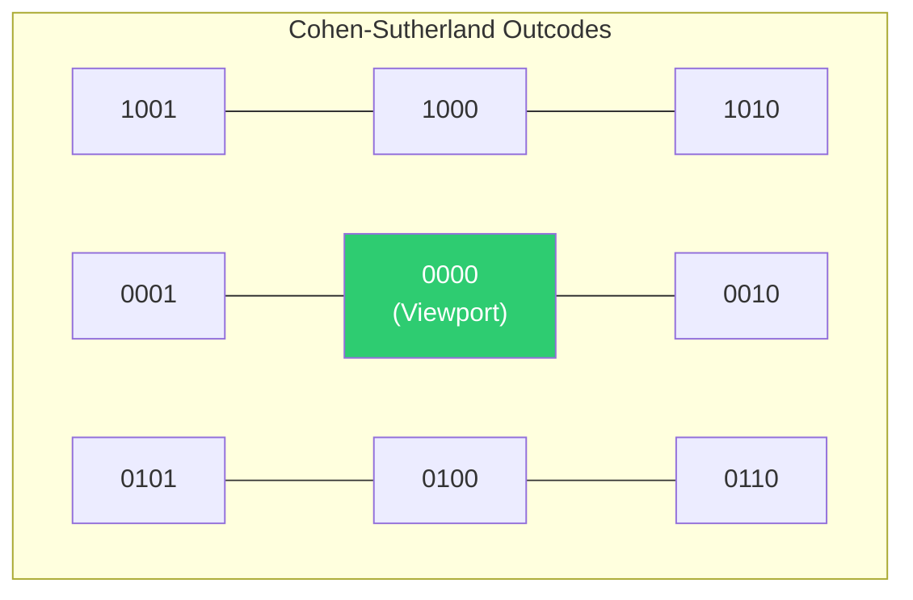

#### 📝 PYQ Conceptual Example (Difficulty: Medium)
**Question:** In the Cohen-Sutherland line clipping algorithm, Line segment $AB$ has the following endpoint Outcodes: $A = 1001$ and $B = 0101$. Without calculating exact intersections, what is the immediate mathematical conclusion the algorithm reaches regarding this line?
**Explanation:**
The Cohen-Sutherland Outcode format is strictly `[Top] [Bottom] [Right] [Left]`.
- Outcode $A = 1001$: The point is physically Top and Left of the screen window.
- Outcode $B = 0101$: The point is physically Bottom and Left of the screen window.
The algorithm strictly performs a mathematical **Bitwise Logical AND** on the two Outcodes to check for a "Trivial Reject".
Calculation: `1001 AND 0101` = `0001`.
Because the final result is strictly NOT `0000`, it mathematically proves that both endpoints physically reside to the Left of the viewing window. It is physically impossible for the line connecting them to ever cross into the visible screen.
**Answer:** The algorithm performs a Bitwise AND (`1001 & 0101 = 0001`). Because the result is non-zero, the line is classified as a "Trivial Reject" and is instantly deleted from memory without calculating any line intersections.

### 11.5 3D Projections & Hidden Surface Removal
**Deep-Dive Definitions & Properties:**
- **Core Definition**:
  - Projections compress 3D volume ($X, Y, Z$) to 2D monitor ($X, Y$)
  - Hidden Surface Removal determines which polygons physically block others
- **Key Properties & Mechanisms**:
  - *Perspective vs Parallel Projection*:
    - **Parallel (Orthographic)**: Projection lines are strictly parallel. Physical object size remains constant regardless of Z-depth. Used in CAD engineering
    - **Perspective**: Projection lines violently converge at a single Center of Projection (Camera Eye). Objects further in Z-axis shrink, simulating human eye physics
  - *Z-Buffer (Depth Buffer) Algorithm*:
    - Foundation of modern 3D GPU hardware utilizing two VRAM arrays: Frame Buffer (RGB) and Z-Buffer (floating-point Z-depth)
    - Mathematically calculates Z-depth of each new pixel
    - Pixel is drawn *if and only if* its Z-depth is physically closer to camera than old pixel
  - **Core Mathematical Formulas**:
    - *Perspective Projection Transformation*: $x_p = \frac{x \cdot d}{z}$ and $y_p = \frac{y \cdot d}{z}$. The profound physical transformation physically dividing Euclidean coordinates by depth ($z$) to mathematically simulate the violent optical convergence of the human eye.

```mermaid
graph LR
    subgraph Parallel Orthographic
    A1["Object 3D"] --> |"Parallel Rays"| P1["2D Projection Plane"]
    end
    
    subgraph Perspective
    A2["Object 3D"] --> |"Converging Rays"| P2["2D Projection Plane"]
    P2 --> |"Converging Rays"| C["Camera Eye<br>(Center of Projection)"]
    end
    style C fill:#e74c3c,color:#fff
```

#### 📝 PYQ Conceptual Example (Difficulty: Hard)
**Question:** Two opaque 3D triangles physically intersect each other in deep 3D space. One triangle is red, the other is blue. If the graphics engine strictly relies on the "Painter's Algorithm" (Depth-Sort Algorithm) for Hidden Surface Removal, why will the visual output be mathematically catastrophic, and why is the Z-Buffer algorithm completely immune to this physical failure?
**Explanation:**
The **Painter's Algorithm** mathematically calculates the absolute center-point depth of entire polygons, violently sorts them from back to front, and paints them whole. It strictly requires polygons to be distinctly separate. If two massive polygons physically slice through each other in 3D space, it is mathematically impossible to say which one is "in front" of the other, because half of the red is in front of the blue, and half is behind it. The Painter's algorithm will blindly draw one entirely on top of the other, destroying the physical intersection.
The **Z-Buffer Algorithm** completely abandons polygon-level sorting. It mathematically operates strictly at the individual, microscopic **Pixel Level**. As it draws the intersecting polygons, it mathematically calculates the exact Z-depth of every single isolated pixel independently. Whichever pixel is mathematically closer at that exact $(X,Y)$ coordinate wins.
**Answer:** The Painter's Algorithm physically fails because it sorts and draws whole polygons; it mathematically cannot handle objects that physically pierce through each other. The Z-Buffer is perfectly immune because it resolves depth strictly at the individual pixel level, flawlessly rendering complex geometric intersections.

---

### Rapid Fire Self-Assessment (Subject 11)
> **🚨 CAUTION:**
> **Test your retention!** Cover the answers below and test yourself:
> 1. (True/False) A mathematically optimal algorithm will always prevent starvation.
> 2. (True/False) Using an array-based implementation guarantees $O(1)$ arbitrary insertion.
> 3. (Match) Which architecture strictly relies on early binding by default?
> *Answers*: 1. False (e.g., SJF is optimal for wait time but starves long processes), 2. False (Requires $O(N)$ shifting), 3. C++ standard methods.

*(End of Subject 11 Checkpoint - Study Guide Complete)*

